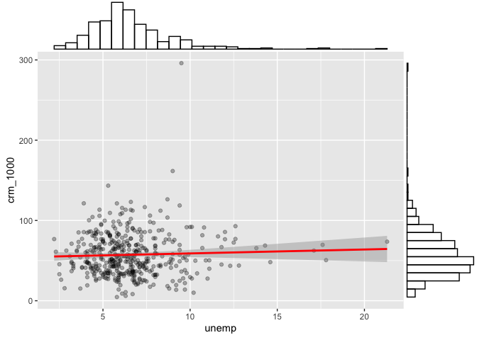

draft\_yma
================
Anna Ma
12/12/2021

## Data exploration

**converted variables to per person and docs, beds, etc.**

``` r
cdi = read_csv("cdi.csv") %>%
  janitor::clean_names() %>%
  mutate(crm_1000 = 1000*(crimes/pop),
         pdocs_1000 = 1000*(docs/pop),
         pbeds_1000 = 1000*(beds/pop),
         density_pop = pop/area,
         # convert region to factors and recoded them accordingly 
         region = factor(region, levels = 1:4,
                    labels = c("northeast", "north central", "south", "west"))) %>% select(-c(docs,beds)) %>% view()
```

### Descriptive statistics of all varaibles

``` r
cdi_descriptive = cdi %>% select(-c(id,cty,state,region))

# Global
skimr::skim(cdi_descriptive) %>% 
  select(-c("skim_type","complete_rate")) %>% 
    mutate(skim_variable = 
             recode(skim_variable, pcincome = "pcincome (in dollars)", totalinc = "totalinc (in million of dollars)"
  )) %>% 
  knitr::kable(
    col.names = c("variable", "n_missing", "mean","sd","min","Q25","median","Q75","max","histogram"),
    caption = "Global Summary", digits = 4)
```

| variable                         | n\_missing |        mean |          sd |         min |         Q25 |      median |         Q75 |          max | histogram |
|:---------------------------------|-----------:|------------:|------------:|------------:|------------:|------------:|------------:|-------------:|:----------|
| area                             |          0 |   1041.4114 |   1549.9221 |     15.0000 |    451.2500 |    656.5000 |    946.7500 |   20062.0000 | ▇▁▁▁▁     |
| pop                              |          0 | 393010.9205 | 601987.0165 | 100043.0000 | 139027.2500 | 217280.5000 | 436064.5000 | 8863164.0000 | ▇▁▁▁▁     |
| pop18                            |          0 |     28.5684 |      4.1911 |     16.4000 |     26.2000 |     28.1000 |     30.0250 |      49.7000 | ▁▇▃▁▁     |
| pop65                            |          0 |     12.1698 |      3.9927 |      3.0000 |      9.8750 |     11.7500 |     13.6250 |      33.8000 | ▂▇▁▁▁     |
| crimes                           |          0 |  27111.6182 |  58237.5064 |    563.0000 |   6219.5000 |  11820.5000 |  26279.5000 |  688936.0000 | ▇▁▁▁▁     |
| hsgrad                           |          0 |     77.5607 |      7.0152 |     46.6000 |     73.8750 |     77.7000 |     82.4000 |      92.9000 | ▁▁▃▇▃     |
| bagrad                           |          0 |     21.0811 |      7.6545 |      8.1000 |     15.2750 |     19.7000 |     25.3250 |      52.3000 | ▆▇▃▁▁     |
| poverty                          |          0 |      8.7207 |      4.6567 |      1.4000 |      5.3000 |      7.9000 |     10.9000 |      36.3000 | ▇▆▁▁▁     |
| unemp                            |          0 |      6.5966 |      2.3379 |      2.2000 |      5.1000 |      6.2000 |      7.5000 |      21.3000 | ▇▇▁▁▁     |
| pcincome (in dollars)            |          0 |  18561.4818 |   4059.1920 |   8899.0000 |  16118.2500 |  17759.0000 |  20270.0000 |   37541.0000 | ▁▇▂▁▁     |
| totalinc (in million of dollars) |          0 |   7869.2727 |  12884.3215 |   1141.0000 |   2311.0000 |   3857.0000 |   8654.2500 |  184230.0000 | ▇▁▁▁▁     |
| crm\_1000                        |          0 |     57.2864 |     27.3277 |      4.6014 |     38.1019 |     52.4286 |     72.5969 |     295.9867 | ▇▅▁▁▁     |
| pdocs\_1000                      |          0 |      2.1230 |      1.5329 |      0.3559 |      1.2127 |      1.7509 |      2.4915 |      17.0377 | ▇▁▁▁▁     |
| pbeds\_1000                      |          0 |      3.6493 |      2.0011 |      0.1649 |      2.1972 |      3.3287 |      4.5649 |      19.6982 | ▇▃▁▁▁     |
| density\_pop                     |          0 |    888.4388 |   2194.7231 |     13.2587 |    192.3449 |    335.9081 |    756.5516 |   32403.7183 | ▇▁▁▁▁     |

Global Summary

Q: 1. do we need to group them by state or county? group by gounty gives
5000+ rows though… 2. do we need box plot still? 3. again, transfer some
variables to “per pop” / “per 1000 pop” ?

### Descriptive analysis

We can use the box plot/ or histogram to check for normality. But I
forgot when do we need normality…isn’t it for residual??

``` r
par(mfrow = c(2,7))

boxplot(cdi$density_pop, main = "density_pop")
boxplot(cdi$area, main = "area")

boxplot(cdi$pop, main = "pop")
boxplot(cdi$pop18, main = "pop18")
boxplot(cdi$pop65, main = "pop65")

boxplot(cdi$pdocs_1000, main = "pdocs_1000")
boxplot(cdi$pbeds_1000, main = "pbeds_1000")

boxplot(cdi$crm_1000,  main = "crm_1000")

boxplot(cdi$hsgrad, main = "hsgrad")
boxplot(cdi$bagrad, main = "bagrad")
boxplot(cdi$poverty, main = "poverty")
boxplot(cdi$unemp,main = "unemp")
boxplot(cdi$pcincome, main = "pcincome")
boxplot(cdi$totalinc, main = "totalinc")
```

<!-- -->

### Correlation

#### Pairwise relationship

-   This gives us an idea of the correlation between each variable, but
    my old project build whole model first then assessed the
    correlation. Need Discussion!

``` r
library(corrplot)
```

    ## corrplot 0.92 loaded

``` r
cor(cdi_descriptive) %>% knitr::kable()
```

|              |       area |        pop |      pop18 |      pop65 |     crimes |     hsgrad |     bagrad |    poverty |      unemp |   pcincome |   totalinc |  crm\_1000 | pdocs\_1000 | pbeds\_1000 | density\_pop |
|:-------------|-----------:|-----------:|-----------:|-----------:|-----------:|-----------:|-----------:|-----------:|-----------:|-----------:|-----------:|-----------:|------------:|------------:|-------------:|
| area         |  1.0000000 |  0.1730834 | -0.0548781 |  0.0057709 |  0.1294754 | -0.0985981 | -0.1372377 |  0.1713433 |  0.1992093 | -0.1877151 |  0.1270743 |  0.0429484 |  -0.1163860 |  -0.1412335 |   -0.1568156 |
| pop          |  0.1730834 |  1.0000000 |  0.0783721 | -0.0290374 |  0.8863318 | -0.0174269 |  0.1468138 |  0.0380195 |  0.0053517 |  0.2356102 |  0.9867476 |  0.2800992 |   0.1668595 |   0.0203012 |    0.3220266 |
| pop18        | -0.0548781 |  0.0783721 |  1.0000000 | -0.6163096 |  0.0899406 |  0.2505843 |  0.4560970 |  0.0339755 | -0.2785271 | -0.0316484 |  0.0711615 |  0.1905688 |   0.2370280 |   0.0295244 |    0.1254644 |
| pop65        |  0.0057709 | -0.0290374 | -0.6163096 |  1.0000000 | -0.0352903 | -0.2682518 | -0.3392288 |  0.0065785 |  0.2363094 |  0.0185907 | -0.0227332 | -0.0665333 |   0.0186087 |   0.2471479 |    0.0291845 |
| crimes       |  0.1294754 |  0.8863318 |  0.0899406 | -0.0352903 |  1.0000000 | -0.1063284 |  0.0770765 |  0.1644057 |  0.0435568 |  0.1175391 |  0.8430980 |  0.5300430 |   0.1577103 |   0.0778907 |    0.5609842 |
| hsgrad       | -0.0985981 | -0.0174269 |  0.2505843 | -0.2682518 | -0.1063284 |  1.0000000 |  0.7077867 | -0.6917505 | -0.5935958 |  0.5229961 |  0.0433557 | -0.2264129 |   0.1427765 |  -0.2111625 |   -0.1040070 |
| bagrad       | -0.1372377 |  0.1468138 |  0.4560970 | -0.3392288 |  0.0770765 |  0.7077867 |  1.0000000 | -0.4084238 | -0.5409069 |  0.6953619 |  0.2222301 |  0.0383046 |   0.4410463 |  -0.0454183 |    0.1556063 |
| poverty      |  0.1713433 |  0.0380195 |  0.0339755 |  0.0065785 |  0.1644057 | -0.6917505 | -0.4084238 |  1.0000000 |  0.4369472 | -0.6017250 | -0.0387393 |  0.4718442 |   0.0637048 |   0.3713989 |    0.1265079 |
| unemp        |  0.1992093 |  0.0053517 | -0.2785271 |  0.2363094 |  0.0435568 | -0.5935958 | -0.5409069 |  0.4369472 |  1.0000000 | -0.3221444 | -0.0338763 |  0.0418466 |  -0.2478866 |  -0.0624878 |    0.0227179 |
| pcincome     | -0.1877151 |  0.2356102 | -0.0316484 |  0.0185907 |  0.1175391 |  0.5229961 |  0.6953619 | -0.6017250 | -0.3221444 |  1.0000000 |  0.3476816 | -0.0802442 |   0.3600458 |  -0.0535500 |    0.2332260 |
| totalinc     |  0.1270743 |  0.9867476 |  0.0711615 | -0.0227332 |  0.8430980 |  0.0433557 |  0.2222301 | -0.0387393 | -0.0338763 |  0.3476816 |  1.0000000 |  0.2281557 |   0.1991038 |   0.0063239 |    0.3162048 |
| crm\_1000    |  0.0429484 |  0.2800992 |  0.1905688 | -0.0665333 |  0.5300430 | -0.2264129 |  0.0383046 |  0.4718442 |  0.0418466 | -0.0802442 |  0.2281557 |  1.0000000 |   0.3070831 |   0.3644505 |    0.4804285 |
| pdocs\_1000  | -0.1163860 |  0.1668595 |  0.2370280 |  0.0186087 |  0.1577103 |  0.1427765 |  0.4410463 |  0.0637048 | -0.2478866 |  0.3600458 |  0.1991038 |  0.3070831 |   1.0000000 |   0.6666947 |    0.3180424 |
| pbeds\_1000  | -0.1412335 |  0.0203012 |  0.0295244 |  0.2471479 |  0.0778907 | -0.2111625 | -0.0454183 |  0.3713989 | -0.0624878 | -0.0535500 |  0.0063239 |  0.3644505 |   0.6666947 |   1.0000000 |    0.2064177 |
| density\_pop | -0.1568156 |  0.3220266 |  0.1254644 |  0.0291845 |  0.5609842 | -0.1040070 |  0.1556063 |  0.1265079 |  0.0227179 |  0.2332260 |  0.3162048 |  0.4804285 |   0.3180424 |   0.2064177 |    1.0000000 |

``` r
library(ggcorrplot)
library(ggstatsplot)
```

    ## You can cite this package as:
    ##      Patil, I. (2021). Visualizations with statistical details: The 'ggstatsplot' approach.
    ##      Journal of Open Source Software, 6(61), 3167, doi:10.21105/joss.03167

``` r
ggstatsplot::ggcorrmat(
  data = cdi_descriptive,
  type = "parametric", # parametric for Pearson, nonparametric for Spearman's correlation
  colors = c("darkred", "white", "steelblue") # change default colors
)
```

<!-- -->

-   Here is the correlation with pairs function. More specific than the
    heat map above. We can observe the correlation between all the terms
    here

``` r
pairs(crm_1000 ~.,data=cdi_descriptive, panel = panel.smooth, upper.panel = NULL, main = "Scatterplot Matrix")
```

<!-- -->

#### Marginal distribution ?

``` r
library(ggplot2)
library(ggExtra)
```

``` r
marg_den = cdi %>% ggplot(aes(x = density_pop, y = crm_1000)) + geom_point(alpha = 0.3) + geom_smooth(method = 'lm', se = TRUE, color = 'red')
ggMarginal(marg_den, type = "histogram", fill="transparent")
```

    ## `geom_smooth()` using formula 'y ~ x'
    ## `geom_smooth()` using formula 'y ~ x'

<!-- -->

``` r
marg_area = cdi %>% ggplot(aes(x = area, y = crm_1000)) + geom_point(alpha = 0.3) + geom_smooth(method = 'lm', se = TRUE, color = 'red')
ggMarginal(marg_area, type = "histogram", fill="transparent")
```

    ## `geom_smooth()` using formula 'y ~ x'
    ## `geom_smooth()` using formula 'y ~ x'

<!-- -->

``` r
marg_pop = cdi %>% ggplot(aes(x = pop, y = crm_1000)) + geom_point(alpha = 0.3) + geom_smooth(method = 'lm', se = TRUE, color = 'red')
ggMarginal(marg_pop, type = "histogram", fill="transparent")
```

    ## `geom_smooth()` using formula 'y ~ x'
    ## `geom_smooth()` using formula 'y ~ x'

<!-- -->

``` r
marg_pop18 = cdi %>% ggplot(aes(x = pop18, y = crm_1000)) + geom_point(alpha = 0.3) + geom_smooth(method = 'lm', se = TRUE, color = 'red')
# positive correlation
ggMarginal(marg_pop18, type = "histogram", fill="transparent")
```

    ## `geom_smooth()` using formula 'y ~ x'
    ## `geom_smooth()` using formula 'y ~ x'

<!-- -->

``` r
marg_pop65 = cdi %>% ggplot(aes(x = pop65, y = crm_1000)) + geom_point(alpha = 0.3) + geom_smooth(method = 'lm', se = TRUE, color = 'red')
ggMarginal(marg_pop65, type = "histogram", fill="transparent")
```

    ## `geom_smooth()` using formula 'y ~ x'
    ## `geom_smooth()` using formula 'y ~ x'

<!-- -->

``` r
marg_pdocs_1000 = cdi %>% ggplot(aes(x = pdocs_1000, y = crm_1000)) + geom_point(alpha = 0.3) + geom_smooth(method = 'lm', se = TRUE, color = 'red')
ggMarginal(marg_pdocs_1000, type = "histogram", fill="transparent")
```

    ## `geom_smooth()` using formula 'y ~ x'
    ## `geom_smooth()` using formula 'y ~ x'

<!-- -->

``` r
marg_pbeds_1000 = cdi %>% ggplot(aes(x = pbeds_1000, y = crm_1000)) + geom_point(alpha = 0.3) + geom_smooth(method = 'lm', se = TRUE, color = 'red')
ggMarginal(marg_pbeds_1000, type = "histogram", fill="transparent")
```

    ## `geom_smooth()` using formula 'y ~ x'
    ## `geom_smooth()` using formula 'y ~ x'

<!-- -->

``` r
marg_hsgrad = cdi %>% ggplot(aes(x = hsgrad, y = crm_1000)) + geom_point(alpha = 0.3) + geom_smooth(method = 'lm', se = TRUE, color = 'red') #negative correlation
ggMarginal(marg_hsgrad, type = "histogram", fill="transparent")
```

    ## `geom_smooth()` using formula 'y ~ x'
    ## `geom_smooth()` using formula 'y ~ x'

<!-- -->

``` r
marg_bagrad = cdi %>% ggplot(aes(x = bagrad, y = crm_1000)) + geom_point(alpha = 0.3) + geom_smooth(method = 'lm', se = TRUE, color = 'red')
ggMarginal(marg_bagrad, type = "histogram", fill="transparent")
```

    ## `geom_smooth()` using formula 'y ~ x'
    ## `geom_smooth()` using formula 'y ~ x'

<!-- -->

``` r
marg_poverty = cdi %>% ggplot(aes(x = poverty, y = crm_1000)) + geom_point(alpha = 0.3) + geom_smooth(method = 'lm', se = TRUE, color = 'red') # positive correlation
ggMarginal(marg_poverty, type = "histogram", fill="transparent")
```

    ## `geom_smooth()` using formula 'y ~ x'
    ## `geom_smooth()` using formula 'y ~ x'

<!-- -->

``` r
marg_unemp = cdi %>% ggplot(aes(x = unemp, y = crm_1000)) + geom_point(alpha = 0.3) + geom_smooth(method = 'lm', se = TRUE, color = 'red')
ggMarginal(marg_unemp, type = "histogram", fill="transparent")
```

    ## `geom_smooth()` using formula 'y ~ x'
    ## `geom_smooth()` using formula 'y ~ x'

<!-- -->

``` r
marg_pcincome = cdi %>% ggplot(aes(x = pcincome, y = crm_1000)) + geom_point(alpha = 0.3) + geom_smooth(method = 'lm', se = TRUE, color = 'red')
ggMarginal(marg_pcincome, type = "histogram", fill="transparent")
```

    ## `geom_smooth()` using formula 'y ~ x'
    ## `geom_smooth()` using formula 'y ~ x'

<!-- -->

``` r
marg_totalinc = cdi %>% ggplot(aes(x = totalinc, y = crm_1000)) + geom_point(alpha = 0.3) + geom_smooth(method = 'lm', se = TRUE, color = 'red')
ggMarginal(marg_totalinc, type = "histogram", fill="transparent")
```

    ## `geom_smooth()` using formula 'y ~ x'
    ## `geom_smooth()` using formula 'y ~ x'

<!-- -->

### Distribution of outcome

``` r
cdi %>% 
  ggplot(aes(x = crm_1000)) +
  geom_histogram()
```

    ## `stat_bin()` using `bins = 30`. Pick better value with `binwidth`.

<!-- -->

do we look at the distribution of outcome like this and transform them
here? check again

### States with unusual rates

group by state

``` r
cdi_by_state = cdi %>% group_by(state) %>% 
  summarise(state_pop = sum(pop),
            state_crimes = sum(crimes)) %>% 
  mutate(state_CRM_1000 = 1000*state_crimes/state_pop)
```

Not sure what counts as out lier, this is what the other group did.

``` r
upper = quantile(cdi$crm_1000, 0.75)
lower = quantile(cdi$crm_1000, 0.25)
IQR = upper - lower
cdi %>% 
  filter(crm_1000 > upper + 1.5*IQR,
         crm_1000 > lower - 1.5*IQR) %>% 
  dplyr::select(cty, crm_1000) %>%
  knitr::kable(digits = 2)
```

| cty       | crm\_1000 |
|:----------|----------:|
| Kings     |    295.99 |
| Dade      |    126.34 |
| Fulton    |    143.35 |
| St.\_Loui |    161.60 |

This shows no outlier on the state level tho…

``` r
upper = quantile(cdi_by_state$state_CRM_1000, 0.75)
lower = quantile(cdi_by_state$state_CRM_1000, 0.25)
IQR = upper - lower
cdi_by_state %>% 
  filter(state_CRM_1000 > upper + 1.5*IQR,
         state_CRM_1000 > lower - 1.5*IQR) %>% 
  dplyr::select(state, state_CRM_1000) %>%
  knitr::kable(digits = 2)
```

| state | state\_CRM\_1000 |
|:------|-----------------:|

``` r
boxplot(cdi_by_state$state_CRM_1000, main = 'State Crime Rate per 1000 people')
```

<!-- -->

**we probably need to plot region as well? not sure**

## Model!

**Q: do we need more descriptive analysis, visualization? rate of crime
for each state?** **there’s a few duplicated cty, but different area,
maybe diff place then? not sure** they can’t be the same… otherwise we
have to recalculate some stuff… duplicated(cdi\[,2:3\]) cdi %&gt;%
filter(cty == “Baltimor”) cdi %&gt;% filter(cty == “St.\_Loui”)

#### Full model predictors ok?

this model used `northeast` as the reference level for region

``` r
cdi_model = cdi %>% select(-c(id,cty,state,area,crimes,totalinc))

# use 
full_fit = lm(crm_1000 ~ ., data = cdi_model)
summary(full_fit)
```

    ## 
    ## Call:
    ## lm(formula = crm_1000 ~ ., data = cdi_model)
    ## 
    ## Residuals:
    ##     Min      1Q  Median      3Q     Max 
    ## -47.786 -11.422  -0.934  10.200  75.180 
    ## 
    ## Coefficients:
    ##                       Estimate Std. Error t value Pr(>|t|)    
    ## (Intercept)         -6.922e+01  2.739e+01  -2.528 0.011849 *  
    ## pop                  5.486e-06  1.579e-06   3.474 0.000566 ***
    ## pop18                6.947e-01  3.305e-01   2.102 0.036150 *  
    ## pop65               -1.998e-01  3.055e-01  -0.654 0.513410    
    ## hsgrad               6.143e-01  2.690e-01   2.284 0.022864 *  
    ## bagrad              -4.835e-01  2.971e-01  -1.628 0.104327    
    ## poverty              1.856e+00  3.864e-01   4.803 2.17e-06 ***
    ## unemp                6.111e-01  5.314e-01   1.150 0.250812    
    ## pcincome             1.039e-03  4.734e-04   2.195 0.028670 *  
    ## regionnorth central  8.978e+00  2.732e+00   3.286 0.001100 ** 
    ## regionsouth          2.779e+01  2.659e+00  10.453  < 2e-16 ***
    ## regionwest           2.118e+01  3.125e+00   6.778 4.09e-11 ***
    ## pdocs_1000          -6.634e-01  1.019e+00  -0.651 0.515556    
    ## pbeds_1000           3.157e+00  7.939e-01   3.977 8.21e-05 ***
    ## density_pop          4.901e-03  4.537e-04  10.802  < 2e-16 ***
    ## ---
    ## Signif. codes:  0 '***' 0.001 '**' 0.01 '*' 0.05 '.' 0.1 ' ' 1
    ## 
    ## Residual standard error: 17.81 on 425 degrees of freedom
    ## Multiple R-squared:  0.589,  Adjusted R-squared:  0.5755 
    ## F-statistic: 43.51 on 14 and 425 DF,  p-value: < 2.2e-16

``` r
olsrr::ols_plot_resid_qq(full_fit)
```

<!-- -->

``` r
olsrr::ols_plot_resid_fit(full_fit)
```

<!-- -->

## Transformation

``` r
lambda = MASS::boxcox(full_fit)
```

<!-- -->

``` r
optlam = lambda$x[which.max(lambda$y)]
optlam
```

    ## [1] 0.5454545

The lambda from the transformation is 0.5454, so we will try to fit a
square root transformation to y

``` r
trans_fit = lm(crm_1000^0.5 ~ .,data = cdi_model)
summary(trans_fit)
```

    ## 
    ## Call:
    ## lm(formula = crm_1000^0.5 ~ ., data = cdi_model)
    ## 
    ## Residuals:
    ##     Min      1Q  Median      3Q     Max 
    ## -4.0410 -0.7300  0.0708  0.7485  4.0273 
    ## 
    ## Coefficients:
    ##                       Estimate Std. Error t value Pr(>|t|)    
    ## (Intercept)         -1.645e+00  1.802e+00  -0.913 0.361766    
    ## pop                  3.624e-07  1.039e-07   3.488 0.000537 ***
    ## pop18                6.320e-02  2.174e-02   2.907 0.003844 ** 
    ## pop65               -3.609e-03  2.009e-02  -0.180 0.857548    
    ## hsgrad               3.479e-02  1.769e-02   1.966 0.049933 *  
    ## bagrad              -3.472e-02  1.954e-02  -1.777 0.076307 .  
    ## poverty              1.192e-01  2.542e-02   4.688 3.72e-06 ***
    ## unemp                4.305e-02  3.496e-02   1.232 0.218783    
    ## pcincome             9.589e-05  3.114e-05   3.079 0.002213 ** 
    ## regionnorth central  7.062e-01  1.797e-01   3.929 9.94e-05 ***
    ## regionsouth          1.996e+00  1.749e-01  11.413  < 2e-16 ***
    ## regionwest           1.674e+00  2.056e-01   8.142 4.37e-15 ***
    ## pdocs_1000          -3.845e-02  6.706e-02  -0.573 0.566744    
    ## pbeds_1000           2.120e-01  5.223e-02   4.059 5.86e-05 ***
    ## density_pop          2.150e-04  2.984e-05   7.203 2.69e-12 ***
    ## ---
    ## Signif. codes:  0 '***' 0.001 '**' 0.01 '*' 0.05 '.' 0.1 ' ' 1
    ## 
    ## Residual standard error: 1.171 on 425 degrees of freedom
    ## Multiple R-squared:  0.5602, Adjusted R-squared:  0.5457 
    ## F-statistic: 38.66 on 14 and 425 DF,  p-value: < 2.2e-16

``` r
olsrr::ols_plot_resid_fit(trans_fit)
```

<!-- -->

``` r
olsrr::ols_plot_resid_qq(trans_fit)
```

<!-- -->

``` r
lambda_trans = MASS::boxcox(trans_fit)
```

<!-- -->

``` r
optlam_trans = lambda_trans$x[which.max(lambda_trans$y)]
lambda_trans
```

    ## $x
    ##   [1] -2.00000000 -1.95959596 -1.91919192 -1.87878788 -1.83838384 -1.79797980
    ##   [7] -1.75757576 -1.71717172 -1.67676768 -1.63636364 -1.59595960 -1.55555556
    ##  [13] -1.51515152 -1.47474747 -1.43434343 -1.39393939 -1.35353535 -1.31313131
    ##  [19] -1.27272727 -1.23232323 -1.19191919 -1.15151515 -1.11111111 -1.07070707
    ##  [25] -1.03030303 -0.98989899 -0.94949495 -0.90909091 -0.86868687 -0.82828283
    ##  [31] -0.78787879 -0.74747475 -0.70707071 -0.66666667 -0.62626263 -0.58585859
    ##  [37] -0.54545455 -0.50505051 -0.46464646 -0.42424242 -0.38383838 -0.34343434
    ##  [43] -0.30303030 -0.26262626 -0.22222222 -0.18181818 -0.14141414 -0.10101010
    ##  [49] -0.06060606 -0.02020202  0.02020202  0.06060606  0.10101010  0.14141414
    ##  [55]  0.18181818  0.22222222  0.26262626  0.30303030  0.34343434  0.38383838
    ##  [61]  0.42424242  0.46464646  0.50505051  0.54545455  0.58585859  0.62626263
    ##  [67]  0.66666667  0.70707071  0.74747475  0.78787879  0.82828283  0.86868687
    ##  [73]  0.90909091  0.94949495  0.98989899  1.03030303  1.07070707  1.11111111
    ##  [79]  1.15151515  1.19191919  1.23232323  1.27272727  1.31313131  1.35353535
    ##  [85]  1.39393939  1.43434343  1.47474747  1.51515152  1.55555556  1.59595960
    ##  [91]  1.63636364  1.67676768  1.71717172  1.75757576  1.79797980  1.83838384
    ##  [97]  1.87878788  1.91919192  1.95959596  2.00000000
    ## 
    ## $y
    ##   [1] -930.4285 -919.7730 -909.2542 -898.8734 -888.6317 -878.5305 -868.5708
    ##   [8] -858.7537 -849.0805 -839.5520 -830.1693 -820.9334 -811.8450 -802.9050
    ##  [15] -794.1142 -785.4733 -776.9829 -768.6436 -760.4560 -752.4205 -744.5376
    ##  [22] -736.8075 -729.2306 -721.8070 -714.5370 -707.4205 -700.4577 -693.6484
    ##  [29] -686.9927 -680.4903 -674.1409 -667.9444 -661.9003 -656.0083 -650.2679
    ##  [36] -644.6786 -639.2398 -633.9510 -628.8115 -623.8205 -618.9774 -614.2813
    ##  [43] -609.7315 -605.3270 -601.0670 -596.9506 -592.9768 -589.1446 -585.4531
    ##  [50] -581.9013 -578.4880 -575.2124 -572.0733 -569.0696 -566.2004 -563.4645
    ##  [57] -560.8609 -558.3886 -556.0464 -553.8333 -551.7484 -549.7905 -547.9587
    ##  [64] -546.2519 -544.6692 -543.2097 -541.8724 -540.6565 -539.5610 -538.5851
    ##  [71] -537.7279 -536.9888 -536.3669 -535.8616 -535.4721 -535.1978 -535.0381
    ##  [78] -534.9925 -535.0603 -535.2412 -535.5346 -535.9401 -536.4574 -537.0862
    ##  [85] -537.8262 -538.6770 -539.6386 -540.7108 -541.8934 -543.1864 -544.5897
    ##  [92] -546.1033 -547.7274 -549.4619 -551.3070 -553.2628 -555.3295 -557.5075
    ##  [99] -559.7968 -562.1978

#### Backward

``` r
fit_back = step(trans_fit, direction='backward')
```

    ## Start:  AIC=153.85
    ## crm_1000^0.5 ~ pop + pop18 + pop65 + hsgrad + bagrad + poverty + 
    ##     unemp + pcincome + region + pdocs_1000 + pbeds_1000 + density_pop
    ## 
    ##               Df Sum of Sq    RSS    AIC
    ## - pop65        1     0.044 583.09 151.89
    ## - pdocs_1000   1     0.451 583.49 152.19
    ## - unemp        1     2.081 585.12 153.42
    ## <none>                     583.04 153.85
    ## - bagrad       1     4.331 587.37 155.11
    ## - hsgrad       1     5.303 588.35 155.84
    ## - pop18        1    11.591 594.63 160.51
    ## - pcincome     1    13.004 596.05 161.56
    ## - pop          1    16.690 599.73 164.27
    ## - pbeds_1000   1    22.604 605.65 168.59
    ## - poverty      1    30.154 613.20 174.04
    ## - density_pop  1    71.185 654.23 202.54
    ## - region       3   205.212 788.25 280.54
    ## 
    ## Step:  AIC=151.89
    ## crm_1000^0.5 ~ pop + pop18 + hsgrad + bagrad + poverty + unemp + 
    ##     pcincome + region + pdocs_1000 + pbeds_1000 + density_pop
    ## 
    ##               Df Sum of Sq    RSS    AIC
    ## - pdocs_1000   1     0.446 583.53 150.22
    ## - unemp        1     2.038 585.12 151.42
    ## <none>                     583.09 151.89
    ## - bagrad       1     4.334 587.42 153.15
    ## - hsgrad       1     5.380 588.47 153.93
    ## - pcincome     1    13.159 596.25 159.71
    ## - pop18        1    16.404 599.49 162.09
    ## - pop          1    16.651 599.74 162.28
    ## - pbeds_1000   1    23.989 607.08 167.63
    ## - poverty      1    31.904 614.99 173.33
    ## - density_pop  1    71.276 654.36 200.63
    ## - region       3   205.335 788.42 278.63
    ## 
    ## Step:  AIC=150.22
    ## crm_1000^0.5 ~ pop + pop18 + hsgrad + bagrad + poverty + unemp + 
    ##     pcincome + region + pbeds_1000 + density_pop
    ## 
    ##               Df Sum of Sq    RSS    AIC
    ## - unemp        1     2.006 585.54 149.73
    ## <none>                     583.53 150.22
    ## - bagrad       1     5.378 588.91 152.26
    ## - hsgrad       1     5.671 589.20 152.48
    ## - pcincome     1    12.753 596.29 157.74
    ## - pop18        1    16.012 599.54 160.13
    ## - pop          1    16.517 600.05 160.50
    ## - poverty      1    32.264 615.80 171.90
    ## - pbeds_1000   1    41.083 624.62 178.16
    ## - density_pop  1    70.863 654.40 198.65
    ## - region       3   204.905 788.44 276.64
    ## 
    ## Step:  AIC=149.73
    ## crm_1000^0.5 ~ pop + pop18 + hsgrad + bagrad + poverty + pcincome + 
    ##     region + pbeds_1000 + density_pop
    ## 
    ##               Df Sum of Sq    RSS    AIC
    ## <none>                     585.54 149.73
    ## - hsgrad       1     4.640 590.18 151.21
    ## - bagrad       1     7.070 592.61 153.01
    ## - pcincome     1    15.076 600.61 158.92
    ## - pop18        1    15.967 601.50 159.57
    ## - pop          1    16.046 601.58 159.63
    ## - pbeds_1000   1    39.273 624.81 176.30
    ## - poverty      1    41.161 626.70 177.62
    ## - density_pop  1    70.118 655.66 197.50
    ## - region       3   209.818 795.36 278.49

``` r
fit_back
```

    ## 
    ## Call:
    ## lm(formula = crm_1000^0.5 ~ pop + pop18 + hsgrad + bagrad + poverty + 
    ##     pcincome + region + pbeds_1000 + density_pop, data = cdi_model)
    ## 
    ## Coefficients:
    ##         (Intercept)                  pop                pop18  
    ##          -1.132e+00            3.546e-07            6.390e-02  
    ##              hsgrad               bagrad              poverty  
    ##           3.180e-02           -4.210e-02            1.298e-01  
    ##            pcincome  regionnorth central          regionsouth  
    ##           1.005e-04            6.887e-01            1.933e+00  
    ##          regionwest           pbeds_1000          density_pop  
    ##           1.642e+00            1.767e-01            2.117e-04

``` r
olsrr::ols_plot_resid_fit(fit_back)
```

<!-- -->

``` r
olsrr::ols_plot_resid_qq(fit_back)
```

<!-- -->

``` r
MASS::boxcox(fit_back)
```

<!-- -->

lm(formula = crm\_1000^0.5 \~ pop + pop18 + hsgrad + bagrad + poverty +
pcincome + region + pbeds\_1000 + density\_pop, data = cdi\_model)

#### forward

``` r
fit_forward = step(trans_fit, direction='forward')
```

    ## Start:  AIC=153.85
    ## crm_1000^0.5 ~ pop + pop18 + pop65 + hsgrad + bagrad + poverty + 
    ##     unemp + pcincome + region + pdocs_1000 + pbeds_1000 + density_pop

``` r
fit_forward
```

    ## 
    ## Call:
    ## lm(formula = crm_1000^0.5 ~ pop + pop18 + pop65 + hsgrad + bagrad + 
    ##     poverty + unemp + pcincome + region + pdocs_1000 + pbeds_1000 + 
    ##     density_pop, data = cdi_model)
    ## 
    ## Coefficients:
    ##         (Intercept)                  pop                pop18  
    ##          -1.645e+00            3.624e-07            6.320e-02  
    ##               pop65               hsgrad               bagrad  
    ##          -3.609e-03            3.479e-02           -3.472e-02  
    ##             poverty                unemp             pcincome  
    ##           1.192e-01            4.305e-02            9.589e-05  
    ## regionnorth central          regionsouth           regionwest  
    ##           7.062e-01            1.996e+00            1.674e+00  
    ##          pdocs_1000           pbeds_1000          density_pop  
    ##          -3.845e-02            2.120e-01            2.150e-04

``` r
olsrr::ols_plot_resid_fit(fit_forward)
```

<!-- -->

``` r
olsrr::ols_plot_resid_qq(fit_forward)
```

<!-- -->

``` r
MASS::boxcox(fit_forward)
```

<!-- -->

lm(formula = crm\_1000^0.5 \~ pop + pop18 + pop65 + hsgrad + bagrad +
poverty + unemp + pcincome + region + pdocs\_1000 + pbeds\_1000 +
density\_pop, data = cdi\_model)

#### both

step-wise?

``` r
fit_both = step(trans_fit, direction='both')
```

    ## Start:  AIC=153.85
    ## crm_1000^0.5 ~ pop + pop18 + pop65 + hsgrad + bagrad + poverty + 
    ##     unemp + pcincome + region + pdocs_1000 + pbeds_1000 + density_pop
    ## 
    ##               Df Sum of Sq    RSS    AIC
    ## - pop65        1     0.044 583.09 151.89
    ## - pdocs_1000   1     0.451 583.49 152.19
    ## - unemp        1     2.081 585.12 153.42
    ## <none>                     583.04 153.85
    ## - bagrad       1     4.331 587.37 155.11
    ## - hsgrad       1     5.303 588.35 155.84
    ## - pop18        1    11.591 594.63 160.51
    ## - pcincome     1    13.004 596.05 161.56
    ## - pop          1    16.690 599.73 164.27
    ## - pbeds_1000   1    22.604 605.65 168.59
    ## - poverty      1    30.154 613.20 174.04
    ## - density_pop  1    71.185 654.23 202.54
    ## - region       3   205.212 788.25 280.54
    ## 
    ## Step:  AIC=151.89
    ## crm_1000^0.5 ~ pop + pop18 + hsgrad + bagrad + poverty + unemp + 
    ##     pcincome + region + pdocs_1000 + pbeds_1000 + density_pop
    ## 
    ##               Df Sum of Sq    RSS    AIC
    ## - pdocs_1000   1     0.446 583.53 150.22
    ## - unemp        1     2.038 585.12 151.42
    ## <none>                     583.09 151.89
    ## - bagrad       1     4.334 587.42 153.15
    ## + pop65        1     0.044 583.04 153.85
    ## - hsgrad       1     5.380 588.47 153.93
    ## - pcincome     1    13.159 596.25 159.71
    ## - pop18        1    16.404 599.49 162.09
    ## - pop          1    16.651 599.74 162.28
    ## - pbeds_1000   1    23.989 607.08 167.63
    ## - poverty      1    31.904 614.99 173.33
    ## - density_pop  1    71.276 654.36 200.63
    ## - region       3   205.335 788.42 278.63
    ## 
    ## Step:  AIC=150.22
    ## crm_1000^0.5 ~ pop + pop18 + hsgrad + bagrad + poverty + unemp + 
    ##     pcincome + region + pbeds_1000 + density_pop
    ## 
    ##               Df Sum of Sq    RSS    AIC
    ## - unemp        1     2.006 585.54 149.73
    ## <none>                     583.53 150.22
    ## + pdocs_1000   1     0.446 583.09 151.89
    ## + pop65        1     0.039 583.49 152.19
    ## - bagrad       1     5.378 588.91 152.26
    ## - hsgrad       1     5.671 589.20 152.48
    ## - pcincome     1    12.753 596.29 157.74
    ## - pop18        1    16.012 599.54 160.13
    ## - pop          1    16.517 600.05 160.50
    ## - poverty      1    32.264 615.80 171.90
    ## - pbeds_1000   1    41.083 624.62 178.16
    ## - density_pop  1    70.863 654.40 198.65
    ## - region       3   204.905 788.44 276.64
    ## 
    ## Step:  AIC=149.73
    ## crm_1000^0.5 ~ pop + pop18 + hsgrad + bagrad + poverty + pcincome + 
    ##     region + pbeds_1000 + density_pop
    ## 
    ##               Df Sum of Sq    RSS    AIC
    ## <none>                     585.54 149.73
    ## + unemp        1     2.006 583.53 150.22
    ## - hsgrad       1     4.640 590.18 151.21
    ## + pdocs_1000   1     0.414 585.12 151.42
    ## + pop65        1     0.000 585.54 151.73
    ## - bagrad       1     7.070 592.61 153.01
    ## - pcincome     1    15.076 600.61 158.92
    ## - pop18        1    15.967 601.50 159.57
    ## - pop          1    16.046 601.58 159.63
    ## - pbeds_1000   1    39.273 624.81 176.30
    ## - poverty      1    41.161 626.70 177.62
    ## - density_pop  1    70.118 655.66 197.50
    ## - region       3   209.818 795.36 278.49

``` r
fit_both
```

    ## 
    ## Call:
    ## lm(formula = crm_1000^0.5 ~ pop + pop18 + hsgrad + bagrad + poverty + 
    ##     pcincome + region + pbeds_1000 + density_pop, data = cdi_model)
    ## 
    ## Coefficients:
    ##         (Intercept)                  pop                pop18  
    ##          -1.132e+00            3.546e-07            6.390e-02  
    ##              hsgrad               bagrad              poverty  
    ##           3.180e-02           -4.210e-02            1.298e-01  
    ##            pcincome  regionnorth central          regionsouth  
    ##           1.005e-04            6.887e-01            1.933e+00  
    ##          regionwest           pbeds_1000          density_pop  
    ##           1.642e+00            1.767e-01            2.117e-04

lm(formula = crm\_1000^0.5 \~ pop + pop18 + hsgrad + bagrad + poverty +
pcincome + region + pbeds\_1000 + density\_pop, data = cdi\_model)

This gives back the same model as back

### Test based procedures

#### Cp

I didn’t include the full model here

**backward & both**

``` r
# printing the 2 best models of each size. For example, the first two lines: print the best 2 models that have 2 variables (including intercept)
library(leaps)
Cp_b = leaps(x = model.matrix(fit_back)[,-1],
      y = cdi_model$crm_1000,
      nbest = 2,
      method = "Cp")
Cp_b
```

    ## $which
    ##        1     2     3     4     5     6     7     8     9     A     B
    ## 1  FALSE FALSE FALSE FALSE FALSE FALSE FALSE FALSE FALSE FALSE  TRUE
    ## 1  FALSE FALSE FALSE FALSE  TRUE FALSE FALSE FALSE FALSE FALSE FALSE
    ## 2  FALSE FALSE FALSE FALSE  TRUE FALSE FALSE FALSE FALSE FALSE  TRUE
    ## 2  FALSE FALSE FALSE FALSE FALSE FALSE FALSE  TRUE FALSE FALSE  TRUE
    ## 3  FALSE FALSE FALSE FALSE  TRUE FALSE FALSE  TRUE FALSE FALSE  TRUE
    ## 3  FALSE FALSE FALSE  TRUE  TRUE FALSE FALSE FALSE FALSE FALSE  TRUE
    ## 4  FALSE FALSE FALSE FALSE FALSE FALSE FALSE  TRUE  TRUE  TRUE  TRUE
    ## 4  FALSE FALSE FALSE FALSE  TRUE FALSE FALSE  TRUE  TRUE FALSE  TRUE
    ## 5  FALSE FALSE FALSE FALSE  TRUE FALSE FALSE  TRUE  TRUE  TRUE  TRUE
    ## 5  FALSE FALSE FALSE FALSE  TRUE FALSE  TRUE  TRUE  TRUE FALSE  TRUE
    ## 6  FALSE FALSE FALSE FALSE  TRUE FALSE  TRUE  TRUE  TRUE  TRUE  TRUE
    ## 6   TRUE FALSE FALSE FALSE  TRUE FALSE FALSE  TRUE  TRUE  TRUE  TRUE
    ## 7   TRUE FALSE FALSE FALSE  TRUE FALSE  TRUE  TRUE  TRUE  TRUE  TRUE
    ## 7   TRUE FALSE  TRUE FALSE  TRUE FALSE FALSE  TRUE  TRUE  TRUE  TRUE
    ## 8   TRUE  TRUE FALSE FALSE  TRUE FALSE  TRUE  TRUE  TRUE  TRUE  TRUE
    ## 8   TRUE FALSE  TRUE FALSE  TRUE FALSE  TRUE  TRUE  TRUE  TRUE  TRUE
    ## 9   TRUE  TRUE FALSE FALSE  TRUE  TRUE  TRUE  TRUE  TRUE  TRUE  TRUE
    ## 9   TRUE  TRUE  TRUE FALSE  TRUE FALSE  TRUE  TRUE  TRUE  TRUE  TRUE
    ## 10  TRUE  TRUE  TRUE FALSE  TRUE  TRUE  TRUE  TRUE  TRUE  TRUE  TRUE
    ## 10  TRUE  TRUE FALSE  TRUE  TRUE  TRUE  TRUE  TRUE  TRUE  TRUE  TRUE
    ## 11  TRUE  TRUE  TRUE  TRUE  TRUE  TRUE  TRUE  TRUE  TRUE  TRUE  TRUE
    ## 
    ## $label
    ##  [1] "(Intercept)" "1"           "2"           "3"           "4"          
    ##  [6] "5"           "6"           "7"           "8"           "9"          
    ## [11] "A"           "B"          
    ## 
    ## $size
    ##  [1]  2  2  3  3  4  4  5  5  6  6  7  7  8  8  9  9 10 10 11 11 12
    ## 
    ## $Cp
    ##  [1] 361.37662 369.85075 185.35978 217.86627 115.16570 160.73877  83.84967
    ##  [8]  84.08696  49.18224  63.36721  33.69922  34.29891  19.17558  24.91300
    ## [15]  14.72619  14.79923  13.80739  14.07314  14.43365  14.96836  12.00000

``` r
Cp_b %>% faraway::Cpplot()
```

<!-- -->

size is the number of parameters in the model, Cp is Cp

The plot shows the model that satisfy the criteria, number indicates the
number of parameters it included. in this case, the 1st to the last.

**forward**

``` r
leaps(x = model.matrix(fit_forward)[,-1],
      y = cdi_model$crm_1000,
      nbest = 2,
      method = "Cp") %>% faraway::Cpplot()
```

<!-- -->

So, multiple model satisfies the Cp criteria here.

#### Adj R2

**backward**

``` r
adjr_b = leaps(x = model.matrix(fit_back)[,-1],
      y = cdi_model$crm_1000,
      nbest = 2,
      method = "adjr2") 

adjr_b
```

    ## $which
    ##        1     2     3     4     5     6     7     8     9     A     B
    ## 1  FALSE FALSE FALSE FALSE FALSE FALSE FALSE FALSE FALSE FALSE  TRUE
    ## 1  FALSE FALSE FALSE FALSE  TRUE FALSE FALSE FALSE FALSE FALSE FALSE
    ## 2  FALSE FALSE FALSE FALSE  TRUE FALSE FALSE FALSE FALSE FALSE  TRUE
    ## 2  FALSE FALSE FALSE FALSE FALSE FALSE FALSE  TRUE FALSE FALSE  TRUE
    ## 3  FALSE FALSE FALSE FALSE  TRUE FALSE FALSE  TRUE FALSE FALSE  TRUE
    ## 3  FALSE FALSE FALSE  TRUE  TRUE FALSE FALSE FALSE FALSE FALSE  TRUE
    ## 4  FALSE FALSE FALSE FALSE FALSE FALSE FALSE  TRUE  TRUE  TRUE  TRUE
    ## 4  FALSE FALSE FALSE FALSE  TRUE FALSE FALSE  TRUE  TRUE FALSE  TRUE
    ## 5  FALSE FALSE FALSE FALSE  TRUE FALSE FALSE  TRUE  TRUE  TRUE  TRUE
    ## 5  FALSE FALSE FALSE FALSE  TRUE FALSE  TRUE  TRUE  TRUE FALSE  TRUE
    ## 6  FALSE FALSE FALSE FALSE  TRUE FALSE  TRUE  TRUE  TRUE  TRUE  TRUE
    ## 6   TRUE FALSE FALSE FALSE  TRUE FALSE FALSE  TRUE  TRUE  TRUE  TRUE
    ## 7   TRUE FALSE FALSE FALSE  TRUE FALSE  TRUE  TRUE  TRUE  TRUE  TRUE
    ## 7   TRUE FALSE  TRUE FALSE  TRUE FALSE FALSE  TRUE  TRUE  TRUE  TRUE
    ## 8   TRUE  TRUE FALSE FALSE  TRUE FALSE  TRUE  TRUE  TRUE  TRUE  TRUE
    ## 8   TRUE FALSE  TRUE FALSE  TRUE FALSE  TRUE  TRUE  TRUE  TRUE  TRUE
    ## 9   TRUE  TRUE FALSE FALSE  TRUE  TRUE  TRUE  TRUE  TRUE  TRUE  TRUE
    ## 9   TRUE  TRUE  TRUE FALSE  TRUE FALSE  TRUE  TRUE  TRUE  TRUE  TRUE
    ## 10  TRUE  TRUE  TRUE FALSE  TRUE  TRUE  TRUE  TRUE  TRUE  TRUE  TRUE
    ## 10  TRUE  TRUE FALSE  TRUE  TRUE  TRUE  TRUE  TRUE  TRUE  TRUE  TRUE
    ## 11  TRUE  TRUE  TRUE  TRUE  TRUE  TRUE  TRUE  TRUE  TRUE  TRUE  TRUE
    ## 
    ## $label
    ##  [1] "(Intercept)" "1"           "2"           "3"           "4"          
    ##  [6] "5"           "6"           "7"           "8"           "9"          
    ## [11] "A"           "B"          
    ## 
    ## $size
    ##  [1]  2  2  3  3  4  4  5  5  6  6  7  7  8  8  9  9 10 10 11 11 12
    ## 
    ## $adjr2
    ##  [1] 0.2290554 0.2208622 0.3998009 0.3683000 0.4685454 0.4242809 0.4997575
    ##  [8] 0.4995265 0.5343835 0.5205424 0.5504069 0.5498204 0.5655639 0.5599397
    ## [15] 0.5708928 0.5708211 0.5727695 0.5725077 0.5731297 0.5726018 0.5765191

``` r
adjr_b%>% 
  faraway::maxadjr(10)
```

    ## 1,2,3,4,5,6,7,8,9,10,11   1,2,3,5,6,7,8,9,10,11     1,2,5,6,7,8,9,10,11 
    ##                   0.577                   0.573                   0.573 
    ##   1,2,4,5,6,7,8,9,10,11     1,2,3,5,7,8,9,10,11       1,2,5,7,8,9,10,11 
    ##                   0.573                   0.573                   0.571 
    ##       1,3,5,7,8,9,10,11         1,5,7,8,9,10,11         1,3,5,8,9,10,11 
    ##                   0.571                   0.566                   0.560 
    ##           5,7,8,9,10,11 
    ##                   0.550

**forward**

``` r
leaps(x = model.matrix(fit_forward)[,-1],
      y = cdi_model$crm_1000,
      nbest = 2,
      method = "adjr2") %>% faraway::maxadjr(10)
```

    ##      1,2,4,5,6,7,8,9,10,11,13,14        1,2,4,5,6,8,9,10,11,13,14 
    ##                            0.577                            0.577 
    ##    1,2,3,4,5,6,7,8,9,10,11,13,14   1,2,4,5,6,7,8,9,10,11,12,13,14 
    ##                            0.576                            0.576 
    ##     1,2,4,5,6,8,9,10,11,12,13,14 1,2,3,4,5,6,7,8,9,10,11,12,13,14 
    ##                            0.576                            0.575 
    ##        1,2,4,6,7,8,9,10,11,13,14          1,2,4,6,7,9,10,11,13,14 
    ##                            0.574                            0.574 
    ##          1,3,4,6,7,9,10,11,13,14            1,2,6,8,9,10,11,13,14 
    ##                            0.573                            0.573

## backward by hand

``` r
# No docs
step1 = update(trans_fit, . ~ . -pdocs_1000)
summary(step1)
```

    ## 
    ## Call:
    ## lm(formula = crm_1000^0.5 ~ pop + pop18 + pop65 + hsgrad + bagrad + 
    ##     poverty + unemp + pcincome + region + pbeds_1000 + density_pop, 
    ##     data = cdi_model)
    ## 
    ## Residuals:
    ##     Min      1Q  Median      3Q     Max 
    ## -4.0402 -0.7295  0.0707  0.7471  4.0630 
    ## 
    ## Coefficients:
    ##                       Estimate Std. Error t value Pr(>|t|)    
    ## (Intercept)         -1.586e+00  1.797e+00  -0.882 0.378105    
    ## pop                  3.607e-07  1.038e-07   3.476 0.000561 ***
    ## pop18                6.215e-02  2.165e-02   2.871 0.004297 ** 
    ## pop65               -3.383e-03  2.008e-02  -0.169 0.866243    
    ## hsgrad               3.562e-02  1.762e-02   2.021 0.043858 *  
    ## bagrad              -3.749e-02  1.892e-02  -1.982 0.048144 *  
    ## poverty              1.198e-01  2.537e-02   4.722 3.18e-06 ***
    ## unemp                4.266e-02  3.492e-02   1.222 0.222514    
    ## pcincome             9.360e-05  3.086e-05   3.033 0.002572 ** 
    ## regionnorth central  7.110e-01  1.794e-01   3.964 8.66e-05 ***
    ## regionsouth          1.998e+00  1.747e-01  11.432  < 2e-16 ***
    ## regionwest           1.656e+00  2.031e-01   8.153 4.00e-15 ***
    ## pbeds_1000           1.910e-01  3.725e-02   5.129 4.43e-07 ***
    ## density_pop          2.132e-04  2.967e-05   7.188 2.97e-12 ***
    ## ---
    ## Signif. codes:  0 '***' 0.001 '**' 0.01 '*' 0.05 '.' 0.1 ' ' 1
    ## 
    ## Residual standard error: 1.17 on 426 degrees of freedom
    ## Multiple R-squared:  0.5598, Adjusted R-squared:  0.5464 
    ## F-statistic: 41.68 on 13 and 426 DF,  p-value: < 2.2e-16

``` r
# No pop65
step2 = update(step1, . ~ . -pop65)
summary(step2)
```

    ## 
    ## Call:
    ## lm(formula = crm_1000^0.5 ~ pop + pop18 + hsgrad + bagrad + poverty + 
    ##     unemp + pcincome + region + pbeds_1000 + density_pop, data = cdi_model)
    ## 
    ## Residuals:
    ##     Min      1Q  Median      3Q     Max 
    ## -4.0525 -0.7474  0.0681  0.7419  4.0605 
    ## 
    ## Coefficients:
    ##                       Estimate Std. Error t value Pr(>|t|)    
    ## (Intercept)         -1.695e+00  1.674e+00  -1.013 0.311653    
    ## pop                  3.602e-07  1.036e-07   3.476 0.000560 ***
    ## pop18                6.399e-02  1.869e-02   3.423 0.000679 ***
    ## hsgrad               3.579e-02  1.757e-02   2.037 0.042260 *  
    ## bagrad              -3.749e-02  1.890e-02  -1.984 0.047915 *  
    ## poverty              1.207e-01  2.483e-02   4.859 1.66e-06 ***
    ## unemp                4.193e-02  3.461e-02   1.211 0.226387    
    ## pcincome             9.396e-05  3.076e-05   3.055 0.002393 ** 
    ## regionnorth central  7.167e-01  1.759e-01   4.073 5.52e-05 ***
    ## regionsouth          1.999e+00  1.743e-01  11.470  < 2e-16 ***
    ## regionwest           1.659e+00  2.020e-01   8.215 2.56e-15 ***
    ## pbeds_1000           1.886e-01  3.441e-02   5.483 7.17e-08 ***
    ## density_pop          2.129e-04  2.957e-05   7.201 2.72e-12 ***
    ## ---
    ## Signif. codes:  0 '***' 0.001 '**' 0.01 '*' 0.05 '.' 0.1 ' ' 1
    ## 
    ## Residual standard error: 1.169 on 427 degrees of freedom
    ## Multiple R-squared:  0.5598, Adjusted R-squared:  0.5474 
    ## F-statistic: 45.25 on 12 and 427 DF,  p-value: < 2.2e-16

``` r
# No unemp
step3 = update(step2, . ~ . -unemp)
summary(step3)
```

    ## 
    ## Call:
    ## lm(formula = crm_1000^0.5 ~ pop + pop18 + hsgrad + bagrad + poverty + 
    ##     pcincome + region + pbeds_1000 + density_pop, data = cdi_model)
    ## 
    ## Residuals:
    ##     Min      1Q  Median      3Q     Max 
    ## -4.1030 -0.7127  0.0509  0.7647  4.0519 
    ## 
    ## Coefficients:
    ##                       Estimate Std. Error t value Pr(>|t|)    
    ## (Intercept)         -1.132e+00  1.609e+00  -0.704 0.481943    
    ## pop                  3.546e-07  1.036e-07   3.425 0.000675 ***
    ## pop18                6.390e-02  1.870e-02   3.416 0.000695 ***
    ## hsgrad               3.180e-02  1.727e-02   1.842 0.066215 .  
    ## bagrad              -4.210e-02  1.852e-02  -2.273 0.023503 *  
    ## poverty              1.298e-01  2.367e-02   5.485 7.08e-08 ***
    ## pcincome             1.005e-04  3.029e-05   3.320 0.000979 ***
    ## regionnorth central  6.887e-01  1.745e-01   3.946 9.27e-05 ***
    ## regionsouth          1.933e+00  1.657e-01  11.667  < 2e-16 ***
    ## regionwest           1.642e+00  2.016e-01   8.145 4.19e-15 ***
    ## pbeds_1000           1.767e-01  3.298e-02   5.358 1.38e-07 ***
    ## density_pop          2.117e-04  2.957e-05   7.159 3.56e-12 ***
    ## ---
    ## Signif. codes:  0 '***' 0.001 '**' 0.01 '*' 0.05 '.' 0.1 ' ' 1
    ## 
    ## Residual standard error: 1.17 on 428 degrees of freedom
    ## Multiple R-squared:  0.5583, Adjusted R-squared:  0.5469 
    ## F-statistic: 49.18 on 11 and 428 DF,  p-value: < 2.2e-16

``` r
step4 = update(step3, . ~ . -hsgrad)
summary(step4)
```

    ## 
    ## Call:
    ## lm(formula = crm_1000^0.5 ~ pop + pop18 + bagrad + poverty + 
    ##     pcincome + region + pbeds_1000 + density_pop, data = cdi_model)
    ## 
    ## Residuals:
    ##     Min      1Q  Median      3Q     Max 
    ## -4.1569 -0.6875  0.0329  0.7588  4.0610 
    ## 
    ## Coefficients:
    ##                       Estimate Std. Error t value Pr(>|t|)    
    ## (Intercept)          1.459e+00  7.825e-01   1.864   0.0630 .  
    ## pop                  3.435e-07  1.037e-07   3.313   0.0010 ***
    ## pop18                6.095e-02  1.869e-02   3.261   0.0012 ** 
    ## bagrad              -2.084e-02  1.452e-02  -1.435   0.1520    
    ## poverty              1.027e-01  1.858e-02   5.526 5.68e-08 ***
    ## pcincome             8.435e-05  2.906e-05   2.902   0.0039 ** 
    ## regionnorth central  7.824e-01  1.674e-01   4.674 3.96e-06 ***
    ## regionsouth          1.930e+00  1.662e-01  11.615  < 2e-16 ***
    ## regionwest           1.741e+00  1.948e-01   8.937  < 2e-16 ***
    ## pbeds_1000           1.819e-01  3.295e-02   5.520 5.88e-08 ***
    ## density_pop          2.063e-04  2.950e-05   6.993 1.04e-11 ***
    ## ---
    ## Signif. codes:  0 '***' 0.001 '**' 0.01 '*' 0.05 '.' 0.1 ' ' 1
    ## 
    ## Residual standard error: 1.173 on 429 degrees of freedom
    ## Multiple R-squared:  0.5548, Adjusted R-squared:  0.5444 
    ## F-statistic: 53.46 on 10 and 429 DF,  p-value: < 2.2e-16

``` r
mult.fit.final = lm(crm_1000^0.5 ~ pop + pop18 + bagrad + poverty + 
    pcincome + region + pbeds_1000 + density_pop, data = cdi_model)
summary(mult.fit.final)
```

    ## 
    ## Call:
    ## lm(formula = crm_1000^0.5 ~ pop + pop18 + bagrad + poverty + 
    ##     pcincome + region + pbeds_1000 + density_pop, data = cdi_model)
    ## 
    ## Residuals:
    ##     Min      1Q  Median      3Q     Max 
    ## -4.1569 -0.6875  0.0329  0.7588  4.0610 
    ## 
    ## Coefficients:
    ##                       Estimate Std. Error t value Pr(>|t|)    
    ## (Intercept)          1.459e+00  7.825e-01   1.864   0.0630 .  
    ## pop                  3.435e-07  1.037e-07   3.313   0.0010 ***
    ## pop18                6.095e-02  1.869e-02   3.261   0.0012 ** 
    ## bagrad              -2.084e-02  1.452e-02  -1.435   0.1520    
    ## poverty              1.027e-01  1.858e-02   5.526 5.68e-08 ***
    ## pcincome             8.435e-05  2.906e-05   2.902   0.0039 ** 
    ## regionnorth central  7.824e-01  1.674e-01   4.674 3.96e-06 ***
    ## regionsouth          1.930e+00  1.662e-01  11.615  < 2e-16 ***
    ## regionwest           1.741e+00  1.948e-01   8.937  < 2e-16 ***
    ## pbeds_1000           1.819e-01  3.295e-02   5.520 5.88e-08 ***
    ## density_pop          2.063e-04  2.950e-05   6.993 1.04e-11 ***
    ## ---
    ## Signif. codes:  0 '***' 0.001 '**' 0.01 '*' 0.05 '.' 0.1 ' ' 1
    ## 
    ## Residual standard error: 1.173 on 429 degrees of freedom
    ## Multiple R-squared:  0.5548, Adjusted R-squared:  0.5444 
    ## F-statistic: 53.46 on 10 and 429 DF,  p-value: < 2.2e-16
