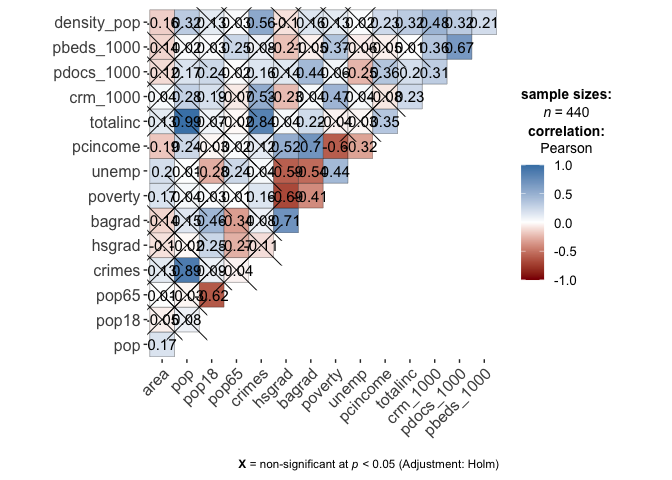

draft\_yma
================
Anna Ma
12/12/2021

## Data exploration

**converted variables to per person and docs, beds, etc.**

``` r
cdi = read_csv("cdi.csv") %>%
  janitor::clean_names() %>%
  mutate(crm_1000 = 1000*(crimes/pop),
         pdocs_1000 = 1000*(docs/pop),
         pbeds_1000 = 1000*(beds/pop),
         density_pop = pop/area,
         # convert region to factors and recoded them accordingly 
         region = factor(region, levels = 1:4,
                    labels = c("northeast", "north central", "south", "west"))) %>% select(-c(docs,beds)) %>% view()
```

### Descriptive statistics of all varaibles

``` r
cdi_descriptive = cdi %>% select(-c(id,cty,state,region))

# Global
skimr::skim(cdi_descriptive) %>% 
  select(-c("skim_type","complete_rate")) %>% 
    mutate(skim_variable = 
             recode(skim_variable, pcincome = "pcincome (in dollars)", totalinc = "totalinc (in million of dollars)"
  )) %>% 
  knitr::kable(
    col.names = c("variable", "n_missing", "mean","sd","min","Q25","median","Q75","max","histogram"),
    caption = "Global Summary", digits = 4)
```

| variable                         | n\_missing |        mean |          sd |         min |         Q25 |      median |         Q75 |          max | histogram |
|:---------------------------------|-----------:|------------:|------------:|------------:|------------:|------------:|------------:|-------------:|:----------|
| area                             |          0 |   1041.4114 |   1549.9221 |     15.0000 |    451.2500 |    656.5000 |    946.7500 |   20062.0000 | ▇▁▁▁▁     |
| pop                              |          0 | 393010.9205 | 601987.0165 | 100043.0000 | 139027.2500 | 217280.5000 | 436064.5000 | 8863164.0000 | ▇▁▁▁▁     |
| pop18                            |          0 |     28.5684 |      4.1911 |     16.4000 |     26.2000 |     28.1000 |     30.0250 |      49.7000 | ▁▇▃▁▁     |
| pop65                            |          0 |     12.1698 |      3.9927 |      3.0000 |      9.8750 |     11.7500 |     13.6250 |      33.8000 | ▂▇▁▁▁     |
| crimes                           |          0 |  27111.6182 |  58237.5064 |    563.0000 |   6219.5000 |  11820.5000 |  26279.5000 |  688936.0000 | ▇▁▁▁▁     |
| hsgrad                           |          0 |     77.5607 |      7.0152 |     46.6000 |     73.8750 |     77.7000 |     82.4000 |      92.9000 | ▁▁▃▇▃     |
| bagrad                           |          0 |     21.0811 |      7.6545 |      8.1000 |     15.2750 |     19.7000 |     25.3250 |      52.3000 | ▆▇▃▁▁     |
| poverty                          |          0 |      8.7207 |      4.6567 |      1.4000 |      5.3000 |      7.9000 |     10.9000 |      36.3000 | ▇▆▁▁▁     |
| unemp                            |          0 |      6.5966 |      2.3379 |      2.2000 |      5.1000 |      6.2000 |      7.5000 |      21.3000 | ▇▇▁▁▁     |
| pcincome (in dollars)            |          0 |  18561.4818 |   4059.1920 |   8899.0000 |  16118.2500 |  17759.0000 |  20270.0000 |   37541.0000 | ▁▇▂▁▁     |
| totalinc (in million of dollars) |          0 |   7869.2727 |  12884.3215 |   1141.0000 |   2311.0000 |   3857.0000 |   8654.2500 |  184230.0000 | ▇▁▁▁▁     |
| crm\_1000                        |          0 |     57.2864 |     27.3277 |      4.6014 |     38.1019 |     52.4286 |     72.5969 |     295.9867 | ▇▅▁▁▁     |
| pdocs\_1000                      |          0 |      2.1230 |      1.5329 |      0.3559 |      1.2127 |      1.7509 |      2.4915 |      17.0377 | ▇▁▁▁▁     |
| pbeds\_1000                      |          0 |      3.6493 |      2.0011 |      0.1649 |      2.1972 |      3.3287 |      4.5649 |      19.6982 | ▇▃▁▁▁     |
| density\_pop                     |          0 |    888.4388 |   2194.7231 |     13.2587 |    192.3449 |    335.9081 |    756.5516 |   32403.7183 | ▇▁▁▁▁     |

Global Summary

Q: 1. do we need to group them by state or county? group by gounty gives
5000+ rows though… 2. do we need box plot still? 3. again, transfer some
variables to “per pop” / “per 1000 pop” ?

### Descriptive analysis

We can use the box plot/ or histogram to check for normality. But I
forgot when do we need normality…isn’t it for residual??

``` r
par(mfrow = c(3,5))

boxplot(cdi$density_pop,  main = "density_pop")
boxplot(cdi$area, main = "area")

boxplot(cdi$pop, main = "pop")
boxplot(cdi$pop18, main = "pop18")
boxplot(cdi$pop65, main = "pop65")

boxplot(cdi$pdocs_1000, main = "pdocs_1000")
boxplot(cdi$pbeds_1000, main = "pbeds_1000")

boxplot(cdi$crm_1000,  main = "crm_1000")

boxplot(cdi$hsgrad, main = "hsgrad")
boxplot(cdi$bagrad, main = "bagrad")
boxplot(cdi$poverty, main = "poverty")
boxplot(cdi$unemp,main = "unemp")
boxplot(cdi$pcincome, main = "pcincome")
boxplot(cdi$totalinc, main = "totalinc")
```

<!-- -->

### Correlation

#### Pairwise relationship

-   This gives us an idea of the correlation between each variable, but
    my old project build whole model first then assessed the
    correlation. Need Discussion!

``` r
library(corrplot)
```

    ## corrplot 0.92 loaded

``` r
corrplot(cor(cdi_descriptive), type = "upper", diag = FALSE)
```

<!-- -->

-   Here is the correlation with pairs function. More specific than the
    heat map above. We can observe the correlation between all the terms
    here

``` r
pairs(crm_1000 ~.,data=cdi_descriptive, panel = panel.smooth, upper.panel = NULL, main = "Scatterplot Matrix")
```

<!-- -->

#### Marginal distribution ?

``` r
library(ggplot2)
library(ggExtra)
```

``` r
marg_den = cdi %>% ggplot(aes(x = density_pop, y = crm_1000)) + geom_point(alpha = 0.3) + geom_smooth(method = 'lm', se = TRUE, color = 'red')
ggMarginal(marg_den, type = "histogram", fill="transparent")
```

    ## `geom_smooth()` using formula 'y ~ x'
    ## `geom_smooth()` using formula 'y ~ x'

<!-- -->

``` r
marg_area = cdi %>% ggplot(aes(x = area, y = crm_1000)) + geom_point(alpha = 0.3) + geom_smooth(method = 'lm', se = TRUE, color = 'red')
ggMarginal(marg_area, type = "histogram", fill="transparent")
```

    ## `geom_smooth()` using formula 'y ~ x'
    ## `geom_smooth()` using formula 'y ~ x'

<!-- -->

``` r
marg_pop = cdi %>% ggplot(aes(x = pop, y = crm_1000)) + geom_point(alpha = 0.3) + geom_smooth(method = 'lm', se = TRUE, color = 'red')
ggMarginal(marg_pop, type = "histogram", fill="transparent")
```

    ## `geom_smooth()` using formula 'y ~ x'
    ## `geom_smooth()` using formula 'y ~ x'

<!-- -->

``` r
marg_pop18 = cdi %>% ggplot(aes(x = pop18, y = crm_1000)) + geom_point(alpha = 0.3) + geom_smooth(method = 'lm', se = TRUE, color = 'red')
# positive correlation
ggMarginal(marg_pop18, type = "histogram", fill="transparent")
```

    ## `geom_smooth()` using formula 'y ~ x'
    ## `geom_smooth()` using formula 'y ~ x'

<!-- -->

``` r
marg_pop65 = cdi %>% ggplot(aes(x = pop65, y = crm_1000)) + geom_point(alpha = 0.3) + geom_smooth(method = 'lm', se = TRUE, color = 'red')
ggMarginal(marg_pop65, type = "histogram", fill="transparent")
```

    ## `geom_smooth()` using formula 'y ~ x'
    ## `geom_smooth()` using formula 'y ~ x'

<!-- -->

``` r
marg_pdocs_1000 = cdi %>% ggplot(aes(x = pdocs_1000, y = crm_1000)) + geom_point(alpha = 0.3) + geom_smooth(method = 'lm', se = TRUE, color = 'red')
ggMarginal(marg_pdocs_1000, type = "histogram", fill="transparent")
```

    ## `geom_smooth()` using formula 'y ~ x'
    ## `geom_smooth()` using formula 'y ~ x'

<!-- -->

``` r
marg_pbeds_1000 = cdi %>% ggplot(aes(x = pbeds_1000, y = crm_1000)) + geom_point(alpha = 0.3) + geom_smooth(method = 'lm', se = TRUE, color = 'red')
ggMarginal(marg_pbeds_1000, type = "histogram", fill="transparent")
```

    ## `geom_smooth()` using formula 'y ~ x'
    ## `geom_smooth()` using formula 'y ~ x'

<!-- -->

``` r
marg_hsgrad = cdi %>% ggplot(aes(x = hsgrad, y = crm_1000)) + geom_point(alpha = 0.3) + geom_smooth(method = 'lm', se = TRUE, color = 'red') #negative correlation
ggMarginal(marg_hsgrad, type = "histogram", fill="transparent")
```

    ## `geom_smooth()` using formula 'y ~ x'
    ## `geom_smooth()` using formula 'y ~ x'

<!-- -->

``` r
marg_bagrad = cdi %>% ggplot(aes(x = bagrad, y = crm_1000)) + geom_point(alpha = 0.3) + geom_smooth(method = 'lm', se = TRUE, color = 'red')
ggMarginal(marg_bagrad, type = "histogram", fill="transparent")
```

    ## `geom_smooth()` using formula 'y ~ x'
    ## `geom_smooth()` using formula 'y ~ x'

<!-- -->

``` r
marg_poverty = cdi %>% ggplot(aes(x = poverty, y = crm_1000)) + geom_point(alpha = 0.3) + geom_smooth(method = 'lm', se = TRUE, color = 'red') # positive correlation
ggMarginal(marg_poverty, type = "histogram", fill="transparent")
```

    ## `geom_smooth()` using formula 'y ~ x'
    ## `geom_smooth()` using formula 'y ~ x'

<!-- -->

``` r
marg_unemp = cdi %>% ggplot(aes(x = unemp, y = crm_1000)) + geom_point(alpha = 0.3) + geom_smooth(method = 'lm', se = TRUE, color = 'red')
ggMarginal(marg_unemp, type = "histogram", fill="transparent")
```

    ## `geom_smooth()` using formula 'y ~ x'
    ## `geom_smooth()` using formula 'y ~ x'

<!-- -->

``` r
marg_pcincome = cdi %>% ggplot(aes(x = pcincome, y = crm_1000)) + geom_point(alpha = 0.3) + geom_smooth(method = 'lm', se = TRUE, color = 'red')
ggMarginal(marg_pcincome, type = "histogram", fill="transparent")
```

    ## `geom_smooth()` using formula 'y ~ x'
    ## `geom_smooth()` using formula 'y ~ x'

<!-- -->

``` r
marg_totalinc = cdi %>% ggplot(aes(x = totalinc, y = crm_1000)) + geom_point(alpha = 0.3) + geom_smooth(method = 'lm', se = TRUE, color = 'red')
ggMarginal(marg_totalinc, type = "histogram", fill="transparent")
```

    ## `geom_smooth()` using formula 'y ~ x'
    ## `geom_smooth()` using formula 'y ~ x'

<!-- -->

### Distribution of outcome

``` r
cdi %>% 
  ggplot(aes(x = crm_1000)) +
  geom_histogram()
```

    ## `stat_bin()` using `bins = 30`. Pick better value with `binwidth`.

<!-- -->

``` r
# log transfor the outcome
cdi %>% 
  ggplot(aes(x = log(crm_1000))) +
  geom_histogram()
```

    ## `stat_bin()` using `bins = 30`. Pick better value with `binwidth`.

<!-- -->

do we look at the distribution of outcome like this and transform them
here? check again

### States with unusual rates

group by state

``` r
cdi_by_state = cdi %>% group_by(state) %>% 
  summarise(state_pop = sum(pop),
            state_crimes = sum(crimes)) %>% 
  mutate(state_CRM_1000 = 1000*state_crimes/state_pop)
```

Not sure what counts as out lier, this is what the other group did.

``` r
upper = quantile(cdi$crm_1000, 0.75)
lower = quantile(cdi$crm_1000, 0.25)
IQR = upper - lower
cdi %>% 
  filter(crm_1000 > upper + 1.5*IQR,
         crm_1000 > lower - 1.5*IQR) %>% 
  dplyr::select(cty, crm_1000) %>%
  knitr::kable(digits = 2)
```

| cty       | crm\_1000 |
|:----------|----------:|
| Kings     |    295.99 |
| Dade      |    126.34 |
| Fulton    |    143.35 |
| St.\_Loui |    161.60 |

This shows no outlier on the state level tho…

``` r
upper = quantile(cdi_by_state$state_CRM_1000, 0.75)
lower = quantile(cdi_by_state$state_CRM_1000, 0.25)
IQR = upper - lower
cdi_by_state %>% 
  filter(state_CRM_1000 > upper + 1.5*IQR,
         state_CRM_1000 > lower - 1.5*IQR) %>% 
  dplyr::select(state, state_CRM_1000) %>%
  knitr::kable(digits = 2)
```

| state | state\_CRM\_1000 |
|:------|-----------------:|

``` r
boxplot(cdi_by_state$state_CRM_1000, main = 'State Crime Rate per 1000 people')
```

<!-- -->
