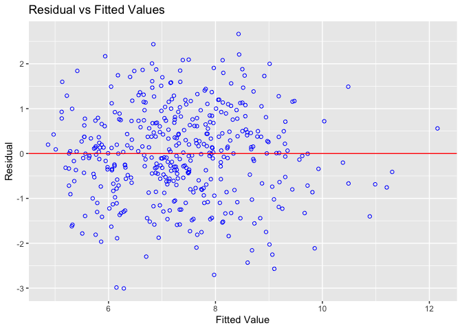

draft_yma
================
Anna Ma
12/12/2021

## Data exploration

**converted variables to per person and docs, beds, etc.**

``` r
cdi = read_csv("cdi.csv") %>%
  janitor::clean_names() %>%
  mutate(crm_1000 = 1000*(crimes/pop),
         pdocs_1000 = 1000*(docs/pop),
         pbeds_1000 = 1000*(beds/pop),
         density_pop = pop/area,
         # convert region to factors and recoded them accordingly 
         region = factor(region, levels = 1:4,
                    labels = c("northeast", "northcentral", "south", "west"))) %>% select(-c(docs,beds))
```

### Descriptive statistics of all varaibles

``` r
cdi_descriptive = cdi %>% select(-c(id,cty,state,region))

# Global
skimr::skim(cdi_descriptive) %>% 
  select(-c("skim_type","complete_rate")) %>% 
    mutate(skim_variable = 
             recode(skim_variable, pcincome = "pcincome (in dollars)", totalinc = "totalinc (in million of dollars)"
  )) %>% 
  knitr::kable(
    col.names = c("variable", "n_missing", "mean","sd","min","Q25","median","Q75","max","histogram"),
    caption = "Global Summary", digits = 4)
```

| variable                         | n_missing |        mean |          sd |         min |         Q25 |      median |         Q75 |          max | histogram |
|:---------------------------------|----------:|------------:|------------:|------------:|------------:|------------:|------------:|-------------:|:----------|
| area                             |         0 |   1041.4114 |   1549.9221 |     15.0000 |    451.2500 |    656.5000 |    946.7500 |   20062.0000 | ▇▁▁▁▁     |
| pop                              |         0 | 393010.9205 | 601987.0165 | 100043.0000 | 139027.2500 | 217280.5000 | 436064.5000 | 8863164.0000 | ▇▁▁▁▁     |
| pop18                            |         0 |     28.5684 |      4.1911 |     16.4000 |     26.2000 |     28.1000 |     30.0250 |      49.7000 | ▁▇▃▁▁     |
| pop65                            |         0 |     12.1698 |      3.9927 |      3.0000 |      9.8750 |     11.7500 |     13.6250 |      33.8000 | ▂▇▁▁▁     |
| crimes                           |         0 |  27111.6182 |  58237.5064 |    563.0000 |   6219.5000 |  11820.5000 |  26279.5000 |  688936.0000 | ▇▁▁▁▁     |
| hsgrad                           |         0 |     77.5607 |      7.0152 |     46.6000 |     73.8750 |     77.7000 |     82.4000 |      92.9000 | ▁▁▃▇▃     |
| bagrad                           |         0 |     21.0811 |      7.6545 |      8.1000 |     15.2750 |     19.7000 |     25.3250 |      52.3000 | ▆▇▃▁▁     |
| poverty                          |         0 |      8.7207 |      4.6567 |      1.4000 |      5.3000 |      7.9000 |     10.9000 |      36.3000 | ▇▆▁▁▁     |
| unemp                            |         0 |      6.5966 |      2.3379 |      2.2000 |      5.1000 |      6.2000 |      7.5000 |      21.3000 | ▇▇▁▁▁     |
| pcincome (in dollars)            |         0 |  18561.4818 |   4059.1920 |   8899.0000 |  16118.2500 |  17759.0000 |  20270.0000 |   37541.0000 | ▁▇▂▁▁     |
| totalinc (in million of dollars) |         0 |   7869.2727 |  12884.3215 |   1141.0000 |   2311.0000 |   3857.0000 |   8654.2500 |  184230.0000 | ▇▁▁▁▁     |
| crm_1000                         |         0 |     57.2864 |     27.3277 |      4.6014 |     38.1019 |     52.4286 |     72.5969 |     295.9867 | ▇▅▁▁▁     |
| pdocs_1000                       |         0 |      2.1230 |      1.5329 |      0.3559 |      1.2127 |      1.7509 |      2.4915 |      17.0377 | ▇▁▁▁▁     |
| pbeds_1000                       |         0 |      3.6493 |      2.0011 |      0.1649 |      2.1972 |      3.3287 |      4.5649 |      19.6982 | ▇▃▁▁▁     |
| density_pop                      |         0 |    888.4388 |   2194.7231 |     13.2587 |    192.3449 |    335.9081 |    756.5516 |   32403.7183 | ▇▁▁▁▁     |

Global Summary

Q: 1. do we need to group them by state or county? group by gounty gives
5000+ rows though… 2. do we need box plot still? 3. again, transfer some
variables to “per pop” / “per 1000 pop” ?

### Descriptive analysis

We can use the box plot/ or histogram to check for normality. But I
forgot when do we need normality…isn’t it for residual??

``` r
par(mfrow = c(2,7))

boxplot(cdi$density_pop, main = "density_pop")
boxplot(cdi$area, main = "area")

boxplot(cdi$pop, main = "pop")
boxplot(cdi$pop18, main = "pop18")
boxplot(cdi$pop65, main = "pop65")

boxplot(cdi$pdocs_1000, main = "pdocs_1000")
boxplot(cdi$pbeds_1000, main = "pbeds_1000")

boxplot(cdi$crm_1000,  main = "crm_1000")

boxplot(cdi$hsgrad, main = "hsgrad")
boxplot(cdi$bagrad, main = "bagrad")
boxplot(cdi$poverty, main = "poverty")
boxplot(cdi$unemp,main = "unemp")
boxplot(cdi$pcincome, main = "pcincome")
boxplot(cdi$totalinc, main = "totalinc")
```

<!-- -->

### Correlation

#### Pairwise relationship

-   This gives us an idea of the correlation between each variable, but
    my old project build whole model first then assessed the
    correlation. Need Discussion!

``` r
library(corrplot)
```

    ## corrplot 0.92 loaded

``` r
cor(cdi_descriptive) %>% knitr::kable()
```

|             |       area |        pop |      pop18 |      pop65 |     crimes |     hsgrad |     bagrad |    poverty |      unemp |   pcincome |   totalinc |   crm_1000 | pdocs_1000 | pbeds_1000 | density_pop |
|:------------|-----------:|-----------:|-----------:|-----------:|-----------:|-----------:|-----------:|-----------:|-----------:|-----------:|-----------:|-----------:|-----------:|-----------:|------------:|
| area        |  1.0000000 |  0.1730834 | -0.0548781 |  0.0057709 |  0.1294754 | -0.0985981 | -0.1372377 |  0.1713433 |  0.1992093 | -0.1877151 |  0.1270743 |  0.0429484 | -0.1163860 | -0.1412335 |  -0.1568156 |
| pop         |  0.1730834 |  1.0000000 |  0.0783721 | -0.0290374 |  0.8863318 | -0.0174269 |  0.1468138 |  0.0380195 |  0.0053517 |  0.2356102 |  0.9867476 |  0.2800992 |  0.1668595 |  0.0203012 |   0.3220266 |
| pop18       | -0.0548781 |  0.0783721 |  1.0000000 | -0.6163096 |  0.0899406 |  0.2505843 |  0.4560970 |  0.0339755 | -0.2785271 | -0.0316484 |  0.0711615 |  0.1905688 |  0.2370280 |  0.0295244 |   0.1254644 |
| pop65       |  0.0057709 | -0.0290374 | -0.6163096 |  1.0000000 | -0.0352903 | -0.2682518 | -0.3392288 |  0.0065785 |  0.2363094 |  0.0185907 | -0.0227332 | -0.0665333 |  0.0186087 |  0.2471479 |   0.0291845 |
| crimes      |  0.1294754 |  0.8863318 |  0.0899406 | -0.0352903 |  1.0000000 | -0.1063284 |  0.0770765 |  0.1644057 |  0.0435568 |  0.1175391 |  0.8430980 |  0.5300430 |  0.1577103 |  0.0778907 |   0.5609842 |
| hsgrad      | -0.0985981 | -0.0174269 |  0.2505843 | -0.2682518 | -0.1063284 |  1.0000000 |  0.7077867 | -0.6917505 | -0.5935958 |  0.5229961 |  0.0433557 | -0.2264129 |  0.1427765 | -0.2111625 |  -0.1040070 |
| bagrad      | -0.1372377 |  0.1468138 |  0.4560970 | -0.3392288 |  0.0770765 |  0.7077867 |  1.0000000 | -0.4084238 | -0.5409069 |  0.6953619 |  0.2222301 |  0.0383046 |  0.4410463 | -0.0454183 |   0.1556063 |
| poverty     |  0.1713433 |  0.0380195 |  0.0339755 |  0.0065785 |  0.1644057 | -0.6917505 | -0.4084238 |  1.0000000 |  0.4369472 | -0.6017250 | -0.0387393 |  0.4718442 |  0.0637048 |  0.3713989 |   0.1265079 |
| unemp       |  0.1992093 |  0.0053517 | -0.2785271 |  0.2363094 |  0.0435568 | -0.5935958 | -0.5409069 |  0.4369472 |  1.0000000 | -0.3221444 | -0.0338763 |  0.0418466 | -0.2478866 | -0.0624878 |   0.0227179 |
| pcincome    | -0.1877151 |  0.2356102 | -0.0316484 |  0.0185907 |  0.1175391 |  0.5229961 |  0.6953619 | -0.6017250 | -0.3221444 |  1.0000000 |  0.3476816 | -0.0802442 |  0.3600458 | -0.0535500 |   0.2332260 |
| totalinc    |  0.1270743 |  0.9867476 |  0.0711615 | -0.0227332 |  0.8430980 |  0.0433557 |  0.2222301 | -0.0387393 | -0.0338763 |  0.3476816 |  1.0000000 |  0.2281557 |  0.1991038 |  0.0063239 |   0.3162048 |
| crm_1000    |  0.0429484 |  0.2800992 |  0.1905688 | -0.0665333 |  0.5300430 | -0.2264129 |  0.0383046 |  0.4718442 |  0.0418466 | -0.0802442 |  0.2281557 |  1.0000000 |  0.3070831 |  0.3644505 |   0.4804285 |
| pdocs_1000  | -0.1163860 |  0.1668595 |  0.2370280 |  0.0186087 |  0.1577103 |  0.1427765 |  0.4410463 |  0.0637048 | -0.2478866 |  0.3600458 |  0.1991038 |  0.3070831 |  1.0000000 |  0.6666947 |   0.3180424 |
| pbeds_1000  | -0.1412335 |  0.0203012 |  0.0295244 |  0.2471479 |  0.0778907 | -0.2111625 | -0.0454183 |  0.3713989 | -0.0624878 | -0.0535500 |  0.0063239 |  0.3644505 |  0.6666947 |  1.0000000 |   0.2064177 |
| density_pop | -0.1568156 |  0.3220266 |  0.1254644 |  0.0291845 |  0.5609842 | -0.1040070 |  0.1556063 |  0.1265079 |  0.0227179 |  0.2332260 |  0.3162048 |  0.4804285 |  0.3180424 |  0.2064177 |   1.0000000 |

``` r
library(ggcorrplot)
library(ggstatsplot)
```

    ## You can cite this package as:
    ##      Patil, I. (2021). Visualizations with statistical details: The 'ggstatsplot' approach.
    ##      Journal of Open Source Software, 6(61), 3167, doi:10.21105/joss.03167

``` r
ggstatsplot::ggcorrmat(
  data = cdi_descriptive,
  type = "parametric", # parametric for Pearson, nonparametric for Spearman's correlation
  colors = c("darkred", "white", "steelblue") # change default colors
)
```

<!-- -->

-   Here is the correlation with pairs function. More specific than the
    heat map above. We can observe the correlation between all the terms
    here

``` r
pairs(crm_1000 ~.,data=cdi_descriptive, panel = panel.smooth, upper.panel = NULL, main = "Scatterplot Matrix")
```

<!-- -->

#### Marginal distribution ?

``` r
library(ggplot2)
library(ggExtra)
```

``` r
marg_den = cdi %>% ggplot(aes(x = density_pop, y = crm_1000)) + geom_point(alpha = 0.3) + geom_smooth(method = 'lm', se = TRUE, color = 'red')
ggMarginal(marg_den, type = "histogram", fill="transparent")
```

    ## `geom_smooth()` using formula 'y ~ x'
    ## `geom_smooth()` using formula 'y ~ x'

<!-- -->

``` r
marg_area = cdi %>% ggplot(aes(x = area, y = crm_1000)) + geom_point(alpha = 0.3) + geom_smooth(method = 'lm', se = TRUE, color = 'red')
ggMarginal(marg_area, type = "histogram", fill="transparent")
```

    ## `geom_smooth()` using formula 'y ~ x'
    ## `geom_smooth()` using formula 'y ~ x'

<!-- -->

``` r
marg_pop = cdi %>% ggplot(aes(x = pop, y = crm_1000)) + geom_point(alpha = 0.3) + geom_smooth(method = 'lm', se = TRUE, color = 'red')
ggMarginal(marg_pop, type = "histogram", fill="transparent")
```

    ## `geom_smooth()` using formula 'y ~ x'
    ## `geom_smooth()` using formula 'y ~ x'

<!-- -->

``` r
marg_pop18 = cdi %>% ggplot(aes(x = pop18, y = crm_1000)) + geom_point(alpha = 0.3) + geom_smooth(method = 'lm', se = TRUE, color = 'red')
# positive correlation
ggMarginal(marg_pop18, type = "histogram", fill="transparent")
```

    ## `geom_smooth()` using formula 'y ~ x'
    ## `geom_smooth()` using formula 'y ~ x'

<!-- -->

``` r
marg_pop65 = cdi %>% ggplot(aes(x = pop65, y = crm_1000)) + geom_point(alpha = 0.3) + geom_smooth(method = 'lm', se = TRUE, color = 'red')
ggMarginal(marg_pop65, type = "histogram", fill="transparent")
```

    ## `geom_smooth()` using formula 'y ~ x'
    ## `geom_smooth()` using formula 'y ~ x'

<!-- -->

``` r
marg_pdocs_1000 = cdi %>% ggplot(aes(x = pdocs_1000, y = crm_1000)) + geom_point(alpha = 0.3) + geom_smooth(method = 'lm', se = TRUE, color = 'red')
ggMarginal(marg_pdocs_1000, type = "histogram", fill="transparent")
```

    ## `geom_smooth()` using formula 'y ~ x'
    ## `geom_smooth()` using formula 'y ~ x'

<!-- -->

``` r
marg_pbeds_1000 = cdi %>% ggplot(aes(x = pbeds_1000, y = crm_1000)) + geom_point(alpha = 0.3) + geom_smooth(method = 'lm', se = TRUE, color = 'red')
ggMarginal(marg_pbeds_1000, type = "histogram", fill="transparent")
```

    ## `geom_smooth()` using formula 'y ~ x'
    ## `geom_smooth()` using formula 'y ~ x'

<!-- -->

``` r
marg_hsgrad = cdi %>% ggplot(aes(x = hsgrad, y = crm_1000)) + geom_point(alpha = 0.3) + geom_smooth(method = 'lm', se = TRUE, color = 'red') #negative correlation
ggMarginal(marg_hsgrad, type = "histogram", fill="transparent")
```

    ## `geom_smooth()` using formula 'y ~ x'
    ## `geom_smooth()` using formula 'y ~ x'

<!-- -->

``` r
marg_bagrad = cdi %>% ggplot(aes(x = bagrad, y = crm_1000)) + geom_point(alpha = 0.3) + geom_smooth(method = 'lm', se = TRUE, color = 'red')
ggMarginal(marg_bagrad, type = "histogram", fill="transparent")
```

    ## `geom_smooth()` using formula 'y ~ x'
    ## `geom_smooth()` using formula 'y ~ x'

<!-- -->

``` r
marg_poverty = cdi %>% ggplot(aes(x = poverty, y = crm_1000)) + geom_point(alpha = 0.3) + geom_smooth(method = 'lm', se = TRUE, color = 'red') # positive correlation
ggMarginal(marg_poverty, type = "histogram", fill="transparent")
```

    ## `geom_smooth()` using formula 'y ~ x'
    ## `geom_smooth()` using formula 'y ~ x'

<!-- -->

``` r
marg_unemp = cdi %>% ggplot(aes(x = unemp, y = crm_1000)) + geom_point(alpha = 0.3) + geom_smooth(method = 'lm', se = TRUE, color = 'red')
ggMarginal(marg_unemp, type = "histogram", fill="transparent")
```

    ## `geom_smooth()` using formula 'y ~ x'
    ## `geom_smooth()` using formula 'y ~ x'

<!-- -->

``` r
marg_pcincome = cdi %>% ggplot(aes(x = pcincome, y = crm_1000)) + geom_point(alpha = 0.3) + geom_smooth(method = 'lm', se = TRUE, color = 'red')
ggMarginal(marg_pcincome, type = "histogram", fill="transparent")
```

    ## `geom_smooth()` using formula 'y ~ x'
    ## `geom_smooth()` using formula 'y ~ x'

<!-- -->

``` r
marg_totalinc = cdi %>% ggplot(aes(x = totalinc, y = crm_1000)) + geom_point(alpha = 0.3) + geom_smooth(method = 'lm', se = TRUE, color = 'red')
ggMarginal(marg_totalinc, type = "histogram", fill="transparent")
```

    ## `geom_smooth()` using formula 'y ~ x'
    ## `geom_smooth()` using formula 'y ~ x'

<!-- -->

### Distribution of outcome

``` r
cdi %>% 
  ggplot(aes(x = crm_1000)) +
  geom_histogram()
```

    ## `stat_bin()` using `bins = 30`. Pick better value with `binwidth`.

<!-- -->

do we look at the distribution of outcome like this and transform them
here? check again

### Counties with unusual rates

``` r
upper = quantile(cdi$crm_1000, 0.75)
lower = quantile(cdi$crm_1000, 0.25)
IQR = upper - lower
cdi %>% 
  filter(crm_1000 > upper + 1.5*IQR,
         crm_1000 > lower - 1.5*IQR) %>% 
  dplyr::select(cty, crm_1000) %>%
  knitr::kable(digits = 2)
```

| cty       | crm_1000 |
|:----------|---------:|
| Kings     |   295.99 |
| Dade      |   126.34 |
| Fulton    |   143.35 |
| St.\_Loui |   161.60 |

## Model!

**Q: do we need more descriptive analysis, visualization? rate of crime
for each state?**

#### Full model predictors

this model used `northeast` as the reference level for region

``` r
cdi_model = cdi %>% select(-c(id,cty,state,area,crimes,totalinc))

# use 
full_fit = lm(crm_1000 ~ ., data = cdi_model)
summary(full_fit)
```

    ## 
    ## Call:
    ## lm(formula = crm_1000 ~ ., data = cdi_model)
    ## 
    ## Residuals:
    ##     Min      1Q  Median      3Q     Max 
    ## -47.786 -11.422  -0.934  10.200  75.180 
    ## 
    ## Coefficients:
    ##                      Estimate Std. Error t value Pr(>|t|)    
    ## (Intercept)        -6.922e+01  2.739e+01  -2.528 0.011849 *  
    ## pop                 5.486e-06  1.579e-06   3.474 0.000566 ***
    ## pop18               6.947e-01  3.305e-01   2.102 0.036150 *  
    ## pop65              -1.998e-01  3.055e-01  -0.654 0.513410    
    ## hsgrad              6.143e-01  2.690e-01   2.284 0.022864 *  
    ## bagrad             -4.835e-01  2.971e-01  -1.628 0.104327    
    ## poverty             1.856e+00  3.864e-01   4.803 2.17e-06 ***
    ## unemp               6.111e-01  5.314e-01   1.150 0.250812    
    ## pcincome            1.039e-03  4.734e-04   2.195 0.028670 *  
    ## regionnorthcentral  8.978e+00  2.732e+00   3.286 0.001100 ** 
    ## regionsouth         2.779e+01  2.659e+00  10.453  < 2e-16 ***
    ## regionwest          2.118e+01  3.125e+00   6.778 4.09e-11 ***
    ## pdocs_1000         -6.634e-01  1.019e+00  -0.651 0.515556    
    ## pbeds_1000          3.157e+00  7.939e-01   3.977 8.21e-05 ***
    ## density_pop         4.901e-03  4.537e-04  10.802  < 2e-16 ***
    ## ---
    ## Signif. codes:  0 '***' 0.001 '**' 0.01 '*' 0.05 '.' 0.1 ' ' 1
    ## 
    ## Residual standard error: 17.81 on 425 degrees of freedom
    ## Multiple R-squared:  0.589,  Adjusted R-squared:  0.5755 
    ## F-statistic: 43.51 on 14 and 425 DF,  p-value: < 2.2e-16

``` r
olsrr::ols_plot_resid_qq(full_fit)
```

<!-- -->

``` r
olsrr::ols_plot_resid_fit(full_fit)
```

<!-- -->

## Transformation

``` r
lambda = MASS::boxcox(full_fit)
```

<!-- -->

``` r
optlam = lambda$x[which.max(lambda$y)]
optlam
```

    ## [1] 0.5454545

The lambda from the transformation is 0.5454, so we will try to fit a
square root transformation to Y

### New tibble with transformed crm_1000 -> crm_1000_sqr

``` r
cdi_trans = cdi_model %>% mutate(crm_1000_sqr = crm_1000^0.5) %>% select(-c(crm_1000))
```

``` r
trans_fit = lm(crm_1000_sqr ~ .,data = cdi_trans)
summary(trans_fit)
```

    ## 
    ## Call:
    ## lm(formula = crm_1000_sqr ~ ., data = cdi_trans)
    ## 
    ## Residuals:
    ##     Min      1Q  Median      3Q     Max 
    ## -4.0410 -0.7300  0.0708  0.7485  4.0273 
    ## 
    ## Coefficients:
    ##                      Estimate Std. Error t value Pr(>|t|)    
    ## (Intercept)        -1.645e+00  1.802e+00  -0.913 0.361766    
    ## pop                 3.624e-07  1.039e-07   3.488 0.000537 ***
    ## pop18               6.320e-02  2.174e-02   2.907 0.003844 ** 
    ## pop65              -3.609e-03  2.009e-02  -0.180 0.857548    
    ## hsgrad              3.479e-02  1.769e-02   1.966 0.049933 *  
    ## bagrad             -3.472e-02  1.954e-02  -1.777 0.076307 .  
    ## poverty             1.192e-01  2.542e-02   4.688 3.72e-06 ***
    ## unemp               4.305e-02  3.496e-02   1.232 0.218783    
    ## pcincome            9.589e-05  3.114e-05   3.079 0.002213 ** 
    ## regionnorthcentral  7.062e-01  1.797e-01   3.929 9.94e-05 ***
    ## regionsouth         1.996e+00  1.749e-01  11.413  < 2e-16 ***
    ## regionwest          1.674e+00  2.056e-01   8.142 4.37e-15 ***
    ## pdocs_1000         -3.845e-02  6.706e-02  -0.573 0.566744    
    ## pbeds_1000          2.120e-01  5.223e-02   4.059 5.86e-05 ***
    ## density_pop         2.150e-04  2.984e-05   7.203 2.69e-12 ***
    ## ---
    ## Signif. codes:  0 '***' 0.001 '**' 0.01 '*' 0.05 '.' 0.1 ' ' 1
    ## 
    ## Residual standard error: 1.171 on 425 degrees of freedom
    ## Multiple R-squared:  0.5602, Adjusted R-squared:  0.5457 
    ## F-statistic: 38.66 on 14 and 425 DF,  p-value: < 2.2e-16

``` r
olsrr::ols_plot_resid_fit(trans_fit)
```

<!-- -->

``` r
olsrr::ols_plot_resid_qq(trans_fit)
```

<!-- -->

``` r
lambda_trans = MASS::boxcox(trans_fit)
```

<!-- -->

``` r
optlam_trans = lambda_trans$x[which.max(lambda_trans$y)]
optlam_trans
```

    ## [1] 1.111111

### Counties with unusual rates

``` r
upper = quantile(cdi_trans$crm_1000_sqr, 0.75)
lower = quantile(cdi_trans$crm_1000_sqr, 0.25)
IQR = upper - lower

cdi_trans %>% 
  filter(crm_1000_sqr > upper + 1.5*IQR,
         crm_1000_sqr > lower - 1.5*IQR) %>% 
  dplyr::select(crm_1000_sqr) %>% 
  mutate(cty = c("Kings", "St._Loui")) %>% 
  knitr::kable(digits = 2)
```

| crm_1000_sqr | cty       |
|-------------:|:----------|
|        17.20 | Kings     |
|        12.71 | St.\_Loui |

``` r
# cdi %>% filter(pop == 2300664 | pop == 396685) %>% select(cty,pop)
```

#### Backward

``` r
fit_back = step(trans_fit, direction='backward')
```

    ## Start:  AIC=153.85
    ## crm_1000_sqr ~ pop + pop18 + pop65 + hsgrad + bagrad + poverty + 
    ##     unemp + pcincome + region + pdocs_1000 + pbeds_1000 + density_pop
    ## 
    ##               Df Sum of Sq    RSS    AIC
    ## - pop65        1     0.044 583.09 151.89
    ## - pdocs_1000   1     0.451 583.49 152.19
    ## - unemp        1     2.081 585.12 153.42
    ## <none>                     583.04 153.85
    ## - bagrad       1     4.331 587.37 155.11
    ## - hsgrad       1     5.303 588.35 155.84
    ## - pop18        1    11.591 594.63 160.51
    ## - pcincome     1    13.004 596.05 161.56
    ## - pop          1    16.690 599.73 164.27
    ## - pbeds_1000   1    22.604 605.65 168.59
    ## - poverty      1    30.154 613.20 174.04
    ## - density_pop  1    71.185 654.23 202.54
    ## - region       3   205.212 788.25 280.54
    ## 
    ## Step:  AIC=151.89
    ## crm_1000_sqr ~ pop + pop18 + hsgrad + bagrad + poverty + unemp + 
    ##     pcincome + region + pdocs_1000 + pbeds_1000 + density_pop
    ## 
    ##               Df Sum of Sq    RSS    AIC
    ## - pdocs_1000   1     0.446 583.53 150.22
    ## - unemp        1     2.038 585.12 151.42
    ## <none>                     583.09 151.89
    ## - bagrad       1     4.334 587.42 153.15
    ## - hsgrad       1     5.380 588.47 153.93
    ## - pcincome     1    13.159 596.25 159.71
    ## - pop18        1    16.404 599.49 162.09
    ## - pop          1    16.651 599.74 162.28
    ## - pbeds_1000   1    23.989 607.08 167.63
    ## - poverty      1    31.904 614.99 173.33
    ## - density_pop  1    71.276 654.36 200.63
    ## - region       3   205.335 788.42 278.63
    ## 
    ## Step:  AIC=150.22
    ## crm_1000_sqr ~ pop + pop18 + hsgrad + bagrad + poverty + unemp + 
    ##     pcincome + region + pbeds_1000 + density_pop
    ## 
    ##               Df Sum of Sq    RSS    AIC
    ## - unemp        1     2.006 585.54 149.73
    ## <none>                     583.53 150.22
    ## - bagrad       1     5.378 588.91 152.26
    ## - hsgrad       1     5.671 589.20 152.48
    ## - pcincome     1    12.753 596.29 157.74
    ## - pop18        1    16.012 599.54 160.13
    ## - pop          1    16.517 600.05 160.50
    ## - poverty      1    32.264 615.80 171.90
    ## - pbeds_1000   1    41.083 624.62 178.16
    ## - density_pop  1    70.863 654.40 198.65
    ## - region       3   204.905 788.44 276.64
    ## 
    ## Step:  AIC=149.73
    ## crm_1000_sqr ~ pop + pop18 + hsgrad + bagrad + poverty + pcincome + 
    ##     region + pbeds_1000 + density_pop
    ## 
    ##               Df Sum of Sq    RSS    AIC
    ## <none>                     585.54 149.73
    ## - hsgrad       1     4.640 590.18 151.21
    ## - bagrad       1     7.070 592.61 153.01
    ## - pcincome     1    15.076 600.61 158.92
    ## - pop18        1    15.967 601.50 159.57
    ## - pop          1    16.046 601.58 159.63
    ## - pbeds_1000   1    39.273 624.81 176.30
    ## - poverty      1    41.161 626.70 177.62
    ## - density_pop  1    70.118 655.66 197.50
    ## - region       3   209.818 795.36 278.49

``` r
fit_back
```

    ## 
    ## Call:
    ## lm(formula = crm_1000_sqr ~ pop + pop18 + hsgrad + bagrad + poverty + 
    ##     pcincome + region + pbeds_1000 + density_pop, data = cdi_trans)
    ## 
    ## Coefficients:
    ##        (Intercept)                 pop               pop18              hsgrad  
    ##         -1.132e+00           3.546e-07           6.390e-02           3.180e-02  
    ##             bagrad             poverty            pcincome  regionnorthcentral  
    ##         -4.210e-02           1.298e-01           1.005e-04           6.887e-01  
    ##        regionsouth          regionwest          pbeds_1000         density_pop  
    ##          1.933e+00           1.642e+00           1.767e-01           2.117e-04

``` r
olsrr::ols_plot_resid_fit(fit_back)
```

<!-- -->

``` r
olsrr::ols_plot_resid_qq(fit_back)
```

<!-- -->

``` r
MASS::boxcox(fit_back)
```

<!-- -->

Backward: crm_1000_sqr \~ pop + pop18 + hsgrad + bagrad + poverty +
pcincome + region + pbeds_1000 + density_pop

#### forward

``` r
fit_forward = step(trans_fit, direction="forward")
```

    ## Start:  AIC=153.85
    ## crm_1000_sqr ~ pop + pop18 + pop65 + hsgrad + bagrad + poverty + 
    ##     unemp + pcincome + region + pdocs_1000 + pbeds_1000 + density_pop

``` r
fit_forward
```

    ## 
    ## Call:
    ## lm(formula = crm_1000_sqr ~ pop + pop18 + pop65 + hsgrad + bagrad + 
    ##     poverty + unemp + pcincome + region + pdocs_1000 + pbeds_1000 + 
    ##     density_pop, data = cdi_trans)
    ## 
    ## Coefficients:
    ##        (Intercept)                 pop               pop18               pop65  
    ##         -1.645e+00           3.624e-07           6.320e-02          -3.609e-03  
    ##             hsgrad              bagrad             poverty               unemp  
    ##          3.479e-02          -3.472e-02           1.192e-01           4.305e-02  
    ##           pcincome  regionnorthcentral         regionsouth          regionwest  
    ##          9.589e-05           7.062e-01           1.996e+00           1.674e+00  
    ##         pdocs_1000          pbeds_1000         density_pop  
    ##         -3.845e-02           2.120e-01           2.150e-04

``` r
olsrr::ols_plot_resid_fit(fit_forward)
```

<!-- -->

``` r
olsrr::ols_plot_resid_qq(fit_forward)
```

<!-- -->

``` r
MASS::boxcox(fit_forward)
```

<!-- -->

lm(formula = crm_1000_sqr \~ pop + pop18 + pop65 + hsgrad + bagrad +
poverty + unemp + pcincome + region + pdocs_1000 + pbeds_1000 +
density_pop, data = cdi_trans)

#### both

step-wise?

``` r
fit_both = step(trans_fit, direction='both')
```

    ## Start:  AIC=153.85
    ## crm_1000_sqr ~ pop + pop18 + pop65 + hsgrad + bagrad + poverty + 
    ##     unemp + pcincome + region + pdocs_1000 + pbeds_1000 + density_pop
    ## 
    ##               Df Sum of Sq    RSS    AIC
    ## - pop65        1     0.044 583.09 151.89
    ## - pdocs_1000   1     0.451 583.49 152.19
    ## - unemp        1     2.081 585.12 153.42
    ## <none>                     583.04 153.85
    ## - bagrad       1     4.331 587.37 155.11
    ## - hsgrad       1     5.303 588.35 155.84
    ## - pop18        1    11.591 594.63 160.51
    ## - pcincome     1    13.004 596.05 161.56
    ## - pop          1    16.690 599.73 164.27
    ## - pbeds_1000   1    22.604 605.65 168.59
    ## - poverty      1    30.154 613.20 174.04
    ## - density_pop  1    71.185 654.23 202.54
    ## - region       3   205.212 788.25 280.54
    ## 
    ## Step:  AIC=151.89
    ## crm_1000_sqr ~ pop + pop18 + hsgrad + bagrad + poverty + unemp + 
    ##     pcincome + region + pdocs_1000 + pbeds_1000 + density_pop
    ## 
    ##               Df Sum of Sq    RSS    AIC
    ## - pdocs_1000   1     0.446 583.53 150.22
    ## - unemp        1     2.038 585.12 151.42
    ## <none>                     583.09 151.89
    ## - bagrad       1     4.334 587.42 153.15
    ## + pop65        1     0.044 583.04 153.85
    ## - hsgrad       1     5.380 588.47 153.93
    ## - pcincome     1    13.159 596.25 159.71
    ## - pop18        1    16.404 599.49 162.09
    ## - pop          1    16.651 599.74 162.28
    ## - pbeds_1000   1    23.989 607.08 167.63
    ## - poverty      1    31.904 614.99 173.33
    ## - density_pop  1    71.276 654.36 200.63
    ## - region       3   205.335 788.42 278.63
    ## 
    ## Step:  AIC=150.22
    ## crm_1000_sqr ~ pop + pop18 + hsgrad + bagrad + poverty + unemp + 
    ##     pcincome + region + pbeds_1000 + density_pop
    ## 
    ##               Df Sum of Sq    RSS    AIC
    ## - unemp        1     2.006 585.54 149.73
    ## <none>                     583.53 150.22
    ## + pdocs_1000   1     0.446 583.09 151.89
    ## + pop65        1     0.039 583.49 152.19
    ## - bagrad       1     5.378 588.91 152.26
    ## - hsgrad       1     5.671 589.20 152.48
    ## - pcincome     1    12.753 596.29 157.74
    ## - pop18        1    16.012 599.54 160.13
    ## - pop          1    16.517 600.05 160.50
    ## - poverty      1    32.264 615.80 171.90
    ## - pbeds_1000   1    41.083 624.62 178.16
    ## - density_pop  1    70.863 654.40 198.65
    ## - region       3   204.905 788.44 276.64
    ## 
    ## Step:  AIC=149.73
    ## crm_1000_sqr ~ pop + pop18 + hsgrad + bagrad + poverty + pcincome + 
    ##     region + pbeds_1000 + density_pop
    ## 
    ##               Df Sum of Sq    RSS    AIC
    ## <none>                     585.54 149.73
    ## + unemp        1     2.006 583.53 150.22
    ## - hsgrad       1     4.640 590.18 151.21
    ## + pdocs_1000   1     0.414 585.12 151.42
    ## + pop65        1     0.000 585.54 151.73
    ## - bagrad       1     7.070 592.61 153.01
    ## - pcincome     1    15.076 600.61 158.92
    ## - pop18        1    15.967 601.50 159.57
    ## - pop          1    16.046 601.58 159.63
    ## - pbeds_1000   1    39.273 624.81 176.30
    ## - poverty      1    41.161 626.70 177.62
    ## - density_pop  1    70.118 655.66 197.50
    ## - region       3   209.818 795.36 278.49

``` r
fit_both
```

    ## 
    ## Call:
    ## lm(formula = crm_1000_sqr ~ pop + pop18 + hsgrad + bagrad + poverty + 
    ##     pcincome + region + pbeds_1000 + density_pop, data = cdi_trans)
    ## 
    ## Coefficients:
    ##        (Intercept)                 pop               pop18              hsgrad  
    ##         -1.132e+00           3.546e-07           6.390e-02           3.180e-02  
    ##             bagrad             poverty            pcincome  regionnorthcentral  
    ##         -4.210e-02           1.298e-01           1.005e-04           6.887e-01  
    ##        regionsouth          regionwest          pbeds_1000         density_pop  
    ##          1.933e+00           1.642e+00           1.767e-01           2.117e-04

lm(formula = crm_1000^0.5 \~ pop + pop18 + hsgrad + bagrad + poverty +
pcincome + region + pbeds_1000 + density_pop, data = cdi_model)

This gives back the same model as back

## Criterion Based: Adjr2 and Cp

``` r
# printing the 2 best models of each size. For example, the first two lines: print the best 2 models that have 2 variables (including intercept)

models <- regsubsets(crm_1000_sqr ~., data = cdi_trans,nvmax = 12)
res_sum = summary(models)

par(mfrow=c(1,2))
plot(1:12, res_sum$cp, xlab="No of parameters", ylab="Cp Statistic")
plot(1:12, res_sum$adjr2, xlab="No of parameters", ylab="Adj R2")
```

<!-- -->

``` r
mod_s = data.frame(
  Adj.R2 = which.max(res_sum$adjr2),
  CP = which.min(res_sum$cp)
)

get_model_formula <- function(id, object, outcome){
  # get models data
  models <- summary(object)$which[id,-1]
  # Get outcome variable
  #form <- as.formula(object$call[[2]])
  #outcome <- all.vars(form)[1]
  # Get model predictors
  predictors <- names(which(models == TRUE))
  predictors <- paste(predictors, collapse = "+")
  # Build model formula
  as.formula(paste0(outcome, "~", predictors))
}
```

Model chosen by Adj *R*<sup>2</sup>:

``` r
get_model_formula(12, models, "crm_1000_sqr")
```

    ## crm_1000_sqr ~ pop + pop18 + hsgrad + bagrad + poverty + unemp + 
    ##     pcincome + regionnorthcentral + regionsouth + regionwest + 
    ##     pbeds_1000 + density_pop
    ## <environment: 0x7f9f70b6fdf8>

``` r
fit_adjr = lm(crm_1000_sqr ~ pop + pop18 + hsgrad + bagrad + poverty + unemp + pcincome + region+ pbeds_1000 + density_pop, data = cdi_trans)

olsrr::ols_plot_resid_fit(fit_adjr)
```

<!-- -->

``` r
olsrr::ols_plot_resid_qq(fit_adjr)
```

<!-- -->

``` r
MASS::boxcox(fit_adjr)
```

<!-- -->

crm_1000_sqr \~ pop + pop18 + hsgrad + bagrad + poverty + unemp +
pcincome + region+ pbeds_1000 + density_pop

Model chosen by Cp: Same with backward

``` r
get_model_formula(11, models, "crm_1000_sqr")
```

    ## crm_1000_sqr ~ pop + pop18 + hsgrad + bagrad + poverty + pcincome + 
    ##     regionnorthcentral + regionsouth + regionwest + pbeds_1000 + 
    ##     density_pop
    ## <environment: 0x7f9f74ebde20>

crm_1000_sqr \~ pop + pop18 + hsgrad + bagrad + poverty + pcincome +
region+ pbeds_1000 + density_pop

``` r
fit_Cp = lm(crm_1000_sqr ~ pop + pop18 + hsgrad + bagrad + poverty + pcincome + region+ pbeds_1000 + density_pop, data=cdi_trans)

olsrr::ols_plot_resid_fit(fit_Cp)
```

<!-- -->

``` r
olsrr::ols_plot_resid_qq(fit_Cp)
```

<!-- -->

``` r
MASS::boxcox(fit_Cp)
```

<!-- -->

### Criterion

#### Cp

``` r
olsrr::ols_mallows_cp(fit_back,trans_fit)
```

    ## [1] 6.819036

``` r
olsrr::ols_mallows_cp(fit_forward,trans_fit)
```

    ## [1] 11

``` r
olsrr::ols_mallows_cp(fit_both,trans_fit)
```

    ## [1] 6.819036

``` r
olsrr::ols_mallows_cp(fit_adjr,trans_fit)
```

    ## [1] 7.357033

``` r
olsrr::ols_mallows_cp(fit_Cp,trans_fit)
```

    ## [1] 6.819036

#### Adj R2

``` r
summary(fit_back) # 0.5469
```

    ## 
    ## Call:
    ## lm(formula = crm_1000_sqr ~ pop + pop18 + hsgrad + bagrad + poverty + 
    ##     pcincome + region + pbeds_1000 + density_pop, data = cdi_trans)
    ## 
    ## Residuals:
    ##     Min      1Q  Median      3Q     Max 
    ## -4.1030 -0.7127  0.0509  0.7647  4.0519 
    ## 
    ## Coefficients:
    ##                      Estimate Std. Error t value Pr(>|t|)    
    ## (Intercept)        -1.132e+00  1.609e+00  -0.704 0.481943    
    ## pop                 3.546e-07  1.036e-07   3.425 0.000675 ***
    ## pop18               6.390e-02  1.870e-02   3.416 0.000695 ***
    ## hsgrad              3.180e-02  1.727e-02   1.842 0.066215 .  
    ## bagrad             -4.210e-02  1.852e-02  -2.273 0.023503 *  
    ## poverty             1.298e-01  2.367e-02   5.485 7.08e-08 ***
    ## pcincome            1.005e-04  3.029e-05   3.320 0.000979 ***
    ## regionnorthcentral  6.887e-01  1.745e-01   3.946 9.27e-05 ***
    ## regionsouth         1.933e+00  1.657e-01  11.667  < 2e-16 ***
    ## regionwest          1.642e+00  2.016e-01   8.145 4.19e-15 ***
    ## pbeds_1000          1.767e-01  3.298e-02   5.358 1.38e-07 ***
    ## density_pop         2.117e-04  2.957e-05   7.159 3.56e-12 ***
    ## ---
    ## Signif. codes:  0 '***' 0.001 '**' 0.01 '*' 0.05 '.' 0.1 ' ' 1
    ## 
    ## Residual standard error: 1.17 on 428 degrees of freedom
    ## Multiple R-squared:  0.5583, Adjusted R-squared:  0.5469 
    ## F-statistic: 49.18 on 11 and 428 DF,  p-value: < 2.2e-16

``` r
summary(fit_forward) #0.5457
```

    ## 
    ## Call:
    ## lm(formula = crm_1000_sqr ~ pop + pop18 + pop65 + hsgrad + bagrad + 
    ##     poverty + unemp + pcincome + region + pdocs_1000 + pbeds_1000 + 
    ##     density_pop, data = cdi_trans)
    ## 
    ## Residuals:
    ##     Min      1Q  Median      3Q     Max 
    ## -4.0410 -0.7300  0.0708  0.7485  4.0273 
    ## 
    ## Coefficients:
    ##                      Estimate Std. Error t value Pr(>|t|)    
    ## (Intercept)        -1.645e+00  1.802e+00  -0.913 0.361766    
    ## pop                 3.624e-07  1.039e-07   3.488 0.000537 ***
    ## pop18               6.320e-02  2.174e-02   2.907 0.003844 ** 
    ## pop65              -3.609e-03  2.009e-02  -0.180 0.857548    
    ## hsgrad              3.479e-02  1.769e-02   1.966 0.049933 *  
    ## bagrad             -3.472e-02  1.954e-02  -1.777 0.076307 .  
    ## poverty             1.192e-01  2.542e-02   4.688 3.72e-06 ***
    ## unemp               4.305e-02  3.496e-02   1.232 0.218783    
    ## pcincome            9.589e-05  3.114e-05   3.079 0.002213 ** 
    ## regionnorthcentral  7.062e-01  1.797e-01   3.929 9.94e-05 ***
    ## regionsouth         1.996e+00  1.749e-01  11.413  < 2e-16 ***
    ## regionwest          1.674e+00  2.056e-01   8.142 4.37e-15 ***
    ## pdocs_1000         -3.845e-02  6.706e-02  -0.573 0.566744    
    ## pbeds_1000          2.120e-01  5.223e-02   4.059 5.86e-05 ***
    ## density_pop         2.150e-04  2.984e-05   7.203 2.69e-12 ***
    ## ---
    ## Signif. codes:  0 '***' 0.001 '**' 0.01 '*' 0.05 '.' 0.1 ' ' 1
    ## 
    ## Residual standard error: 1.171 on 425 degrees of freedom
    ## Multiple R-squared:  0.5602, Adjusted R-squared:  0.5457 
    ## F-statistic: 38.66 on 14 and 425 DF,  p-value: < 2.2e-16

``` r
summary(fit_both) #0.5469
```

    ## 
    ## Call:
    ## lm(formula = crm_1000_sqr ~ pop + pop18 + hsgrad + bagrad + poverty + 
    ##     pcincome + region + pbeds_1000 + density_pop, data = cdi_trans)
    ## 
    ## Residuals:
    ##     Min      1Q  Median      3Q     Max 
    ## -4.1030 -0.7127  0.0509  0.7647  4.0519 
    ## 
    ## Coefficients:
    ##                      Estimate Std. Error t value Pr(>|t|)    
    ## (Intercept)        -1.132e+00  1.609e+00  -0.704 0.481943    
    ## pop                 3.546e-07  1.036e-07   3.425 0.000675 ***
    ## pop18               6.390e-02  1.870e-02   3.416 0.000695 ***
    ## hsgrad              3.180e-02  1.727e-02   1.842 0.066215 .  
    ## bagrad             -4.210e-02  1.852e-02  -2.273 0.023503 *  
    ## poverty             1.298e-01  2.367e-02   5.485 7.08e-08 ***
    ## pcincome            1.005e-04  3.029e-05   3.320 0.000979 ***
    ## regionnorthcentral  6.887e-01  1.745e-01   3.946 9.27e-05 ***
    ## regionsouth         1.933e+00  1.657e-01  11.667  < 2e-16 ***
    ## regionwest          1.642e+00  2.016e-01   8.145 4.19e-15 ***
    ## pbeds_1000          1.767e-01  3.298e-02   5.358 1.38e-07 ***
    ## density_pop         2.117e-04  2.957e-05   7.159 3.56e-12 ***
    ## ---
    ## Signif. codes:  0 '***' 0.001 '**' 0.01 '*' 0.05 '.' 0.1 ' ' 1
    ## 
    ## Residual standard error: 1.17 on 428 degrees of freedom
    ## Multiple R-squared:  0.5583, Adjusted R-squared:  0.5469 
    ## F-statistic: 49.18 on 11 and 428 DF,  p-value: < 2.2e-16

``` r
summary(fit_adjr) #0.5474
```

    ## 
    ## Call:
    ## lm(formula = crm_1000_sqr ~ pop + pop18 + hsgrad + bagrad + poverty + 
    ##     unemp + pcincome + region + pbeds_1000 + density_pop, data = cdi_trans)
    ## 
    ## Residuals:
    ##     Min      1Q  Median      3Q     Max 
    ## -4.0525 -0.7474  0.0681  0.7419  4.0605 
    ## 
    ## Coefficients:
    ##                      Estimate Std. Error t value Pr(>|t|)    
    ## (Intercept)        -1.695e+00  1.674e+00  -1.013 0.311653    
    ## pop                 3.602e-07  1.036e-07   3.476 0.000560 ***
    ## pop18               6.399e-02  1.869e-02   3.423 0.000679 ***
    ## hsgrad              3.579e-02  1.757e-02   2.037 0.042260 *  
    ## bagrad             -3.749e-02  1.890e-02  -1.984 0.047915 *  
    ## poverty             1.207e-01  2.483e-02   4.859 1.66e-06 ***
    ## unemp               4.193e-02  3.461e-02   1.211 0.226387    
    ## pcincome            9.396e-05  3.076e-05   3.055 0.002393 ** 
    ## regionnorthcentral  7.167e-01  1.759e-01   4.073 5.52e-05 ***
    ## regionsouth         1.999e+00  1.743e-01  11.470  < 2e-16 ***
    ## regionwest          1.659e+00  2.020e-01   8.215 2.56e-15 ***
    ## pbeds_1000          1.886e-01  3.441e-02   5.483 7.17e-08 ***
    ## density_pop         2.129e-04  2.957e-05   7.201 2.72e-12 ***
    ## ---
    ## Signif. codes:  0 '***' 0.001 '**' 0.01 '*' 0.05 '.' 0.1 ' ' 1
    ## 
    ## Residual standard error: 1.169 on 427 degrees of freedom
    ## Multiple R-squared:  0.5598, Adjusted R-squared:  0.5474 
    ## F-statistic: 45.25 on 12 and 427 DF,  p-value: < 2.2e-16

``` r
summary(fit_Cp) #0.5469
```

    ## 
    ## Call:
    ## lm(formula = crm_1000_sqr ~ pop + pop18 + hsgrad + bagrad + poverty + 
    ##     pcincome + region + pbeds_1000 + density_pop, data = cdi_trans)
    ## 
    ## Residuals:
    ##     Min      1Q  Median      3Q     Max 
    ## -4.1030 -0.7127  0.0509  0.7647  4.0519 
    ## 
    ## Coefficients:
    ##                      Estimate Std. Error t value Pr(>|t|)    
    ## (Intercept)        -1.132e+00  1.609e+00  -0.704 0.481943    
    ## pop                 3.546e-07  1.036e-07   3.425 0.000675 ***
    ## pop18               6.390e-02  1.870e-02   3.416 0.000695 ***
    ## hsgrad              3.180e-02  1.727e-02   1.842 0.066215 .  
    ## bagrad             -4.210e-02  1.852e-02  -2.273 0.023503 *  
    ## poverty             1.298e-01  2.367e-02   5.485 7.08e-08 ***
    ## pcincome            1.005e-04  3.029e-05   3.320 0.000979 ***
    ## regionnorthcentral  6.887e-01  1.745e-01   3.946 9.27e-05 ***
    ## regionsouth         1.933e+00  1.657e-01  11.667  < 2e-16 ***
    ## regionwest          1.642e+00  2.016e-01   8.145 4.19e-15 ***
    ## pbeds_1000          1.767e-01  3.298e-02   5.358 1.38e-07 ***
    ## density_pop         2.117e-04  2.957e-05   7.159 3.56e-12 ***
    ## ---
    ## Signif. codes:  0 '***' 0.001 '**' 0.01 '*' 0.05 '.' 0.1 ' ' 1
    ## 
    ## Residual standard error: 1.17 on 428 degrees of freedom
    ## Multiple R-squared:  0.5583, Adjusted R-squared:  0.5469 
    ## F-statistic: 49.18 on 11 and 428 DF,  p-value: < 2.2e-16

#### BIC

``` r
library(flexmix)
```

    ## Loading required package: lattice

``` r
BIC(fit_back) #1453.527
```

    ## [1] 1453.527

``` r
BIC(fit_forward) #1469.908
```

    ## [1] 1469.908

``` r
BIC(fit_both) #1453.527
```

    ## [1] 1453.527

``` r
BIC(fit_adjr) # 1458.104
```

    ## [1] 1458.104

``` r
BIC(fit_Cp) #1453.527
```

    ## [1] 1453.527

#### MSE

``` r
back_summ =summary(fit_back) #1.331
mean(back_summ$residuals^2)
```

    ## [1] 1.330768

``` r
forward_summ =summary(fit_forward) #1.325
mean(forward_summ$residuals^2)
```

    ## [1] 1.325096

``` r
both_summ =summary(fit_both) #1.331
mean(both_summ$residuals^2)
```

    ## [1] 1.330768

``` r
adjr_summ =summary(fit_adjr) #1.326
mean(adjr_summ$residuals^2)
```

    ## [1] 1.326209

``` r
Cp_summ =summary(fit_Cp) #1.331
mean(Cp_summ$residuals^2)
```

    ## [1] 1.330768

## Check Collinearity

``` r
performance::check_collinearity(fit_back)
```

    ## # Check for Multicollinearity
    ## 
    ## Low Correlation
    ## 
    ##         Term  VIF Increased SE Tolerance
    ##          pop 1.00         1.00      1.00
    ##        pop18 1.93         1.39      0.52
    ##       hsgrad 3.15         1.78      0.32
    ##       bagrad 3.35         1.83      0.30
    ##      poverty 2.16         1.47      0.46
    ##     pcincome 1.03         1.01      0.97
    ##       region 1.63         1.28      0.61
    ##   pbeds_1000 1.32         1.15      0.76
    ##  density_pop 1.01         1.00      0.99

``` r
performance::check_collinearity(fit_forward)
```

    ## # Check for Multicollinearity
    ## 
    ## Low Correlation
    ## 
    ##         Term  VIF Increased SE Tolerance
    ##          pop 1.00         1.00      1.00
    ##        pop18 2.60         1.61      0.38
    ##        pop65 2.05         1.43      0.49
    ##       hsgrad 3.30         1.82      0.30
    ##       bagrad 3.72         1.93      0.27
    ##      poverty 2.48         1.58      0.40
    ##        unemp 1.89         1.37      0.53
    ##     pcincome 1.02         1.01      0.98
    ##       region 1.99         1.41      0.50
    ##   pdocs_1000 2.75         1.66      0.36
    ##   pbeds_1000 3.31         1.82      0.30
    ##  density_pop 1.00         1.00      1.00

``` r
performance::check_collinearity(fit_adjr)
```

    ## # Check for Multicollinearity
    ## 
    ## Low Correlation
    ## 
    ##         Term  VIF Increased SE Tolerance
    ##          pop 1.00         1.00      1.00
    ##        pop18 1.93         1.39      0.52
    ##       hsgrad 3.27         1.81      0.31
    ##       bagrad 3.49         1.87      0.29
    ##      poverty 2.38         1.54      0.42
    ##        unemp 1.86         1.36      0.54
    ##     pcincome 1.03         1.01      0.97
    ##       region 1.83         1.35      0.55
    ##   pbeds_1000 1.44         1.20      0.69
    ##  density_pop 1.00         1.00      1.00

``` r
performance::check_collinearity(fit_Cp)
```

    ## # Check for Multicollinearity
    ## 
    ## Low Correlation
    ## 
    ##         Term  VIF Increased SE Tolerance
    ##          pop 1.00         1.00      1.00
    ##        pop18 1.93         1.39      0.52
    ##       hsgrad 3.15         1.78      0.32
    ##       bagrad 3.35         1.83      0.30
    ##      poverty 2.16         1.47      0.46
    ##     pcincome 1.03         1.01      0.97
    ##       region 1.63         1.28      0.61
    ##   pbeds_1000 1.32         1.15      0.76
    ##  density_pop 1.01         1.00      0.99

delete vif larger than 10. Non of them are greater than 10. So all of
the models are good, don’t have to worry about collinearity.

``` r
par(mfrow=c(2,2))
plot(fit_back)
```

<!-- -->

## Checking to Outliers and Influential Points

### Back

#### Old Method

``` r
# residuals vs leverage plot
plot(fit_back, which = 4)
```

<!-- -->

``` r
#remove outliers
cdi_trans_without = cdi_trans[-c(1, 6, 53),]
fit_without = lm(crm_1000_sqr ~ pop + pop18 + hsgrad + bagrad + poverty + 
    pcincome + region + pbeds_1000 + density_pop, data = cdi_trans_without)
summary(fit_without)
```

    ## 
    ## Call:
    ## lm(formula = crm_1000_sqr ~ pop + pop18 + hsgrad + bagrad + poverty + 
    ##     pcincome + region + pbeds_1000 + density_pop, data = cdi_trans_without)
    ## 
    ## Residuals:
    ##     Min      1Q  Median      3Q     Max 
    ## -4.1188 -0.6411  0.0541  0.7382  3.9271 
    ## 
    ## Coefficients:
    ##                      Estimate Std. Error t value Pr(>|t|)    
    ## (Intercept)        -9.799e-01  1.578e+00  -0.621 0.534855    
    ## pop                 7.023e-07  1.440e-07   4.876 1.54e-06 ***
    ## pop18               7.488e-02  1.858e-02   4.031 6.59e-05 ***
    ## hsgrad              2.191e-02  1.696e-02   1.292 0.197156    
    ## bagrad             -4.137e-02  1.809e-02  -2.286 0.022718 *  
    ## poverty             1.216e-01  2.321e-02   5.241 2.52e-07 ***
    ## pcincome            1.119e-04  3.070e-05   3.645 0.000301 ***
    ## regionnorthcentral  7.114e-01  1.706e-01   4.170 3.70e-05 ***
    ## regionsouth         1.956e+00  1.620e-01  12.072  < 2e-16 ***
    ## regionwest          1.708e+00  1.993e-01   8.569  < 2e-16 ***
    ## pbeds_1000          2.021e-01  3.285e-02   6.152 1.77e-09 ***
    ## density_pop         9.171e-05  4.812e-05   1.906 0.057329 .  
    ## ---
    ## Signif. codes:  0 '***' 0.001 '**' 0.01 '*' 0.05 '.' 0.1 ' ' 1
    ## 
    ## Residual standard error: 1.141 on 425 degrees of freedom
    ## Multiple R-squared:  0.5468, Adjusted R-squared:  0.535 
    ## F-statistic: 46.61 on 11 and 425 DF,  p-value: < 2.2e-16

``` r
par(mfrow=c(2,2))
plot(fit_without)
```

<!-- -->

### Threshold: $D\_{i}>\\frac{4}{n} = \\frac{4}{440} = 0.009$

``` r
cook = olsrr::ols_plot_cooksd_bar(fit_back, print_plot = TRUE)
```

<!-- -->

``` r
normal = cook$data$color == "normal"
outlier = cook$data$color == "outlier"
```

``` r
outlier_df = cdi[outlier,]
```

This gives us 21 outliers. We should consider if we want to take them
all out

### Build model without outlier

Here’s what happens when we take them all out.

``` r
cdi_trans_without = cdi_trans[normal,]
```

Built the without model with **fit_back**

``` r
fit_without = lm(crm_1000_sqr ~ pop + pop18 + hsgrad + bagrad + poverty + pcincome + region + pbeds_1000 + density_pop, data = cdi_trans_without)

summary(fit_without)
```

    ## 
    ## Call:
    ## lm(formula = crm_1000_sqr ~ pop + pop18 + hsgrad + bagrad + poverty + 
    ##     pcincome + region + pbeds_1000 + density_pop, data = cdi_trans_without)
    ## 
    ## Residuals:
    ##      Min       1Q   Median       3Q      Max 
    ## -3.00642 -0.64442  0.01144  0.70460  2.66430 
    ## 
    ## Coefficients:
    ##                      Estimate Std. Error t value Pr(>|t|)    
    ## (Intercept)        -5.572e-01  1.495e+00  -0.373  0.70953    
    ## pop                 7.928e-07  1.620e-07   4.893 1.43e-06 ***
    ## pop18               7.018e-02  1.826e-02   3.844  0.00014 ***
    ## hsgrad              2.008e-02  1.569e-02   1.280  0.20137    
    ## bagrad             -3.298e-02  1.746e-02  -1.890  0.05953 .  
    ## poverty             1.260e-01  2.266e-02   5.562 4.83e-08 ***
    ## pcincome            9.286e-05  3.023e-05   3.072  0.00227 ** 
    ## regionnorthcentral  9.289e-01  1.566e-01   5.932 6.40e-09 ***
    ## regionsouth         1.944e+00  1.483e-01  13.105  < 2e-16 ***
    ## regionwest          1.715e+00  1.869e-01   9.176  < 2e-16 ***
    ## pbeds_1000          1.841e-01  3.307e-02   5.566 4.73e-08 ***
    ## density_pop         1.237e-04  4.825e-05   2.564  0.01072 *  
    ## ---
    ## Signif. codes:  0 '***' 0.001 '**' 0.01 '*' 0.05 '.' 0.1 ' ' 1
    ## 
    ## Residual standard error: 1.023 on 407 degrees of freedom
    ## Multiple R-squared:  0.5965, Adjusted R-squared:  0.5856 
    ## F-statistic: 54.69 on 11 and 407 DF,  p-value: < 2.2e-16

``` r
# Residual performance
par(mfrow=c(2,2))
olsrr::ols_plot_resid_fit(fit_without)
```

<!-- -->

``` r
olsrr::ols_plot_resid_qq(fit_without)
```

<!-- -->

``` r
MASS::boxcox(fit_without)

#Cp -88.45??
olsrr::ols_mallows_cp(fit_without,trans_fit)
```

    ## [1] -88.4523

``` r
#BIC: 1274.534
BIC(fit_without) 
```

    ## [1] 1274.534

``` r
#MSE
without_summ =summary(fit_without) #1.017
mean(without_summ$residuals^2)
```

    ## [1] 1.016776

``` r
#VIF 
performance::check_collinearity(fit_without)
```

    ## # Check for Multicollinearity
    ## 
    ## Low Correlation
    ## 
    ##         Term  VIF Increased SE Tolerance
    ##          pop 1.00         1.00      1.00
    ##        pop18 2.02         1.42      0.50
    ##       hsgrad 2.98         1.73      0.34
    ##       bagrad 3.57         1.89      0.28
    ##      poverty 2.02         1.42      0.49
    ##     pcincome 1.03         1.02      0.97
    ##       region 1.69         1.30      0.59
    ##   pbeds_1000 1.45         1.20      0.69
    ##  density_pop 1.02         1.01      0.98

<!-- -->

Built the without model with **fit_adjr**

``` r
fit_without2 = lm(crm_1000_sqr ~ pop + pop18 + hsgrad + bagrad + poverty + unemp + pcincome + region+ pbeds_1000 + density_pop, data = cdi_trans_without)

summary(fit_without2)
```

    ## 
    ## Call:
    ## lm(formula = crm_1000_sqr ~ pop + pop18 + hsgrad + bagrad + poverty + 
    ##     unemp + pcincome + region + pbeds_1000 + density_pop, data = cdi_trans_without)
    ## 
    ## Residuals:
    ##      Min       1Q   Median       3Q      Max 
    ## -3.10044 -0.63774  0.02999  0.68804  2.75799 
    ## 
    ## Coefficients:
    ##                      Estimate Std. Error t value Pr(>|t|)    
    ## (Intercept)        -1.026e+00  1.547e+00  -0.664 0.507302    
    ## pop                 8.019e-07  1.621e-07   4.946 1.11e-06 ***
    ## pop18               7.024e-02  1.825e-02   3.849 0.000138 ***
    ## hsgrad              2.318e-02  1.590e-02   1.458 0.145688    
    ## bagrad             -2.865e-02  1.783e-02  -1.607 0.108916    
    ## poverty             1.179e-01  2.367e-02   4.982 9.34e-07 ***
    ## unemp               3.611e-02  3.078e-02   1.173 0.241442    
    ## pcincome            8.721e-05  3.059e-05   2.851 0.004585 ** 
    ## regionnorthcentral  9.526e-01  1.578e-01   6.036 3.56e-09 ***
    ## regionsouth         2.002e+00  1.563e-01  12.807  < 2e-16 ***
    ## regionwest          1.731e+00  1.873e-01   9.241  < 2e-16 ***
    ## pbeds_1000          1.955e-01  3.445e-02   5.674 2.66e-08 ***
    ## density_pop         1.222e-04  4.824e-05   2.532 0.011714 *  
    ## ---
    ## Signif. codes:  0 '***' 0.001 '**' 0.01 '*' 0.05 '.' 0.1 ' ' 1
    ## 
    ## Residual standard error: 1.023 on 406 degrees of freedom
    ## Multiple R-squared:  0.5978, Adjusted R-squared:  0.586 
    ## F-statistic:  50.3 on 12 and 406 DF,  p-value: < 2.2e-16

``` r
# Residual performance
par(mfrow=c(2,2))
olsrr::ols_plot_resid_fit(fit_without2)
```

<!-- -->

``` r
olsrr::ols_plot_resid_qq(fit_without2)
```

<!-- -->

``` r
MASS::boxcox(fit_without2)

#Cp -87.5??
olsrr::ols_mallows_cp(fit_without2,trans_fit)
```

    ## [1] -87.50137

``` r
#BIC: 1279.154
BIC(fit_without2)
```

    ## [1] 1279.154

``` r
#MSE
without2_summ =summary(fit_without2) #1.013
mean(without2_summ$residuals^2)
```

    ## [1] 1.013342

``` r
#VIF 
performance::check_collinearity(fit_without2) 
```

    ## # Check for Multicollinearity
    ## 
    ## Low Correlation
    ## 
    ##         Term  VIF Increased SE Tolerance
    ##          pop 1.00         1.00      1.00
    ##        pop18 2.02         1.42      0.50
    ##       hsgrad 3.06         1.75      0.33
    ##       bagrad 3.73         1.93      0.27
    ##      poverty 2.21         1.49      0.45
    ##        unemp 1.78         1.33      0.56
    ##     pcincome 1.03         1.01      0.97
    ##       region 1.90         1.38      0.53
    ##   pbeds_1000 1.57         1.25      0.64
    ##  density_pop 1.02         1.01      0.98

<!-- -->

# Model Validation

## Compute RMSE and adjusted R^2 by cross-validation

Using back and adjr model and data without outlier

``` r
library(modelr)
set.seed(1)
cv_df = 
  crossv_kfold(cdi_trans_without, k = 5) %>% 
  mutate(
    train = map(train, as_tibble),
    test = map(test, as_tibble))

cv_df = 
  cv_df %>%
  mutate(
    fit_back = map(train, ~lm(crm_1000_sqr ~ pop + pop18 + hsgrad + bagrad + poverty + pcincome + region + pbeds_1000 + density_pop, data = .x)),
    trans_fit = map(train, ~lm(crm_1000_sqr ~ pop + pop18 + pop65+ hsgrad + bagrad + poverty + unemp + pcincome + region+ +pdocs_1000+pbeds_1000 + density_pop, data = .x)),
    fit_adjr = map(train, ~lm(crm_1000_sqr ~ pop + pop18 + hsgrad + bagrad + poverty + unemp + pcincome + region+ pbeds_1000 + density_pop, data = .x)),
    fit_forward = map(train, ~lm(crm_1000_sqr ~ pop + pop18 + hsgrad + bagrad + poverty + unemp + pcincome + region+ pbeds_1000 + density_pop, data = .x))) %>% 
  mutate(
    rmse_model2 = map2_dbl(fit_back, test, ~rmse(model = .x, data = .y)),
    rmse_model3 = map2_dbl(trans_fit, test, ~rmse(model = .x, data = .y)),
    rmse_model4 = map2_dbl(fit_adjr, test, ~rmse(model = .x, data = .y)),
    rmse_model5 = map2_dbl(fit_forward, test, ~rmse(model = .x, data = .y))) %>%
  mutate(
    mspe_model2 = map2_dbl(fit_back, test, ~ mean((.y$crm_1000_sqr -predict.lm(.x,.y))^2)),
    mspe_model3 = map2_dbl(trans_fit, test, ~ mean((.y$crm_1000_sqr -predict.lm(.x,.y))^2)),
    mspe_model4 = map2_dbl(fit_adjr, test, ~ mean((.y$crm_1000_sqr -predict.lm(.x,.y))^2)),
    mspe_model5 = map2_dbl(fit_forward, test, ~ mean((.y$crm_1000_sqr -predict.lm(.x,.y))^2))
  ) %>% 
  mutate(
    res_model2 = map(fit_back, broom::glance %>% as.data.frame),
    res_model3 = map(trans_fit, broom::glance %>% as.data.frame),
    res_model4 = map(fit_adjr, broom::glance %>% as.data.frame),
    res_model5 = map(fit_forward, broom::glance %>% as.data.frame)) %>%
  unnest(res_model2, res_model3, res_model4, res_model5) %>%
  dplyr::select(rmse_model2,rmse_model3,rmse_model4,rmse_model5,
                mspe_model2,mspe_model3,mspe_model4,mspe_model5,
                value.adj.r.squared,value.adj.r.squared1,value.adj.r.squared2,value.adj.r.squared3) %>%
  rename(adjR_model2 = value.adj.r.squared,
         adjR_model3 = value.adj.r.squared1,
         adjR_model4 = value.adj.r.squared2,
         adjR_model5 = value.adj.r.squared3)

cv_df %>%
  summarise_each(funs(mean( .,na.rm = TRUE))) %>%
  t()
```

    ##                  [,1]
    ## rmse_model2 1.0308857
    ## rmse_model3 1.0313201
    ## rmse_model4 1.0298095
    ## rmse_model5 1.0298095
    ## mspe_model2 1.0667417
    ## mspe_model3 1.0673377
    ## mspe_model4 1.0642349
    ## mspe_model5 1.0642349
    ## adjR_model2 0.5839439
    ## adjR_model3 0.5827164
    ## adjR_model4 0.5841018
    ## adjR_model5 0.5841018

## Plot the violin plot

``` r
unnest_cd_df = cv_df %>%
  pivot_longer(rmse_model2:adjR_model5, 
               names_pattern = "(.*)(......)$", 
               names_to = c("limit", "model")) %>% 
  mutate(limit=ifelse(limit=="", "value", limit)) %>%
  pivot_wider(id_cols = model, 
              names_from = limit, 
              values_from = value, 
              names_repair = "check_unique") %>% 
  unnest(c(rmse_, adjR_)) %>%
  rename(rmse = rmse_,
         adjR = adjR_)
unnest_cd_df %>% ggplot(aes(x = model, y = rmse)) + geom_violin() 
```

<!-- -->

``` r
unnest_cd_df %>% ggplot(aes(x = model, y = adjR)) + geom_violin() 
```

<!-- -->

## backward by hand

``` r
# No docs
step1 = update(trans_fit, . ~ . -pdocs_1000)
summary(step1)
```

    ## 
    ## Call:
    ## lm(formula = crm_1000_sqr ~ pop + pop18 + pop65 + hsgrad + bagrad + 
    ##     poverty + unemp + pcincome + region + pbeds_1000 + density_pop, 
    ##     data = cdi_trans)
    ## 
    ## Residuals:
    ##     Min      1Q  Median      3Q     Max 
    ## -4.0402 -0.7295  0.0707  0.7471  4.0630 
    ## 
    ## Coefficients:
    ##                      Estimate Std. Error t value Pr(>|t|)    
    ## (Intercept)        -1.586e+00  1.797e+00  -0.882 0.378105    
    ## pop                 3.607e-07  1.038e-07   3.476 0.000561 ***
    ## pop18               6.215e-02  2.165e-02   2.871 0.004297 ** 
    ## pop65              -3.383e-03  2.008e-02  -0.169 0.866243    
    ## hsgrad              3.562e-02  1.762e-02   2.021 0.043858 *  
    ## bagrad             -3.749e-02  1.892e-02  -1.982 0.048144 *  
    ## poverty             1.198e-01  2.537e-02   4.722 3.18e-06 ***
    ## unemp               4.266e-02  3.492e-02   1.222 0.222514    
    ## pcincome            9.360e-05  3.086e-05   3.033 0.002572 ** 
    ## regionnorthcentral  7.110e-01  1.794e-01   3.964 8.66e-05 ***
    ## regionsouth         1.998e+00  1.747e-01  11.432  < 2e-16 ***
    ## regionwest          1.656e+00  2.031e-01   8.153 4.00e-15 ***
    ## pbeds_1000          1.910e-01  3.725e-02   5.129 4.43e-07 ***
    ## density_pop         2.132e-04  2.967e-05   7.188 2.97e-12 ***
    ## ---
    ## Signif. codes:  0 '***' 0.001 '**' 0.01 '*' 0.05 '.' 0.1 ' ' 1
    ## 
    ## Residual standard error: 1.17 on 426 degrees of freedom
    ## Multiple R-squared:  0.5598, Adjusted R-squared:  0.5464 
    ## F-statistic: 41.68 on 13 and 426 DF,  p-value: < 2.2e-16

``` r
# No pop65
step2 = update(step1, . ~ . -pop65)
summary(step2)
```

    ## 
    ## Call:
    ## lm(formula = crm_1000_sqr ~ pop + pop18 + hsgrad + bagrad + poverty + 
    ##     unemp + pcincome + region + pbeds_1000 + density_pop, data = cdi_trans)
    ## 
    ## Residuals:
    ##     Min      1Q  Median      3Q     Max 
    ## -4.0525 -0.7474  0.0681  0.7419  4.0605 
    ## 
    ## Coefficients:
    ##                      Estimate Std. Error t value Pr(>|t|)    
    ## (Intercept)        -1.695e+00  1.674e+00  -1.013 0.311653    
    ## pop                 3.602e-07  1.036e-07   3.476 0.000560 ***
    ## pop18               6.399e-02  1.869e-02   3.423 0.000679 ***
    ## hsgrad              3.579e-02  1.757e-02   2.037 0.042260 *  
    ## bagrad             -3.749e-02  1.890e-02  -1.984 0.047915 *  
    ## poverty             1.207e-01  2.483e-02   4.859 1.66e-06 ***
    ## unemp               4.193e-02  3.461e-02   1.211 0.226387    
    ## pcincome            9.396e-05  3.076e-05   3.055 0.002393 ** 
    ## regionnorthcentral  7.167e-01  1.759e-01   4.073 5.52e-05 ***
    ## regionsouth         1.999e+00  1.743e-01  11.470  < 2e-16 ***
    ## regionwest          1.659e+00  2.020e-01   8.215 2.56e-15 ***
    ## pbeds_1000          1.886e-01  3.441e-02   5.483 7.17e-08 ***
    ## density_pop         2.129e-04  2.957e-05   7.201 2.72e-12 ***
    ## ---
    ## Signif. codes:  0 '***' 0.001 '**' 0.01 '*' 0.05 '.' 0.1 ' ' 1
    ## 
    ## Residual standard error: 1.169 on 427 degrees of freedom
    ## Multiple R-squared:  0.5598, Adjusted R-squared:  0.5474 
    ## F-statistic: 45.25 on 12 and 427 DF,  p-value: < 2.2e-16

``` r
# No unemp
step3 = update(step2, . ~ . -unemp)
summary(step3)
```

    ## 
    ## Call:
    ## lm(formula = crm_1000_sqr ~ pop + pop18 + hsgrad + bagrad + poverty + 
    ##     pcincome + region + pbeds_1000 + density_pop, data = cdi_trans)
    ## 
    ## Residuals:
    ##     Min      1Q  Median      3Q     Max 
    ## -4.1030 -0.7127  0.0509  0.7647  4.0519 
    ## 
    ## Coefficients:
    ##                      Estimate Std. Error t value Pr(>|t|)    
    ## (Intercept)        -1.132e+00  1.609e+00  -0.704 0.481943    
    ## pop                 3.546e-07  1.036e-07   3.425 0.000675 ***
    ## pop18               6.390e-02  1.870e-02   3.416 0.000695 ***
    ## hsgrad              3.180e-02  1.727e-02   1.842 0.066215 .  
    ## bagrad             -4.210e-02  1.852e-02  -2.273 0.023503 *  
    ## poverty             1.298e-01  2.367e-02   5.485 7.08e-08 ***
    ## pcincome            1.005e-04  3.029e-05   3.320 0.000979 ***
    ## regionnorthcentral  6.887e-01  1.745e-01   3.946 9.27e-05 ***
    ## regionsouth         1.933e+00  1.657e-01  11.667  < 2e-16 ***
    ## regionwest          1.642e+00  2.016e-01   8.145 4.19e-15 ***
    ## pbeds_1000          1.767e-01  3.298e-02   5.358 1.38e-07 ***
    ## density_pop         2.117e-04  2.957e-05   7.159 3.56e-12 ***
    ## ---
    ## Signif. codes:  0 '***' 0.001 '**' 0.01 '*' 0.05 '.' 0.1 ' ' 1
    ## 
    ## Residual standard error: 1.17 on 428 degrees of freedom
    ## Multiple R-squared:  0.5583, Adjusted R-squared:  0.5469 
    ## F-statistic: 49.18 on 11 and 428 DF,  p-value: < 2.2e-16

``` r
step4 = update(step3, . ~ . -hsgrad)
summary(step4)
```

    ## 
    ## Call:
    ## lm(formula = crm_1000_sqr ~ pop + pop18 + bagrad + poverty + 
    ##     pcincome + region + pbeds_1000 + density_pop, data = cdi_trans)
    ## 
    ## Residuals:
    ##     Min      1Q  Median      3Q     Max 
    ## -4.1569 -0.6875  0.0329  0.7588  4.0610 
    ## 
    ## Coefficients:
    ##                      Estimate Std. Error t value Pr(>|t|)    
    ## (Intercept)         1.459e+00  7.825e-01   1.864   0.0630 .  
    ## pop                 3.435e-07  1.037e-07   3.313   0.0010 ***
    ## pop18               6.095e-02  1.869e-02   3.261   0.0012 ** 
    ## bagrad             -2.084e-02  1.452e-02  -1.435   0.1520    
    ## poverty             1.027e-01  1.858e-02   5.526 5.68e-08 ***
    ## pcincome            8.435e-05  2.906e-05   2.902   0.0039 ** 
    ## regionnorthcentral  7.824e-01  1.674e-01   4.674 3.96e-06 ***
    ## regionsouth         1.930e+00  1.662e-01  11.615  < 2e-16 ***
    ## regionwest          1.741e+00  1.948e-01   8.937  < 2e-16 ***
    ## pbeds_1000          1.819e-01  3.295e-02   5.520 5.88e-08 ***
    ## density_pop         2.063e-04  2.950e-05   6.993 1.04e-11 ***
    ## ---
    ## Signif. codes:  0 '***' 0.001 '**' 0.01 '*' 0.05 '.' 0.1 ' ' 1
    ## 
    ## Residual standard error: 1.173 on 429 degrees of freedom
    ## Multiple R-squared:  0.5548, Adjusted R-squared:  0.5444 
    ## F-statistic: 53.46 on 10 and 429 DF,  p-value: < 2.2e-16

``` r
mult.fit.final = lm(crm_1000^0.5 ~ pop + pop18 + bagrad + poverty + 
    pcincome + region + pbeds_1000 + density_pop, data = cdi_model)
summary(mult.fit.final)
```

    ## 
    ## Call:
    ## lm(formula = crm_1000^0.5 ~ pop + pop18 + bagrad + poverty + 
    ##     pcincome + region + pbeds_1000 + density_pop, data = cdi_model)
    ## 
    ## Residuals:
    ##     Min      1Q  Median      3Q     Max 
    ## -4.1569 -0.6875  0.0329  0.7588  4.0610 
    ## 
    ## Coefficients:
    ##                      Estimate Std. Error t value Pr(>|t|)    
    ## (Intercept)         1.459e+00  7.825e-01   1.864   0.0630 .  
    ## pop                 3.435e-07  1.037e-07   3.313   0.0010 ***
    ## pop18               6.095e-02  1.869e-02   3.261   0.0012 ** 
    ## bagrad             -2.084e-02  1.452e-02  -1.435   0.1520    
    ## poverty             1.027e-01  1.858e-02   5.526 5.68e-08 ***
    ## pcincome            8.435e-05  2.906e-05   2.902   0.0039 ** 
    ## regionnorthcentral  7.824e-01  1.674e-01   4.674 3.96e-06 ***
    ## regionsouth         1.930e+00  1.662e-01  11.615  < 2e-16 ***
    ## regionwest          1.741e+00  1.948e-01   8.937  < 2e-16 ***
    ## pbeds_1000          1.819e-01  3.295e-02   5.520 5.88e-08 ***
    ## density_pop         2.063e-04  2.950e-05   6.993 1.04e-11 ***
    ## ---
    ## Signif. codes:  0 '***' 0.001 '**' 0.01 '*' 0.05 '.' 0.1 ' ' 1
    ## 
    ## Residual standard error: 1.173 on 429 degrees of freedom
    ## Multiple R-squared:  0.5548, Adjusted R-squared:  0.5444 
    ## F-statistic: 53.46 on 10 and 429 DF,  p-value: < 2.2e-16
