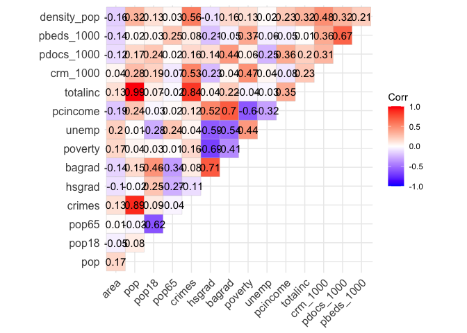

Final project
================
Anna Ma
12/17/2021

# Data exploration

``` r
cdi = read_csv("cdi.csv") %>%
  janitor::clean_names() %>%
  mutate(crm_1000 = 1000*(crimes/pop),
         pdocs_1000 = 1000*(docs/pop),
         pbeds_1000 = 1000*(beds/pop),
         density_pop = pop/area,
         # convert region to factors and recoded them accordingly 
         region = factor(region, levels = 1:4,
                    labels = c("northeast", "northcentral", "south", "west"))) %>% select(-c(docs,beds))
```

## Descriptive statistics of all varaibles

``` r
cdi_descriptive = cdi %>% select(-c(id,cty,state,region))

# Global
skimr::skim(cdi_descriptive) %>% 
  select(-c("skim_type","complete_rate")) %>% 
    mutate(skim_variable = 
             recode(skim_variable, pcincome = "pcincome (in dollars)", totalinc = "totalinc (in million of dollars)"
  )) %>% 
  knitr::kable(
    col.names = c("variable", "n_missing", "mean","sd","min","Q25","median","Q75","max","histogram"),
    caption = "Global Summary", digits = 4)
```

| variable                         | n_missing |        mean |          sd |         min |         Q25 |      median |         Q75 |          max | histogram |
|:---------------------------------|----------:|------------:|------------:|------------:|------------:|------------:|------------:|-------------:|:----------|
| area                             |         0 |   1041.4114 |   1549.9221 |     15.0000 |    451.2500 |    656.5000 |    946.7500 |   20062.0000 | ▇▁▁▁▁     |
| pop                              |         0 | 393010.9205 | 601987.0165 | 100043.0000 | 139027.2500 | 217280.5000 | 436064.5000 | 8863164.0000 | ▇▁▁▁▁     |
| pop18                            |         0 |     28.5684 |      4.1911 |     16.4000 |     26.2000 |     28.1000 |     30.0250 |      49.7000 | ▁▇▃▁▁     |
| pop65                            |         0 |     12.1698 |      3.9927 |      3.0000 |      9.8750 |     11.7500 |     13.6250 |      33.8000 | ▂▇▁▁▁     |
| crimes                           |         0 |  27111.6182 |  58237.5064 |    563.0000 |   6219.5000 |  11820.5000 |  26279.5000 |  688936.0000 | ▇▁▁▁▁     |
| hsgrad                           |         0 |     77.5607 |      7.0152 |     46.6000 |     73.8750 |     77.7000 |     82.4000 |      92.9000 | ▁▁▃▇▃     |
| bagrad                           |         0 |     21.0811 |      7.6545 |      8.1000 |     15.2750 |     19.7000 |     25.3250 |      52.3000 | ▆▇▃▁▁     |
| poverty                          |         0 |      8.7207 |      4.6567 |      1.4000 |      5.3000 |      7.9000 |     10.9000 |      36.3000 | ▇▆▁▁▁     |
| unemp                            |         0 |      6.5966 |      2.3379 |      2.2000 |      5.1000 |      6.2000 |      7.5000 |      21.3000 | ▇▇▁▁▁     |
| pcincome (in dollars)            |         0 |  18561.4818 |   4059.1920 |   8899.0000 |  16118.2500 |  17759.0000 |  20270.0000 |   37541.0000 | ▁▇▂▁▁     |
| totalinc (in million of dollars) |         0 |   7869.2727 |  12884.3215 |   1141.0000 |   2311.0000 |   3857.0000 |   8654.2500 |  184230.0000 | ▇▁▁▁▁     |
| crm_1000                         |         0 |     57.2864 |     27.3277 |      4.6014 |     38.1019 |     52.4286 |     72.5969 |     295.9867 | ▇▅▁▁▁     |
| pdocs_1000                       |         0 |      2.1230 |      1.5329 |      0.3559 |      1.2127 |      1.7509 |      2.4915 |      17.0377 | ▇▁▁▁▁     |
| pbeds_1000                       |         0 |      3.6493 |      2.0011 |      0.1649 |      2.1972 |      3.3287 |      4.5649 |      19.6982 | ▇▃▁▁▁     |
| density_pop                      |         0 |    888.4388 |   2194.7231 |     13.2587 |    192.3449 |    335.9081 |    756.5516 |   32403.7183 | ▇▁▁▁▁     |

Global Summary

## Descriptive analysis

We can use the box plot/ or histogram to check for normality. But I
forgot when do we need normality…isn’t it for residual??

``` r
par(mfrow = c(2,7))

boxplot(cdi$density_pop, main = "density_pop")
boxplot(cdi$area, main = "area")

boxplot(cdi$pop, main = "pop")
boxplot(cdi$pop18, main = "pop18")
boxplot(cdi$pop65, main = "pop65")

boxplot(cdi$pdocs_1000, main = "pdocs_1000")
boxplot(cdi$pbeds_1000, main = "pbeds_1000")

boxplot(cdi$crm_1000,  main = "crm_1000")

boxplot(cdi$hsgrad, main = "hsgrad")
boxplot(cdi$bagrad, main = "bagrad")
boxplot(cdi$poverty, main = "poverty")
boxplot(cdi$unemp,main = "unemp")
boxplot(cdi$pcincome, main = "pcincome")
boxplot(cdi$totalinc, main = "totalinc")
```

<!-- -->

## Correlation

### Pairwise relationship

-   This gives us an idea of the correlation between each variable, but
    my old project build whole model first then assessed the
    correlation. Need Discussion!

``` r
library(corrplot)
```

    ## corrplot 0.92 loaded

``` r
cor(cdi_descriptive) %>% knitr::kable()
```

|             |       area |        pop |      pop18 |      pop65 |     crimes |     hsgrad |     bagrad |    poverty |      unemp |   pcincome |   totalinc |   crm_1000 | pdocs_1000 | pbeds_1000 | density_pop |
|:------------|-----------:|-----------:|-----------:|-----------:|-----------:|-----------:|-----------:|-----------:|-----------:|-----------:|-----------:|-----------:|-----------:|-----------:|------------:|
| area        |  1.0000000 |  0.1730834 | -0.0548781 |  0.0057709 |  0.1294754 | -0.0985981 | -0.1372377 |  0.1713433 |  0.1992093 | -0.1877151 |  0.1270743 |  0.0429484 | -0.1163860 | -0.1412335 |  -0.1568156 |
| pop         |  0.1730834 |  1.0000000 |  0.0783721 | -0.0290374 |  0.8863318 | -0.0174269 |  0.1468138 |  0.0380195 |  0.0053517 |  0.2356102 |  0.9867476 |  0.2800992 |  0.1668595 |  0.0203012 |   0.3220266 |
| pop18       | -0.0548781 |  0.0783721 |  1.0000000 | -0.6163096 |  0.0899406 |  0.2505843 |  0.4560970 |  0.0339755 | -0.2785271 | -0.0316484 |  0.0711615 |  0.1905688 |  0.2370280 |  0.0295244 |   0.1254644 |
| pop65       |  0.0057709 | -0.0290374 | -0.6163096 |  1.0000000 | -0.0352903 | -0.2682518 | -0.3392288 |  0.0065785 |  0.2363094 |  0.0185907 | -0.0227332 | -0.0665333 |  0.0186087 |  0.2471479 |   0.0291845 |
| crimes      |  0.1294754 |  0.8863318 |  0.0899406 | -0.0352903 |  1.0000000 | -0.1063284 |  0.0770765 |  0.1644057 |  0.0435568 |  0.1175391 |  0.8430980 |  0.5300430 |  0.1577103 |  0.0778907 |   0.5609842 |
| hsgrad      | -0.0985981 | -0.0174269 |  0.2505843 | -0.2682518 | -0.1063284 |  1.0000000 |  0.7077867 | -0.6917505 | -0.5935958 |  0.5229961 |  0.0433557 | -0.2264129 |  0.1427765 | -0.2111625 |  -0.1040070 |
| bagrad      | -0.1372377 |  0.1468138 |  0.4560970 | -0.3392288 |  0.0770765 |  0.7077867 |  1.0000000 | -0.4084238 | -0.5409069 |  0.6953619 |  0.2222301 |  0.0383046 |  0.4410463 | -0.0454183 |   0.1556063 |
| poverty     |  0.1713433 |  0.0380195 |  0.0339755 |  0.0065785 |  0.1644057 | -0.6917505 | -0.4084238 |  1.0000000 |  0.4369472 | -0.6017250 | -0.0387393 |  0.4718442 |  0.0637048 |  0.3713989 |   0.1265079 |
| unemp       |  0.1992093 |  0.0053517 | -0.2785271 |  0.2363094 |  0.0435568 | -0.5935958 | -0.5409069 |  0.4369472 |  1.0000000 | -0.3221444 | -0.0338763 |  0.0418466 | -0.2478866 | -0.0624878 |   0.0227179 |
| pcincome    | -0.1877151 |  0.2356102 | -0.0316484 |  0.0185907 |  0.1175391 |  0.5229961 |  0.6953619 | -0.6017250 | -0.3221444 |  1.0000000 |  0.3476816 | -0.0802442 |  0.3600458 | -0.0535500 |   0.2332260 |
| totalinc    |  0.1270743 |  0.9867476 |  0.0711615 | -0.0227332 |  0.8430980 |  0.0433557 |  0.2222301 | -0.0387393 | -0.0338763 |  0.3476816 |  1.0000000 |  0.2281557 |  0.1991038 |  0.0063239 |   0.3162048 |
| crm_1000    |  0.0429484 |  0.2800992 |  0.1905688 | -0.0665333 |  0.5300430 | -0.2264129 |  0.0383046 |  0.4718442 |  0.0418466 | -0.0802442 |  0.2281557 |  1.0000000 |  0.3070831 |  0.3644505 |   0.4804285 |
| pdocs_1000  | -0.1163860 |  0.1668595 |  0.2370280 |  0.0186087 |  0.1577103 |  0.1427765 |  0.4410463 |  0.0637048 | -0.2478866 |  0.3600458 |  0.1991038 |  0.3070831 |  1.0000000 |  0.6666947 |   0.3180424 |
| pbeds_1000  | -0.1412335 |  0.0203012 |  0.0295244 |  0.2471479 |  0.0778907 | -0.2111625 | -0.0454183 |  0.3713989 | -0.0624878 | -0.0535500 |  0.0063239 |  0.3644505 |  0.6666947 |  1.0000000 |   0.2064177 |
| density_pop | -0.1568156 |  0.3220266 |  0.1254644 |  0.0291845 |  0.5609842 | -0.1040070 |  0.1556063 |  0.1265079 |  0.0227179 |  0.2332260 |  0.3162048 |  0.4804285 |  0.3180424 |  0.2064177 |   1.0000000 |

``` r
library(ggcorrplot)

ggcorrplot(cor(cdi_descriptive), type = "upper",
   lab = TRUE)
```

<!-- -->

Scatter plot

``` r
pairs(crm_1000 ~.,data=cdi_descriptive, panel = panel.smooth, upper.panel = NULL, main = "Scatterplot Matrix")
```

<!-- -->

## Marginal distribution

``` r
library(ggplot2)
library(ggExtra)
```

``` r
marg_den = cdi %>% ggplot(aes(x = density_pop, y = crm_1000)) + geom_point(alpha = 0.3) + geom_smooth(method = 'lm', se = TRUE, color = 'red')
ggMarginal(marg_den, type = "histogram", fill="transparent")
```

    ## `geom_smooth()` using formula 'y ~ x'
    ## `geom_smooth()` using formula 'y ~ x'

<!-- -->

``` r
marg_area = cdi %>% ggplot(aes(x = area, y = crm_1000)) + geom_point(alpha = 0.3) + geom_smooth(method = 'lm', se = TRUE, color = 'red')
ggMarginal(marg_area, type = "histogram", fill="transparent")
```

    ## `geom_smooth()` using formula 'y ~ x'
    ## `geom_smooth()` using formula 'y ~ x'

<!-- -->

``` r
marg_pop = cdi %>% ggplot(aes(x = pop, y = crm_1000)) + geom_point(alpha = 0.3) + geom_smooth(method = 'lm', se = TRUE, color = 'red')
ggMarginal(marg_pop, type = "histogram", fill="transparent")
```

    ## `geom_smooth()` using formula 'y ~ x'
    ## `geom_smooth()` using formula 'y ~ x'

<!-- -->

``` r
marg_pop18 = cdi %>% ggplot(aes(x = pop18, y = crm_1000)) + geom_point(alpha = 0.3) + geom_smooth(method = 'lm', se = TRUE, color = 'red')
# positive correlation
ggMarginal(marg_pop18, type = "histogram", fill="transparent")
```

    ## `geom_smooth()` using formula 'y ~ x'
    ## `geom_smooth()` using formula 'y ~ x'

<!-- -->

``` r
marg_pop65 = cdi %>% ggplot(aes(x = pop65, y = crm_1000)) + geom_point(alpha = 0.3) + geom_smooth(method = 'lm', se = TRUE, color = 'red')
ggMarginal(marg_pop65, type = "histogram", fill="transparent")
```

    ## `geom_smooth()` using formula 'y ~ x'
    ## `geom_smooth()` using formula 'y ~ x'

<!-- -->

``` r
marg_pdocs_1000 = cdi %>% ggplot(aes(x = pdocs_1000, y = crm_1000)) + geom_point(alpha = 0.3) + geom_smooth(method = 'lm', se = TRUE, color = 'red')
ggMarginal(marg_pdocs_1000, type = "histogram", fill="transparent")
```

    ## `geom_smooth()` using formula 'y ~ x'
    ## `geom_smooth()` using formula 'y ~ x'

<!-- -->

``` r
marg_pbeds_1000 = cdi %>% ggplot(aes(x = pbeds_1000, y = crm_1000)) + geom_point(alpha = 0.3) + geom_smooth(method = 'lm', se = TRUE, color = 'red')
ggMarginal(marg_pbeds_1000, type = "histogram", fill="transparent")
```

    ## `geom_smooth()` using formula 'y ~ x'
    ## `geom_smooth()` using formula 'y ~ x'

<!-- -->

``` r
marg_hsgrad = cdi %>% ggplot(aes(x = hsgrad, y = crm_1000)) + geom_point(alpha = 0.3) + geom_smooth(method = 'lm', se = TRUE, color = 'red') #negative correlation
ggMarginal(marg_hsgrad, type = "histogram", fill="transparent")
```

    ## `geom_smooth()` using formula 'y ~ x'
    ## `geom_smooth()` using formula 'y ~ x'

<!-- -->

``` r
marg_bagrad = cdi %>% ggplot(aes(x = bagrad, y = crm_1000)) + geom_point(alpha = 0.3) + geom_smooth(method = 'lm', se = TRUE, color = 'red')
ggMarginal(marg_bagrad, type = "histogram", fill="transparent")
```

    ## `geom_smooth()` using formula 'y ~ x'
    ## `geom_smooth()` using formula 'y ~ x'

<!-- -->

``` r
marg_poverty = cdi %>% ggplot(aes(x = poverty, y = crm_1000)) + geom_point(alpha = 0.3) + geom_smooth(method = 'lm', se = TRUE, color = 'red') # positive correlation
ggMarginal(marg_poverty, type = "histogram", fill="transparent")
```

    ## `geom_smooth()` using formula 'y ~ x'
    ## `geom_smooth()` using formula 'y ~ x'

<!-- -->

``` r
marg_unemp = cdi %>% ggplot(aes(x = unemp, y = crm_1000)) + geom_point(alpha = 0.3) + geom_smooth(method = 'lm', se = TRUE, color = 'red')
ggMarginal(marg_unemp, type = "histogram", fill="transparent")
```

    ## `geom_smooth()` using formula 'y ~ x'
    ## `geom_smooth()` using formula 'y ~ x'

<!-- -->

``` r
marg_pcincome = cdi %>% ggplot(aes(x = pcincome, y = crm_1000)) + geom_point(alpha = 0.3) + geom_smooth(method = 'lm', se = TRUE, color = 'red')
ggMarginal(marg_pcincome, type = "histogram", fill="transparent")
```

    ## `geom_smooth()` using formula 'y ~ x'
    ## `geom_smooth()` using formula 'y ~ x'

<!-- -->

``` r
marg_totalinc = cdi %>% ggplot(aes(x = totalinc, y = crm_1000)) + geom_point(alpha = 0.3) + geom_smooth(method = 'lm', se = TRUE, color = 'red')
ggMarginal(marg_totalinc, type = "histogram", fill="transparent")
```

    ## `geom_smooth()` using formula 'y ~ x'
    ## `geom_smooth()` using formula 'y ~ x'

<!-- -->

## Distribution of outcome

``` r
cdi %>% 
  ggplot(aes(x = crm_1000)) +
  geom_histogram()
```

    ## `stat_bin()` using `bins = 30`. Pick better value with `binwidth`.

<!-- -->

do we look at the distribution of outcome like this and transform them
here? check again

## Counties with unusual rates

``` r
upper = quantile(cdi$crm_1000, 0.75)
lower = quantile(cdi$crm_1000, 0.25)
IQR = upper - lower
cdi %>% 
  filter(crm_1000 > upper + 1.5*IQR,
         crm_1000 > lower - 1.5*IQR) %>% 
  dplyr::select(cty, crm_1000) %>%
  knitr::kable(digits = 2)
```

| cty       | crm_1000 |
|:----------|---------:|
| Kings     |   295.99 |
| Dade      |   126.34 |
| Fulton    |   143.35 |
| St.\_Loui |   161.60 |

# Model

## Full model predictors

this model used `northeast` as the reference level for region

``` r
cdi_model = cdi %>% select(-c(id,cty,state,area,crimes,totalinc))

# use 
full_fit = lm(crm_1000 ~ ., data = cdi_model)
summary(full_fit)
```

    ## 
    ## Call:
    ## lm(formula = crm_1000 ~ ., data = cdi_model)
    ## 
    ## Residuals:
    ##     Min      1Q  Median      3Q     Max 
    ## -47.786 -11.422  -0.934  10.200  75.180 
    ## 
    ## Coefficients:
    ##                      Estimate Std. Error t value Pr(>|t|)    
    ## (Intercept)        -6.922e+01  2.739e+01  -2.528 0.011849 *  
    ## pop                 5.486e-06  1.579e-06   3.474 0.000566 ***
    ## pop18               6.947e-01  3.305e-01   2.102 0.036150 *  
    ## pop65              -1.998e-01  3.055e-01  -0.654 0.513410    
    ## hsgrad              6.143e-01  2.690e-01   2.284 0.022864 *  
    ## bagrad             -4.835e-01  2.971e-01  -1.628 0.104327    
    ## poverty             1.856e+00  3.864e-01   4.803 2.17e-06 ***
    ## unemp               6.111e-01  5.314e-01   1.150 0.250812    
    ## pcincome            1.039e-03  4.734e-04   2.195 0.028670 *  
    ## regionnorthcentral  8.978e+00  2.732e+00   3.286 0.001100 ** 
    ## regionsouth         2.779e+01  2.659e+00  10.453  < 2e-16 ***
    ## regionwest          2.118e+01  3.125e+00   6.778 4.09e-11 ***
    ## pdocs_1000         -6.634e-01  1.019e+00  -0.651 0.515556    
    ## pbeds_1000          3.157e+00  7.939e-01   3.977 8.21e-05 ***
    ## density_pop         4.901e-03  4.537e-04  10.802  < 2e-16 ***
    ## ---
    ## Signif. codes:  0 '***' 0.001 '**' 0.01 '*' 0.05 '.' 0.1 ' ' 1
    ## 
    ## Residual standard error: 17.81 on 425 degrees of freedom
    ## Multiple R-squared:  0.589,  Adjusted R-squared:  0.5755 
    ## F-statistic: 43.51 on 14 and 425 DF,  p-value: < 2.2e-16

``` r
olsrr::ols_plot_resid_qq(full_fit)
```

<!-- -->

``` r
olsrr::ols_plot_resid_fit(full_fit)
```

<!-- -->

## Transformation

``` r
lambda = MASS::boxcox(full_fit)
```

<!-- -->

``` r
optlam = lambda$x[which.max(lambda$y)]
optlam
```

    ## [1] 0.5454545

The lambda from the transformation is 0.5454, so we will try to fit a
square root transformation to Y

New tibble with transformed Y:

``` r
cdi_trans = cdi_model %>% mutate(crm_1000_sqr = crm_1000^0.5) %>% select(-c(crm_1000))
```

``` r
trans_fit = lm(crm_1000_sqr ~ .,data = cdi_trans)
summary(trans_fit)
```

    ## 
    ## Call:
    ## lm(formula = crm_1000_sqr ~ ., data = cdi_trans)
    ## 
    ## Residuals:
    ##     Min      1Q  Median      3Q     Max 
    ## -4.0410 -0.7300  0.0708  0.7485  4.0273 
    ## 
    ## Coefficients:
    ##                      Estimate Std. Error t value Pr(>|t|)    
    ## (Intercept)        -1.645e+00  1.802e+00  -0.913 0.361766    
    ## pop                 3.624e-07  1.039e-07   3.488 0.000537 ***
    ## pop18               6.320e-02  2.174e-02   2.907 0.003844 ** 
    ## pop65              -3.609e-03  2.009e-02  -0.180 0.857548    
    ## hsgrad              3.479e-02  1.769e-02   1.966 0.049933 *  
    ## bagrad             -3.472e-02  1.954e-02  -1.777 0.076307 .  
    ## poverty             1.192e-01  2.542e-02   4.688 3.72e-06 ***
    ## unemp               4.305e-02  3.496e-02   1.232 0.218783    
    ## pcincome            9.589e-05  3.114e-05   3.079 0.002213 ** 
    ## regionnorthcentral  7.062e-01  1.797e-01   3.929 9.94e-05 ***
    ## regionsouth         1.996e+00  1.749e-01  11.413  < 2e-16 ***
    ## regionwest          1.674e+00  2.056e-01   8.142 4.37e-15 ***
    ## pdocs_1000         -3.845e-02  6.706e-02  -0.573 0.566744    
    ## pbeds_1000          2.120e-01  5.223e-02   4.059 5.86e-05 ***
    ## density_pop         2.150e-04  2.984e-05   7.203 2.69e-12 ***
    ## ---
    ## Signif. codes:  0 '***' 0.001 '**' 0.01 '*' 0.05 '.' 0.1 ' ' 1
    ## 
    ## Residual standard error: 1.171 on 425 degrees of freedom
    ## Multiple R-squared:  0.5602, Adjusted R-squared:  0.5457 
    ## F-statistic: 38.66 on 14 and 425 DF,  p-value: < 2.2e-16

``` r
olsrr::ols_plot_resid_fit(trans_fit)
```

<!-- -->

``` r
olsrr::ols_plot_resid_qq(trans_fit)
```

<!-- -->

``` r
lambda_trans = MASS::boxcox(trans_fit)
```

<!-- -->

``` r
optlam_trans = lambda_trans$x[which.max(lambda_trans$y)]
optlam_trans
```

    ## [1] 1.111111

### Counties with unusual rates

``` r
upper = quantile(cdi_trans$crm_1000_sqr, 0.75)
lower = quantile(cdi_trans$crm_1000_sqr, 0.25)
IQR = upper - lower

cdi_trans %>% 
  filter(crm_1000_sqr > upper + 1.5*IQR,
         crm_1000_sqr > lower - 1.5*IQR) %>% 
  dplyr::select(crm_1000_sqr) %>% 
  mutate(cty = c("Kings", "St._Loui")) %>% 
  knitr::kable(digits = 2)
```

| crm_1000_sqr | cty       |
|-------------:|:----------|
|        17.20 | Kings     |
|        12.71 | St.\_Loui |

## Model Selection

### Step-wise approach

#### Backward

``` r
fit_back = step(trans_fit, direction='backward')
```

    ## Start:  AIC=153.85
    ## crm_1000_sqr ~ pop + pop18 + pop65 + hsgrad + bagrad + poverty + 
    ##     unemp + pcincome + region + pdocs_1000 + pbeds_1000 + density_pop
    ## 
    ##               Df Sum of Sq    RSS    AIC
    ## - pop65        1     0.044 583.09 151.89
    ## - pdocs_1000   1     0.451 583.49 152.19
    ## - unemp        1     2.081 585.12 153.42
    ## <none>                     583.04 153.85
    ## - bagrad       1     4.331 587.37 155.11
    ## - hsgrad       1     5.303 588.35 155.84
    ## - pop18        1    11.591 594.63 160.51
    ## - pcincome     1    13.004 596.05 161.56
    ## - pop          1    16.690 599.73 164.27
    ## - pbeds_1000   1    22.604 605.65 168.59
    ## - poverty      1    30.154 613.20 174.04
    ## - density_pop  1    71.185 654.23 202.54
    ## - region       3   205.212 788.25 280.54
    ## 
    ## Step:  AIC=151.89
    ## crm_1000_sqr ~ pop + pop18 + hsgrad + bagrad + poverty + unemp + 
    ##     pcincome + region + pdocs_1000 + pbeds_1000 + density_pop
    ## 
    ##               Df Sum of Sq    RSS    AIC
    ## - pdocs_1000   1     0.446 583.53 150.22
    ## - unemp        1     2.038 585.12 151.42
    ## <none>                     583.09 151.89
    ## - bagrad       1     4.334 587.42 153.15
    ## - hsgrad       1     5.380 588.47 153.93
    ## - pcincome     1    13.159 596.25 159.71
    ## - pop18        1    16.404 599.49 162.09
    ## - pop          1    16.651 599.74 162.28
    ## - pbeds_1000   1    23.989 607.08 167.63
    ## - poverty      1    31.904 614.99 173.33
    ## - density_pop  1    71.276 654.36 200.63
    ## - region       3   205.335 788.42 278.63
    ## 
    ## Step:  AIC=150.22
    ## crm_1000_sqr ~ pop + pop18 + hsgrad + bagrad + poverty + unemp + 
    ##     pcincome + region + pbeds_1000 + density_pop
    ## 
    ##               Df Sum of Sq    RSS    AIC
    ## - unemp        1     2.006 585.54 149.73
    ## <none>                     583.53 150.22
    ## - bagrad       1     5.378 588.91 152.26
    ## - hsgrad       1     5.671 589.20 152.48
    ## - pcincome     1    12.753 596.29 157.74
    ## - pop18        1    16.012 599.54 160.13
    ## - pop          1    16.517 600.05 160.50
    ## - poverty      1    32.264 615.80 171.90
    ## - pbeds_1000   1    41.083 624.62 178.16
    ## - density_pop  1    70.863 654.40 198.65
    ## - region       3   204.905 788.44 276.64
    ## 
    ## Step:  AIC=149.73
    ## crm_1000_sqr ~ pop + pop18 + hsgrad + bagrad + poverty + pcincome + 
    ##     region + pbeds_1000 + density_pop
    ## 
    ##               Df Sum of Sq    RSS    AIC
    ## <none>                     585.54 149.73
    ## - hsgrad       1     4.640 590.18 151.21
    ## - bagrad       1     7.070 592.61 153.01
    ## - pcincome     1    15.076 600.61 158.92
    ## - pop18        1    15.967 601.50 159.57
    ## - pop          1    16.046 601.58 159.63
    ## - pbeds_1000   1    39.273 624.81 176.30
    ## - poverty      1    41.161 626.70 177.62
    ## - density_pop  1    70.118 655.66 197.50
    ## - region       3   209.818 795.36 278.49

``` r
fit_back
```

    ## 
    ## Call:
    ## lm(formula = crm_1000_sqr ~ pop + pop18 + hsgrad + bagrad + poverty + 
    ##     pcincome + region + pbeds_1000 + density_pop, data = cdi_trans)
    ## 
    ## Coefficients:
    ##        (Intercept)                 pop               pop18              hsgrad  
    ##         -1.132e+00           3.546e-07           6.390e-02           3.180e-02  
    ##             bagrad             poverty            pcincome  regionnorthcentral  
    ##         -4.210e-02           1.298e-01           1.005e-04           6.887e-01  
    ##        regionsouth          regionwest          pbeds_1000         density_pop  
    ##          1.933e+00           1.642e+00           1.767e-01           2.117e-04

``` r
olsrr::ols_plot_resid_fit(fit_back)
```

<!-- -->

``` r
olsrr::ols_plot_resid_qq(fit_back)
```

<!-- -->

``` r
MASS::boxcox(fit_back)
```

<!-- -->

Backward: crm_1000_sqr \~ pop + pop18 + hsgrad + bagrad + poverty +
pcincome + region + pbeds_1000 + density_pop

#### forward

``` r
fit_forward = step(trans_fit, direction="forward")
```

    ## Start:  AIC=153.85
    ## crm_1000_sqr ~ pop + pop18 + pop65 + hsgrad + bagrad + poverty + 
    ##     unemp + pcincome + region + pdocs_1000 + pbeds_1000 + density_pop

``` r
fit_forward
```

    ## 
    ## Call:
    ## lm(formula = crm_1000_sqr ~ pop + pop18 + pop65 + hsgrad + bagrad + 
    ##     poverty + unemp + pcincome + region + pdocs_1000 + pbeds_1000 + 
    ##     density_pop, data = cdi_trans)
    ## 
    ## Coefficients:
    ##        (Intercept)                 pop               pop18               pop65  
    ##         -1.645e+00           3.624e-07           6.320e-02          -3.609e-03  
    ##             hsgrad              bagrad             poverty               unemp  
    ##          3.479e-02          -3.472e-02           1.192e-01           4.305e-02  
    ##           pcincome  regionnorthcentral         regionsouth          regionwest  
    ##          9.589e-05           7.062e-01           1.996e+00           1.674e+00  
    ##         pdocs_1000          pbeds_1000         density_pop  
    ##         -3.845e-02           2.120e-01           2.150e-04

``` r
olsrr::ols_plot_resid_fit(fit_forward)
```

<!-- -->

``` r
olsrr::ols_plot_resid_qq(fit_forward)
```

<!-- -->

``` r
MASS::boxcox(fit_forward)
```

<!-- -->

model: crm_1000_sqr \~ pop + pop18 + pop65 + hsgrad + bagrad + poverty +
unemp + pcincome + region + pdocs_1000 + pbeds_1000 + density_pop, data
= cdi_trans)

#### both

step-wise

``` r
fit_both = step(trans_fit, direction='both')
```

    ## Start:  AIC=153.85
    ## crm_1000_sqr ~ pop + pop18 + pop65 + hsgrad + bagrad + poverty + 
    ##     unemp + pcincome + region + pdocs_1000 + pbeds_1000 + density_pop
    ## 
    ##               Df Sum of Sq    RSS    AIC
    ## - pop65        1     0.044 583.09 151.89
    ## - pdocs_1000   1     0.451 583.49 152.19
    ## - unemp        1     2.081 585.12 153.42
    ## <none>                     583.04 153.85
    ## - bagrad       1     4.331 587.37 155.11
    ## - hsgrad       1     5.303 588.35 155.84
    ## - pop18        1    11.591 594.63 160.51
    ## - pcincome     1    13.004 596.05 161.56
    ## - pop          1    16.690 599.73 164.27
    ## - pbeds_1000   1    22.604 605.65 168.59
    ## - poverty      1    30.154 613.20 174.04
    ## - density_pop  1    71.185 654.23 202.54
    ## - region       3   205.212 788.25 280.54
    ## 
    ## Step:  AIC=151.89
    ## crm_1000_sqr ~ pop + pop18 + hsgrad + bagrad + poverty + unemp + 
    ##     pcincome + region + pdocs_1000 + pbeds_1000 + density_pop
    ## 
    ##               Df Sum of Sq    RSS    AIC
    ## - pdocs_1000   1     0.446 583.53 150.22
    ## - unemp        1     2.038 585.12 151.42
    ## <none>                     583.09 151.89
    ## - bagrad       1     4.334 587.42 153.15
    ## + pop65        1     0.044 583.04 153.85
    ## - hsgrad       1     5.380 588.47 153.93
    ## - pcincome     1    13.159 596.25 159.71
    ## - pop18        1    16.404 599.49 162.09
    ## - pop          1    16.651 599.74 162.28
    ## - pbeds_1000   1    23.989 607.08 167.63
    ## - poverty      1    31.904 614.99 173.33
    ## - density_pop  1    71.276 654.36 200.63
    ## - region       3   205.335 788.42 278.63
    ## 
    ## Step:  AIC=150.22
    ## crm_1000_sqr ~ pop + pop18 + hsgrad + bagrad + poverty + unemp + 
    ##     pcincome + region + pbeds_1000 + density_pop
    ## 
    ##               Df Sum of Sq    RSS    AIC
    ## - unemp        1     2.006 585.54 149.73
    ## <none>                     583.53 150.22
    ## + pdocs_1000   1     0.446 583.09 151.89
    ## + pop65        1     0.039 583.49 152.19
    ## - bagrad       1     5.378 588.91 152.26
    ## - hsgrad       1     5.671 589.20 152.48
    ## - pcincome     1    12.753 596.29 157.74
    ## - pop18        1    16.012 599.54 160.13
    ## - pop          1    16.517 600.05 160.50
    ## - poverty      1    32.264 615.80 171.90
    ## - pbeds_1000   1    41.083 624.62 178.16
    ## - density_pop  1    70.863 654.40 198.65
    ## - region       3   204.905 788.44 276.64
    ## 
    ## Step:  AIC=149.73
    ## crm_1000_sqr ~ pop + pop18 + hsgrad + bagrad + poverty + pcincome + 
    ##     region + pbeds_1000 + density_pop
    ## 
    ##               Df Sum of Sq    RSS    AIC
    ## <none>                     585.54 149.73
    ## + unemp        1     2.006 583.53 150.22
    ## - hsgrad       1     4.640 590.18 151.21
    ## + pdocs_1000   1     0.414 585.12 151.42
    ## + pop65        1     0.000 585.54 151.73
    ## - bagrad       1     7.070 592.61 153.01
    ## - pcincome     1    15.076 600.61 158.92
    ## - pop18        1    15.967 601.50 159.57
    ## - pop          1    16.046 601.58 159.63
    ## - pbeds_1000   1    39.273 624.81 176.30
    ## - poverty      1    41.161 626.70 177.62
    ## - density_pop  1    70.118 655.66 197.50
    ## - region       3   209.818 795.36 278.49

``` r
fit_both
```

    ## 
    ## Call:
    ## lm(formula = crm_1000_sqr ~ pop + pop18 + hsgrad + bagrad + poverty + 
    ##     pcincome + region + pbeds_1000 + density_pop, data = cdi_trans)
    ## 
    ## Coefficients:
    ##        (Intercept)                 pop               pop18              hsgrad  
    ##         -1.132e+00           3.546e-07           6.390e-02           3.180e-02  
    ##             bagrad             poverty            pcincome  regionnorthcentral  
    ##         -4.210e-02           1.298e-01           1.005e-04           6.887e-01  
    ##        regionsouth          regionwest          pbeds_1000         density_pop  
    ##          1.933e+00           1.642e+00           1.767e-01           2.117e-04

lm(formula = crm_1000^0.5 \~ pop + pop18 + hsgrad + bagrad + poverty +
pcincome + region + pbeds_1000 + density_pop, data = cdi_model)

This gives back the same model as back

### Criterion Based: Adjr2 and Cp

``` r
# printing the 2 best models of each size. For example, the first two lines: print the best 2 models that have 2 variables (including intercept)

models <- regsubsets(crm_1000_sqr ~., data = cdi_trans,nvmax = 12)
res_sum = summary(models)

par(mfrow=c(1,2))
plot(1:12, res_sum$cp, xlab="No of parameters", ylab="Cp Statistic")
plot(1:12, res_sum$adjr2, xlab="No of parameters", ylab="Adj R2")
```

<!-- -->

``` r
mod_s = data.frame(
  Adj.R2 = which.max(res_sum$adjr2),
  CP = which.min(res_sum$cp)
)

get_model_formula <- function(id, object, outcome){
  # get models data
  models <- summary(object)$which[id,-1]
  # Get outcome variable
  #form <- as.formula(object$call[[2]])
  #outcome <- all.vars(form)[1]
  # Get model predictors
  predictors <- names(which(models == TRUE))
  predictors <- paste(predictors, collapse = "+")
  # Build model formula
  as.formula(paste0(outcome, "~", predictors))
}
```

Model chosen by Adj *R*<sup>2</sup>:

``` r
get_model_formula(12, models, "crm_1000_sqr")
```

    ## crm_1000_sqr ~ pop + pop18 + hsgrad + bagrad + poverty + unemp + 
    ##     pcincome + regionnorthcentral + regionsouth + regionwest + 
    ##     pbeds_1000 + density_pop
    ## <environment: 0x7fd744257e50>

``` r
fit_adjr = lm(crm_1000_sqr ~ pop + pop18 + hsgrad + bagrad + poverty + unemp + pcincome + region+ pbeds_1000 + density_pop, data = cdi_trans)

olsrr::ols_plot_resid_fit(fit_adjr)
```

<!-- -->

``` r
olsrr::ols_plot_resid_qq(fit_adjr)
```

<!-- -->

``` r
MASS::boxcox(fit_adjr)
```

<!-- -->

crm_1000_sqr \~ pop + pop18 + hsgrad + bagrad + poverty + unemp +
pcincome + region+ pbeds_1000 + density_pop

Model chosen by Cp: Same with backward

``` r
get_model_formula(11, models, "crm_1000_sqr")
```

    ## crm_1000_sqr ~ pop + pop18 + hsgrad + bagrad + poverty + pcincome + 
    ##     regionnorthcentral + regionsouth + regionwest + pbeds_1000 + 
    ##     density_pop
    ## <environment: 0x7fd748a56588>

crm_1000_sqr \~ pop + pop18 + hsgrad + bagrad + poverty + pcincome +
region+ pbeds_1000 + density_pop

``` r
fit_Cp = lm(crm_1000_sqr ~ pop + pop18 + hsgrad + bagrad + poverty + pcincome + region+ pbeds_1000 + density_pop, data=cdi_trans)

olsrr::ols_plot_resid_fit(fit_Cp)
```

<!-- -->

``` r
olsrr::ols_plot_resid_qq(fit_Cp)
```

<!-- -->

``` r
MASS::boxcox(fit_Cp)
```

<!-- -->

## Check Collinearity

``` r
performance::check_collinearity(fit_back)
```

    ## # Check for Multicollinearity
    ## 
    ## Low Correlation
    ## 
    ##         Term  VIF Increased SE Tolerance
    ##          pop 1.00         1.00      1.00
    ##        pop18 1.93         1.39      0.52
    ##       hsgrad 3.15         1.78      0.32
    ##       bagrad 3.35         1.83      0.30
    ##      poverty 2.16         1.47      0.46
    ##     pcincome 1.03         1.01      0.97
    ##       region 1.63         1.28      0.61
    ##   pbeds_1000 1.32         1.15      0.76
    ##  density_pop 1.01         1.00      0.99

``` r
performance::check_collinearity(fit_forward)
```

    ## # Check for Multicollinearity
    ## 
    ## Low Correlation
    ## 
    ##         Term  VIF Increased SE Tolerance
    ##          pop 1.00         1.00      1.00
    ##        pop18 2.60         1.61      0.38
    ##        pop65 2.05         1.43      0.49
    ##       hsgrad 3.30         1.82      0.30
    ##       bagrad 3.72         1.93      0.27
    ##      poverty 2.48         1.58      0.40
    ##        unemp 1.89         1.37      0.53
    ##     pcincome 1.02         1.01      0.98
    ##       region 1.99         1.41      0.50
    ##   pdocs_1000 2.75         1.66      0.36
    ##   pbeds_1000 3.31         1.82      0.30
    ##  density_pop 1.00         1.00      1.00

``` r
performance::check_collinearity(fit_adjr)
```

    ## # Check for Multicollinearity
    ## 
    ## Low Correlation
    ## 
    ##         Term  VIF Increased SE Tolerance
    ##          pop 1.00         1.00      1.00
    ##        pop18 1.93         1.39      0.52
    ##       hsgrad 3.27         1.81      0.31
    ##       bagrad 3.49         1.87      0.29
    ##      poverty 2.38         1.54      0.42
    ##        unemp 1.86         1.36      0.54
    ##     pcincome 1.03         1.01      0.97
    ##       region 1.83         1.35      0.55
    ##   pbeds_1000 1.44         1.20      0.69
    ##  density_pop 1.00         1.00      1.00

``` r
performance::check_collinearity(fit_Cp)
```

    ## # Check for Multicollinearity
    ## 
    ## Low Correlation
    ## 
    ##         Term  VIF Increased SE Tolerance
    ##          pop 1.00         1.00      1.00
    ##        pop18 1.93         1.39      0.52
    ##       hsgrad 3.15         1.78      0.32
    ##       bagrad 3.35         1.83      0.30
    ##      poverty 2.16         1.47      0.46
    ##     pcincome 1.03         1.01      0.97
    ##       region 1.63         1.28      0.61
    ##   pbeds_1000 1.32         1.15      0.76
    ##  density_pop 1.01         1.00      0.99

Delete predictors when vif larger than 10. Non of them are greater than
10. So all of the models are good, don’t have to worry about
collinearity.

## Checking to Outliers and Influential Points

``` r
olsrr::ols_plot_cooksd_bar(fit_back, print_plot = TRUE)
```

<!-- -->

``` r
#remove observations whose cook's D > 0.5
cdi_trans_without = cdi_trans[-c(1, 6),]
```

## Build model without outlier

Built the without model with **fit_back**

``` r
fit_back_without = lm(crm_1000_sqr ~ pop + pop18 + hsgrad + bagrad + poverty + pcincome + region + pbeds_1000 + density_pop, data = cdi_trans_without)

summary(fit_back_without)
```

    ## 
    ## Call:
    ## lm(formula = crm_1000_sqr ~ pop + pop18 + hsgrad + bagrad + poverty + 
    ##     pcincome + region + pbeds_1000 + density_pop, data = cdi_trans_without)
    ## 
    ## Residuals:
    ##     Min      1Q  Median      3Q     Max 
    ## -4.1228 -0.6365  0.0530  0.7450  3.9171 
    ## 
    ## Coefficients:
    ##                      Estimate Std. Error t value Pr(>|t|)    
    ## (Intercept)        -9.873e-01  1.576e+00  -0.626 0.531435    
    ## pop                 7.169e-07  1.419e-07   5.053 6.46e-07 ***
    ## pop18               7.526e-02  1.855e-02   4.056 5.93e-05 ***
    ## hsgrad              2.185e-02  1.695e-02   1.289 0.198159    
    ## bagrad             -4.136e-02  1.808e-02  -2.288 0.022652 *  
    ## poverty             1.219e-01  2.319e-02   5.254 2.35e-07 ***
    ## pcincome            1.121e-04  3.068e-05   3.655 0.000289 ***
    ## regionnorthcentral  7.058e-01  1.702e-01   4.146 4.08e-05 ***
    ## regionsouth         1.951e+00  1.617e-01  12.066  < 2e-16 ***
    ## regionwest          1.691e+00  1.971e-01   8.579  < 2e-16 ***
    ## pbeds_1000          2.036e-01  3.274e-02   6.217 1.21e-09 ***
    ## density_pop         7.859e-05  4.288e-05   1.833 0.067561 .  
    ## ---
    ## Signif. codes:  0 '***' 0.001 '**' 0.01 '*' 0.05 '.' 0.1 ' ' 1
    ## 
    ## Residual standard error: 1.14 on 426 degrees of freedom
    ## Multiple R-squared:  0.5488, Adjusted R-squared:  0.5372 
    ## F-statistic: 47.11 on 11 and 426 DF,  p-value: < 2.2e-16

``` r
# Residual performance
par(mfrow=c(2,2))
olsrr::ols_plot_resid_fit(fit_back_without)
```

<!-- -->

``` r
olsrr::ols_plot_resid_qq(fit_back_without)
```

<!-- -->

Build the without model with **trans_fit** (full model)

``` r
trans_fit_without = lm(crm_1000_sqr ~., data = cdi_trans_without)

summary(trans_fit_without)
```

    ## 
    ## Call:
    ## lm(formula = crm_1000_sqr ~ ., data = cdi_trans_without)
    ## 
    ## Residuals:
    ##     Min      1Q  Median      3Q     Max 
    ## -4.0654 -0.6625  0.0540  0.7183  3.9085 
    ## 
    ## Coefficients:
    ##                      Estimate Std. Error t value Pr(>|t|)    
    ## (Intercept)        -1.643e+00  1.767e+00  -0.930 0.353040    
    ## pop                 7.281e-07  1.425e-07   5.111 4.87e-07 ***
    ## pop18               7.584e-02  2.159e-02   3.513 0.000491 ***
    ## pop65              -2.316e-04  1.965e-02  -0.012 0.990601    
    ## hsgrad              2.583e-02  1.733e-02   1.491 0.136820    
    ## bagrad             -3.462e-02  1.911e-02  -1.812 0.070658 .  
    ## poverty             1.111e-01  2.492e-02   4.457 1.07e-05 ***
    ## unemp               4.736e-02  3.407e-02   1.390 0.165214    
    ## pcincome            1.058e-04  3.141e-05   3.367 0.000828 ***
    ## regionnorthcentral  7.343e-01  1.755e-01   4.184 3.49e-05 ***
    ## regionsouth         2.024e+00  1.707e-01  11.857  < 2e-16 ***
    ## regionwest          1.719e+00  2.008e-01   8.565  < 2e-16 ***
    ## pdocs_1000         -2.102e-02  6.581e-02  -0.319 0.749576    
    ## pbeds_1000          2.286e-01  5.101e-02   4.481 9.59e-06 ***
    ## density_pop         8.083e-05  4.359e-05   1.854 0.064417 .  
    ## ---
    ## Signif. codes:  0 '***' 0.001 '**' 0.01 '*' 0.05 '.' 0.1 ' ' 1
    ## 
    ## Residual standard error: 1.141 on 423 degrees of freedom
    ## Multiple R-squared:  0.551,  Adjusted R-squared:  0.5361 
    ## F-statistic: 37.08 on 14 and 423 DF,  p-value: < 2.2e-16

``` r
# Residual performance
par(mfrow=c(2,2))
olsrr::ols_plot_resid_fit(trans_fit_without)
```

<!-- -->

``` r
olsrr::ols_plot_resid_qq(trans_fit_without)
```

<!-- -->

Built the without model with **fit_adjr**

``` r
fit_adjr_without = lm(crm_1000_sqr ~ pop + pop18 + hsgrad + bagrad + poverty + unemp + pcincome + region+ pbeds_1000 + density_pop, data = cdi_trans_without)

summary(fit_adjr_without)
```

    ## 
    ## Call:
    ## lm(formula = crm_1000_sqr ~ pop + pop18 + hsgrad + bagrad + poverty + 
    ##     unemp + pcincome + region + pbeds_1000 + density_pop, data = cdi_trans_without)
    ## 
    ## Residuals:
    ##     Min      1Q  Median      3Q     Max 
    ## -4.0662 -0.6619  0.0502  0.7174  3.9254 
    ## 
    ## Coefficients:
    ##                      Estimate Std. Error t value Pr(>|t|)    
    ## (Intercept)        -1.620e+00  1.638e+00  -0.989 0.323424    
    ## pop                 7.261e-07  1.419e-07   5.118 4.69e-07 ***
    ## pop18               7.546e-02  1.853e-02   4.072 5.57e-05 ***
    ## hsgrad              2.624e-02  1.722e-02   1.524 0.128270    
    ## bagrad             -3.617e-02  1.844e-02  -1.962 0.050439 .  
    ## poverty             1.115e-01  2.432e-02   4.584 6.01e-06 ***
    ## unemp               4.714e-02  3.372e-02   1.398 0.162867    
    ## pcincome            1.048e-04  3.108e-05   3.373 0.000811 ***
    ## regionnorthcentral  7.374e-01  1.715e-01   4.299 2.13e-05 ***
    ## regionsouth         2.025e+00  1.700e-01  11.913  < 2e-16 ***
    ## regionwest          1.711e+00  1.974e-01   8.667  < 2e-16 ***
    ## pbeds_1000          2.172e-01  3.414e-02   6.363 5.12e-10 ***
    ## density_pop         7.881e-05  4.283e-05   1.840 0.066502 .  
    ## ---
    ## Signif. codes:  0 '***' 0.001 '**' 0.01 '*' 0.05 '.' 0.1 ' ' 1
    ## 
    ## Residual standard error: 1.138 on 425 degrees of freedom
    ## Multiple R-squared:  0.5509, Adjusted R-squared:  0.5382 
    ## F-statistic: 43.45 on 12 and 425 DF,  p-value: < 2.2e-16

``` r
# Residual performance
par(mfrow=c(2,2))
olsrr::ols_plot_resid_fit(fit_adjr_without)
```

<!-- -->

``` r
olsrr::ols_plot_resid_qq(fit_adjr_without)
```

<!-- -->

## Criteria

#### Cp for models fit without outlier

``` r
olsrr::ols_mallows_cp(fit_back_without,trans_fit_without) # 7.047
```

    ## [1] 7.047472

``` r
olsrr::ols_mallows_cp(trans_fit_without,trans_fit_without)# 11
```

    ## [1] 11

``` r
olsrr::ols_mallows_cp(fit_adjr_without,trans_fit_without) # 7.102
```

    ## [1] 7.102026

#### AIC

``` r
AIC(fit_back_without) # 1371.373
```

    ## [1] 1371.373

``` r
AIC(trans_fit_without) #1375.258
```

    ## [1] 1375.258

``` r
AIC(fit_adjr_without) # 1371.363
```

    ## [1] 1371.363

#### BIC

``` r
BIC(fit_back_without) #1424.441
```

    ## [1] 1424.441

``` r
BIC(trans_fit_without) #1440,573
```

    ## [1] 1440.573

``` r
BIC(fit_adjr_without) # 1428.514
```

    ## [1] 1428.514

#### MSE

``` r
back_without_summ =summary(fit_back_without) #1.2633
mean(back_without_summ$residuals^2)
```

    ## [1] 1.263328

``` r
trans_without_summ =summary(trans_fit_without) #1.2572
mean(trans_without_summ$residuals^2)
```

    ## [1] 1.257243

``` r
adjr_without_summ =summary(fit_adjr_without) #1.2575
mean(adjr_without_summ$residuals^2)
```

    ## [1] 1.257546

# Model Validation

## Compute RMSE, MSPE, adjusted R^2 by cross-validation

Using back and adjr model and data without outlier

``` r
library(modelr)
set.seed(1)
cv_df = 
  crossv_kfold(cdi_trans_without, k = 5) %>% 
  mutate(
    train = map(train, as_tibble),
    test = map(test, as_tibble))

cv_df = 
  cv_df %>%
  mutate(
    fit_back = map(train, ~lm(crm_1000_sqr ~ pop + pop18 + hsgrad + bagrad + poverty + pcincome + region + pbeds_1000 + density_pop, data = .x)),
    trans_fit = map(train, ~lm(crm_1000_sqr ~ pop + pop18 + pop65+ hsgrad + bagrad + poverty + unemp + pcincome + region+ +pdocs_1000+pbeds_1000 + density_pop, data = .x)),
    fit_adjr = map(train, ~lm(crm_1000_sqr ~ pop + pop18 + hsgrad + bagrad + poverty + unemp + pcincome + region+ pbeds_1000 + density_pop, data = .x))) %>% 
  mutate(
    rmse_back = map2_dbl(fit_back, test, ~rmse(model = .x, data = .y)),
    rmse_full = map2_dbl(trans_fit, test, ~rmse(model = .x, data = .y)),
    rmse_adjr = map2_dbl(fit_adjr, test, ~rmse(model = .x, data = .y))) %>%
  mutate(
    mspe_back = map2_dbl(fit_back, test, ~ mean((.y$crm_1000_sqr -predict.lm(.x,.y))^2)),
    mspe_full = map2_dbl(trans_fit, test, ~ mean((.y$crm_1000_sqr -predict.lm(.x,.y))^2)),
    mspe_adjr = map2_dbl(fit_adjr, test, ~ mean((.y$crm_1000_sqr -predict.lm(.x,.y))^2))) %>% 
  mutate(
    res_back = map(fit_back, broom::glance %>% as.data.frame),
    res_full = map(trans_fit, broom::glance %>% as.data.frame),
    res_adjr = map(fit_adjr, broom::glance %>% as.data.frame)) %>%
  unnest(res_back, res_full, res_adjr) %>%
  dplyr::select(rmse_back,rmse_full,rmse_adjr,
                mspe_back,mspe_full,mspe_adjr,
                value.adj.r.squared,value.adj.r.squared1,value.adj.r.squared2) %>%
  rename(adjR_back = value.adj.r.squared,
         adjR_full = value.adj.r.squared1,
         adjR_adjr = value.adj.r.squared2)

cv_df %>%
  summarise_each(funs(mean( .,na.rm = TRUE))) %>%
  t()
```

    ##                [,1]
    ## rmse_back 1.1675477
    ## rmse_full 1.1812447
    ## rmse_adjr 1.1656535
    ## mspe_back 1.3695900
    ## mspe_full 1.4017130
    ## mspe_adjr 1.3651876
    ## adjR_back 0.5378246
    ## adjR_full 0.5371541
    ## adjR_adjr 0.5386250

## Plot the violin plot

``` r
unnest_cd_df = cv_df %>%
  pivot_longer(rmse_back:adjR_adjr, 
               names_pattern = "(.*)(....)$", 
               names_to = c("limit", "model")) %>% 
  mutate(limit=ifelse(limit=="", "value", limit)) %>%
  pivot_wider(id_cols = model, 
              names_from = limit, 
              values_from = value, 
              names_repair = "check_unique") %>% 
  unnest(c(rmse_, adjR_)) %>%
  rename(rmse = rmse_,
         adjR = adjR_)
unnest_cd_df %>% ggplot(aes(x = model, y = rmse)) + geom_violin() 
```

<!-- -->

``` r
unnest_cd_df %>% ggplot(aes(x = model, y = adjR)) + geom_violin() 
```

<!-- -->
